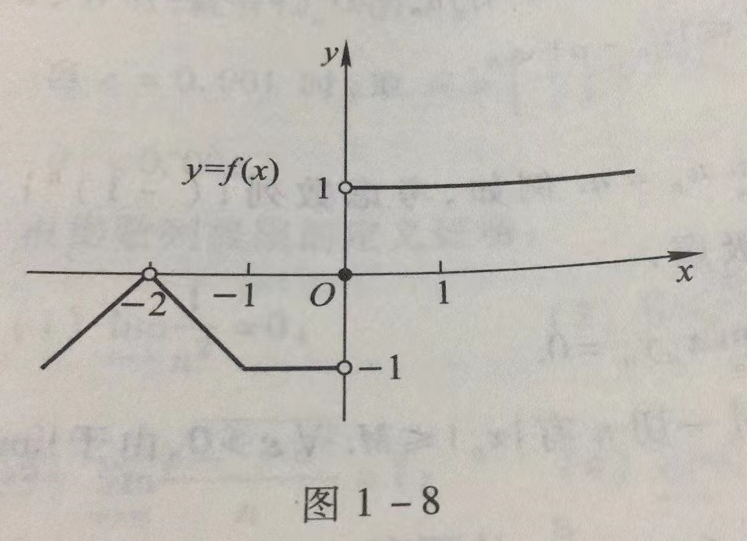
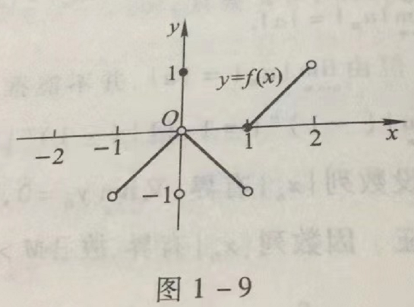

# 第一章 函数与极限

## 习题1-3 函数的极限

1. 对图1-8所示的函数 $f(x)$，求下列极限，如极限不存在，说明理由。

(1) $\lim\limits_{x\rightarrow -2}f(x)$;

(2) $\lim\limits_{x\rightarrow -1}f(x)$;

(3) $\lim\limits_{x\rightarrow 0}f(x)$;

**解**

(1) $\lim\limits_{x\rightarrow -2}f(x)=0$;

(2) $\lim\limits_{x\rightarrow -1}f(x) = -1$;

(3) $\lim\limits_{x\rightarrow 0}f(x)$ 不存在，因为 $f(0^+)\ne f(0^-)$;

2. 对图1-9所示的函数 $f(x)$，下列陈述中哪些是对的，哪些是错的？

(1) $\lim\limits_{x\rightarrow 0}f(x)$ 不存在；

(2) $\lim\limits_{x\rightarrow 0}f(x) = 0$;

(3) $\lim\limits_{x\rightarrow 0}f(x) = 1$;

(4) $\lim\limits_{x\rightarrow 1}f(x) = 0$;

(5) $\lim\limits_{x\rightarrow 1}f(x)$ 不存在;

(6) 对每个 $x_0 \in (-1,1), \lim\limits_{x\rightarrow x_0}f(x)$ 存在.

**解**

(1) 错，$\lim\limits_{x\rightarrow 0}f(x)$ 存在与否，与 $f(0)$的值无关。事实上，$\lim\limits_{x\rightarrow 0}f(x)=0$;

(2) 对。因为 $f(0^+)=f(0^-)$;

(3) 错，$\lim\limits_{x\rightarrow 0}f(x)$ 的值与 $f(0)$的值无关;

(4) 错，$f(1^+)=0$, 但 $f(1^-)=-1$，故 $\lim\limits_{x\rightarrow 1}f(x)$ 不存在;

(5) 对，因为 $f(1^+)\ne f(1^-)$;

(6) 对。