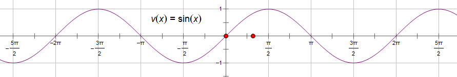

- [三角函数](#三角函数)
  - [一、任意角的三角函数](#一任意角的三角函数)
    - [1.1 象限角的判断](#11-象限角的判断)
    - [1.2 弧度制](#12-弧度制)
    - [1.3 同角三角函数的关系](#13-同角三角函数的关系)
    - [1.4 已知某角的一个三角函数值，求这个角的其他三角函数值](#14-已知某角的一个三角函数值求这个角的其他三角函数值)
    - [1.5 根据函数图像求解析式问题](#15-根据函数图像求解析式问题)
    - [1.6 $y=A\\sin(\\omega x+\\varphi)\\kern4px (A\\gt 0, \\omega \\gt 0)$ 的性质](#16-yasinomega-xvarphikern4px-agt-0-omega-gt-0-的性质)
  - [二、三角函数的图像与性质](#二三角函数的图像与性质)
    - [2.1 三角函数的图像与性质](#21-三角函数的图像与性质)
      - [2.1.1 正弦函数 sine](#211-正弦函数-sine)
      - [2.1.2 余弦函数 cosine](#212-余弦函数-cosine)
      - [2.1.3 正切函数 tangent](#213-正切函数-tangent)
      - [2.1.4 余切函数 cotangent](#214-余切函数-cotangent)
      - [2.1.5 正割函数 secant](#215-正割函数-secant)
      - [2.1.6 余割函数 cosecant](#216-余割函数-cosecant)
    - [2.2 反三角函数的图像与性质](#22-反三角函数的图像与性质)
      - [2.2.1 反正弦函数 arcsine](#221-反正弦函数-arcsine)
      - [2.2.2 反余弦函数 arccosine](#222-反余弦函数-arccosine)
      - [2.2.3 反正切函数 arctangent](#223-反正切函数-arctangent)
      - [2.2.4 反余切函数 arccotangent](#224-反余切函数-arccotangent)
      - [2.2.5 反正割函数 arcsecant](#225-反正割函数-arcsecant)
      - [2.2.6 反余割函数 arccosecant](#226-反余割函数-arccosecant)
    - [2.3 三角函数图像的伸缩变换](#23-三角函数图像的伸缩变换)
  - [三、三角函数恒等变换](#三三角函数恒等变换)
    - [3.1 诱导公式](#31-诱导公式)
    - [3.2 两角和差公式](#32-两角和差公式)
      - [3.2.1 两角差的余弦公式推导](#321-两角差的余弦公式推导)
      - [3.2.2 两角和的余弦公式推导](#322-两角和的余弦公式推导)
      - [3.2.3 两角和的正弦公式推导](#323-两角和的正弦公式推导)
      - [3.2.4 两角差的正弦公式推导](#324-两角差的正弦公式推导)
      - [3.2.5 两角和的正切公式推导](#325-两角和的正切公式推导)
      - [3.2.6 两角差的正切公式推导1](#326-两角差的正切公式推导1)
      - [3.2.7 两角差的正切公式推导2](#327-两角差的正切公式推导2)
    - [3.3 二倍角公式](#33-二倍角公式)
      - [3.3.1 正弦二倍角公式推导](#331-正弦二倍角公式推导)
      - [3.3.2 余弦二倍角公式推导](#332-余弦二倍角公式推导)
      - [3.3.3 正切二倍角公式推导](#333-正切二倍角公式推导)
    - [3.4 二倍角公式逆运算](#34-二倍角公式逆运算)
    - [3.5 半角公式](#35-半角公式)
    - [3.6 万能公式](#36-万能公式)
      - [3.6.1 正切万能推导](#361-正切万能推导)
      - [3.6.2 正弦万能推导](#362-正弦万能推导)
      - [3.6.3 余弦万能推导](#363-余弦万能推导)
    - [3.7 积化和差](#37-积化和差)
      - [口诀](#口诀)
      - [证①](#证)
      - [证②](#证-1)
      - [证③](#证-2)
      - [证④](#证-3)
    - [3.8 和差化积](#38-和差化积)
      - [口诀](#口诀-1)
      - [证①](#证-4)
      - [证②](#证-5)
      - [证③](#证-6)
      - [证④](#证-7)
  - [四、三角函数典型问题](#四三角函数典型问题)
    - [4.1 $A\\sin \\omega x+B\\cos \\omega x \\kern3px (A\\gt 0)$ 问题](#41-asin-omega-xbcos-omega-x-kern3px-agt-0-问题)
    - [4.2 化简问题](#42-化简问题)
      - [4.2.1 整式降幂](#421-整式降幂)
      - [4.2.2 分式去1](#422-分式去1)
  - [参考](#参考)

# 三角函数

## 一、任意角的三角函数

### 1.1 象限角的判断

已知角 $\alpha$ 是某个象限角，求角 $\frac {\alpha} n$ 所在的象限

1. 等分：分母是几，就把每个象限几等分
2. 标号：按逆时针方向循环标上 1,2,3,4
3. 选号： $\alpha$ 在第几象限就找数字几
4. 定象限：数字所在位置就是所求角的位置

### 1.2 弧度制

角度制：把圆周360等分，其中1份所对的圆心角就是1度.

弧度制：长度等于半径的圆弧所对的圆心角叫做1弧度 (1 rad) 的角.

$360\degree = 2\pi rad, 180\degree = \pi rad$

$1\degree = \frac {\pi}{180} rad \approx 0.01745 rad, 1 rad=(\frac {180}{\pi})\degree \approx 57.30\degree = 57\degree 18'$

**注意**

1. 正角的弧度数是一个正数，负角的弧度数是一个负数，零角的弧度数是零
2. 角 $\alpha$ 的弧度数的绝对值 $|\alpha|=\frac l r$( $l$ 为弧度， $r$ 为半径)
3. 用角度制和弧度制来度量零角，单位不同，但数量相同（都是0）
4. 在同一个式子中角度、弧度不可以混用

弧长公式 $l=\frac{n\pi r}{180\degree} = \alpha r$， $n$ 为角度.

扇形面积公式 $S = \frac{n\pi r^2}{360\degree} = \frac 1 2 lr = \frac 1 2 \alpha r^2$

### 1.3 同角三角函数的关系

1. 对角互为倒数
   
   $\sin = \frac 1 {csec}, \cos = \frac 1 {sec}, \tan = \frac 1 \cot$
2. 左右积为中间

   $\tan = \frac \sin \cos, \cot = \frac \cos \sin$

3. 三个红色倒三角形高点平方和为低点的平方

   $\sin^2+\cos^2 = 1, \tan^2+1=\sec^2, 1+\cot^2=\csc^2$

   或者 $\sec^2-\tan^2 = 1, \csc^2 - \cot^2 = 1$

### 1.4 已知某角的一个三角函数值，求这个角的其他三角函数值

图形+象限法.

1. 根据已知函数的绝对值作三角形
2. 根据图形得出其他三角函数的绝对值
3. 根据象限定符号

### 1.5 根据函数图像求解析式问题

1. 根据纵向范围确定 $A$
2. 根据横向周期 $T=\frac{2\pi}\omega$ 确定 $\omega$
3. 代入特殊点确定 $\varphi$
4. 得到解析式 $y=A\sin(\omega x + \varphi)$

**例** 

**解**

1. 根据振幅确定 $|A| = 4$
2. 根据周期 $T=16=\frac{2\pi}{\omega}$ 得到 $\omega = \frac \pi 8$
3. 代入特殊点 $(2,-4)$ （一般使用顶点即凸点和凹点，具有特殊性）得出解析式为 A 选项.

### 1.6 $y=A\sin(\omega x+\varphi)\kern4px (A\gt 0, \omega \gt 0)$ 的性质

- 定义域 $\R$
- 值域 $[-A, A]$
- 特殊点

  - $\omega x + \varphi = k\pi, y = 0$
  - $\omega x + \varphi = \frac \pi 2 + 2k\pi, y =A$
  - $\omega x + \varphi = -\frac \pi 2 + 2k\pi , y =-A$

- 增区间 $\omega x + \varphi \in [-\frac \pi 2 + 2k\pi, \frac \pi 2 + 2k\pi]$
- 减区间 $\omega x + \varphi \in [\frac \pi 2 + 2k\pi, \frac {3\pi} 2 + 2k\pi]$
- 奇偶性要看对称轴
  - 若对称轴包含 $y$ 轴，则为偶函数
  - 若对称轴不包含 $y$ 轴，且 $f(0) = 0$，则为奇函数
  - 其他情况为非奇非偶函数
- 周期 $T=\frac{2\pi}\omega$
- 对称轴 $\omega x + \varphi = \frac \pi 2 + k\pi$
- 对称点 $(\omega x + \varphi = k\pi, 0)$

## 二、三角函数的图像与性质

### 2.1 三角函数的图像与性质

#### 2.1.1 正弦函数 sine

$\sin \alpha = \frac y r$

- 定义域 $\R$
- 值域 $[-1, 1]$
- 特殊点
  - $x=k\pi, y=0$
  - $x=\frac \pi 2 + 2k\pi, y=1$
  - $x=-\frac \pi 2 + 2k\pi, y=-1$
- 增区间 $[-\frac \pi 2 + 2k\pi, \frac \pi 2 + 2k\pi]$
- 减区间 $[\frac \pi 2 + 2k\pi, \frac 3 2 \pi + 2k\pi]$
- 奇函数
- 周期 $T=2\pi$，反周期 $t=\pi$
- 对称轴 $x=\frac \pi 2 + k\pi$
- 对称点 $(k\pi, 0)$

#### 2.1.2 余弦函数 cosine

$\cos \alpha = \frac x r$
    

- 定义域 $\R$
- 值域 $[-1,1]$
- 特殊点
  - $x=\frac \pi 2+k\pi, y=0$
  - $x=2k\pi, y=1$
  - $x=\pi+2k\pi, y=-1$
- 增区间 $[-\pi + 2k\pi, 2k\pi]$
- 减区间 $[2k\pi, \pi+2k\pi]$
- 偶函数
- 周期 $T=2\pi$，反周期 $t=\pi$
- 对称轴 $x=2k\pi$
- 对称点 $(\frac \pi 2 + k\pi, 0)$

#### 2.1.3 正切函数 tangent

$\tan \alpha = \frac y x$
    

- 定义域 $\lbrace x \in \R |x\ne k\pi + \frac \pi 2, k \in \Z\rbrace$
- 值域 $\R$
- 特殊点
  - $x=k\pi, y=0$
- 增区间 $(-\frac \pi 2 + k\pi, \frac \pi 2 + k\pi)$
- 减区间不存在
- 奇函数
- 周期 $T=\pi$
- 对称轴不存在
- 对称点 $(\frac {k\pi} 2, 0)$

#### 2.1.4 余切函数 cotangent

$\cot \alpha = \frac x y$
    

- 定义域 $\lbrace x\in \R| x \ne k\pi, k \in \Z\rbrace$
- 值域 $\R$
- 特殊点 $x=\frac \pi 2 + k\pi, y=0$
- 增区间不存在
- 减区间 $(k\pi, \pi+k\pi)$
- 奇函数
- 周期 $T=\pi$
- 对称轴不存在
- 对称点 $(\frac{k\pi}2, 0)$

#### 2.1.5 正割函数 secant

$\sec \alpha = \frac r x = \frac 1 {\cos \alpha}$
    

- 定义域 $\lbrace x\in \R| x\ne k\pi + \frac \pi 2, k \in \Z\rbrace$
- 值域 $(-\infty, -1] \cup [1, +\infty)$
- 特殊点
  - $x=2k\pi, y=1$
  - $x=\pi+2k\pi, y=-1$
- 增区间 $(2k\pi, \frac \pi 2 + 2k\pi) \cup (\frac \pi 2 + 2k\pi, \pi + 2k\pi)$
- 减区间 $(\pi+2k\pi, \frac {3\pi}2 + 2k\pi) \cup (\frac {3\pi}2 + 2k\pi, 2k\pi)$
- 偶函数
- 周期 $T=2\pi$
- 对称轴 $x=k\pi$
- 对称点不存在

#### 2.1.6 余割函数 cosecant

$\csc \alpha = \frac r y = \frac 1 {\sin \alpha}$
    

- 定义域 $\lbrace x\in \R| x \ne k\pi, k \in \Z\rbrace$
- 值域 $(-\infty, -1] \cup [1, +\infty)$
- 特殊点
  - $x=\frac \pi 2 + 2k\pi, y=1$
  - $x=-\frac \pi 2 + 2k\pi, y=-1$
- 增区间 $(\frac \pi 2 + 2k\pi, \pi + 2k\pi) \cup (\pi + 2k\pi, \frac {3\pi}2 + 2k\pi)$
- 减区间 $(-\frac \pi 2 + 2k\pi, 2k\pi) \cup  (2k\pi, \frac \pi 2 + 2k\pi)$
- 奇函数
- 周期 $T=2\pi$
- 对称轴 $x=\frac \pi 2 + k\pi$
- 对称点 $(k\pi, 0)$

### 2.2 反三角函数的图像与性质

#### 2.2.1 反正弦函数 arcsine

$\arcsin$    
    

定义域 $[-1,1]$，值域 $[-\frac\pi 2, \frac \pi 2]$，奇函数，非周期函数

#### 2.2.2 反余弦函数 arccosine

$\arccos$
    

定义域 $[-1,1]$，值域 $[0, \pi]$，非奇非偶函数，非周期函数

#### 2.2.3 反正切函数 arctangent

$\arctan$
    

定义域 $\R$，值域 $(-\frac\pi 2, \frac \pi 2)$，奇函数，非周期函数

#### 2.2.4 反余切函数 arccotangent

$arccot$
    

定义域 $\R$，值域 $(0,\pi)$，非奇非偶函数，非周期函数

#### 2.2.5 反正割函数 arcsecant

$arcsec$
    

定义域 $\lbrace x\in\R| \kern1em |x| \geqslant 1 \rbrace$，值域 $[0,\frac \pi 2) \cup (\frac \pi 2, \pi]$，非奇非偶，非周期

#### 2.2.6 反余割函数 arccosecant

$arccsc$
    

定义域 $\lbrace x\in\R| \kern1em |x| \geqslant 1 \rbrace$，值域 $[-\frac \pi 2, 0) \cup (0, \frac \pi 2]$，奇函数，非周期

### 2.3 三角函数图像的伸缩变换

$y=\sin x \xrightarrow[变为\frac 1 \omega]{横坐标} y=\sin(\omega x)$

$y=\sin x \xrightarrow[变为 A 倍]{纵坐标} y=A\sin x$

## 三、三角函数恒等变换

### 3.1 诱导公式

1. 

$$
\begin{align}
\sin(\alpha+2k\pi) & =\sin \alpha, \\
\cos(\alpha +2k\pi) & =\cos \alpha, \\
\tan(\alpha+2k\pi) & =\tan \alpha, \\
k & \in \Z
\end{align}
$$

2. 
$$
\begin{align}
\sin(\pi + \alpha) & =-\sin(\alpha), \\
\cos(\pi+\alpha) & =-\cos(\alpha), \\
\tan(\pi+\alpha) & =\tan(\alpha)
\end{align}
$$

3. 

$$
\begin{align}
\sin(-\alpha) & =-\sin \alpha, \\
\cos(-\alpha) & =\cos \alpha, \\
\tan(-\alpha) & =-\tan\alpha
\end{align}
$$

4. 

$$
\begin{align}
\sin(\pi-\alpha) & =\sin \alpha, \\
\cos(\pi-\alpha) & =-\cos \alpha, \\
\tan(\pi-\alpha) & =-\tan\alpha
\end{align}
$$

5. 

$$
\begin{align}
\sin(\frac{\pi}2 -\alpha) & =\cos \alpha, \\
\cos(\frac{\pi}2-\alpha) & =\sin \alpha, \\
\tan(\frac{\pi}2-\alpha) & =\cot\alpha
\end{align}
$$

6. 

$$
\begin{align}
\sin(\frac{\pi}2 +\alpha) & =\cos \alpha, \\
\cos(\frac{\pi}2+\alpha) & =-\sin \alpha, \\
\tan(\frac{\pi}2+\alpha) & =-\cot\alpha
\end{align}
$$

7. 口诀：奇变偶不变，符号看象限

    适用于 $\sin(\frac{k\pi}{2}\pm \alpha), \cos(\frac{k\pi}{2} \pm \alpha), \tan(\frac{k\pi}{2} \pm \alpha), k \in \Z$.

    1. 奇偶：指 $k$ 是奇数、偶数
    2. 变 $\sin \leftrightarrow \cos, \tan \leftrightarrow \cot$
    3. 把 $\alpha$ 当成锐角，看 $\alpha \pm \frac{k\pi}2$ 所在象限，判断 **原式** 正负

### 3.2 两角和差公式

$$
\begin{align}
\sin(\alpha \pm \beta) & = \sin \alpha \cdot \cos \beta \pm \cos \alpha \cdot \sin \beta, \\
\cos(\alpha \pm \beta) & = \cos \alpha \cdot \cos \beta \mp \sin \alpha \cdot \sin \beta, \\
\tan(\alpha \pm \beta) & = \frac{\tan \alpha \pm \tan \beta}{1 \mp \tan \alpha \cdot \tan \beta}
\end{align}
$$

#### 3.2.1 两角差的余弦公式推导

$\angle \alpha$ 的终边交单位圆于点 $P_2(\cos \alpha, \sin \alpha)$， $\angle \beta$ 的终边交单位圆于点 $P_1(\cos \beta, \sin \beta)$， $\angle (\alpha - \beta)$的终边交单位圆于点 $P(\cos{(\alpha-\beta)}, \sin{(\alpha - \beta)})$.由于 $\angle P_1 O P_2 = \angle (\alpha - \beta)$，因此 $|P_1P_2| = |PA|$.由两点间距离公式，得：

$$
\begin{align}
|P_1P_2| & = |PA| \\
\sqrt{(\cos \beta - \cos \alpha)^2 + (\sin \beta - \sin \alpha)^2} & = \sqrt{(\cos{(\alpha - \beta)} - 1)^2 + \sin^2{(\alpha - \beta)}} \\
\cos^2 \beta - 2\cos \alpha \cos \beta + \cos^2 \alpha + \sin^2 \alpha - 2 \sin \alpha \sin \beta + \sin^2 \alpha & = \cos^2(\alpha-\beta) - 2\cos(\alpha - \beta) + 1 + \sin^2(\alpha-\beta)  \\
2- 2\cos\alpha\cos\beta -2\sin\alpha\sin\beta& = 2-2\cos(\alpha - \beta) \\
\cos(\alpha-\beta) & = \cos\alpha\cos\beta + \sin\alpha\sin\beta
\end{align}
$$

#### 3.2.2 两角和的余弦公式推导

$$
\begin{align}
\cos(\alpha+\beta) & = \cos(\alpha - (-\beta)) \\
& = \cos\alpha\cos(-\beta) + \sin\alpha\sin(-\beta) \\
& = \cos\alpha\cos\beta - \sin\alpha\sin\beta
\end{align}
$$

#### 3.2.3 两角和的正弦公式推导

$$
\begin{align}
\sin(\alpha+\beta) & = \cos(\frac{\pi}2 - (\alpha+\beta)) \\
& = \cos((\frac{\pi}2 - \alpha) - \beta) \\
& = \cos(\frac{\pi}2 - \alpha)\cos\beta + \sin(\frac{\pi}2 - \alpha)\sin\beta \\
& = \sin\alpha\cos\beta + \cos\alpha\sin\beta
\end{align}
$$

#### 3.2.4 两角差的正弦公式推导

$$
\begin{align}
\sin(\alpha-\beta) & = \sin(\alpha + (-\beta)) \\
& = \sin\alpha\cos(-\beta) + \cos\alpha\sin(-\beta) \\
& = \sin\alpha\cos\beta - \cos\alpha\sin\beta
\end{align}
$$

#### 3.2.5 两角和的正切公式推导

$$
\begin{align}
\tan(\alpha+\beta) & = \frac{\sin(\alpha+\beta)}{\cos(\alpha+\beta)} \\
& = \frac{\sin\alpha\cos\beta + \cos\alpha\sin\beta}{\cos\alpha\cos\beta - \sin\alpha\sin\beta} \\
& = \frac{(\sin\alpha\cos\beta + \cos\alpha\sin\beta)\div (\cos\alpha\cos\beta)}{(\cos\alpha\cos\beta - \sin\alpha\sin\beta)\div (\cos\alpha\cos\beta)} \\
& = \frac{\tan\alpha + \tan\beta}{1-\tan\alpha\tan\beta} \\
\end{align}
$$

#### 3.2.6 两角差的正切公式推导1

$$
\begin{align}
\tan(\alpha-\beta) & = \frac{\sin(\alpha-\beta)}{\cos(\alpha-\beta)} \\
& = \frac{\sin\alpha\cos\beta - \cos\alpha\sin\beta}{\cos\alpha\cos\beta + \sin\alpha\sin\beta} \\
& = \frac{(\sin\alpha\cos\beta - \cos\alpha\sin\beta)\div (\cos\alpha\cos\beta)}{(\cos\alpha\cos\beta + \sin\alpha\sin\beta) \div (\cos\alpha\cos\beta)} \\
& = \frac{\tan\alpha - \tan\beta}{1+\tan\alpha\tan\beta} \\
\end{align}
$$

#### 3.2.7 两角差的正切公式推导2

$$
\begin{align}
\tan(\alpha-\beta) & = \tan(\alpha+(-\beta)) \\
& = \frac{\tan\alpha+\tan(-\beta)}{1-\tan\alpha\tan(-\beta)} \\
& = \frac{\tan\alpha-\tan\beta}{1+\tan\alpha\tan\beta}
\end{align}
$$

### 3.3 二倍角公式

$$
\begin{align}
\sin 2\alpha & = 2\sin \alpha \cdot \cos \alpha \\
\cos 2\alpha & = \cos^2 \alpha - \sin^2 \alpha \\
& = 2\cos^2 \alpha - 1 \\
& = 1-2\sin^2 \alpha \\
\tan 2\alpha & = \frac{2\tan \alpha}{1-\tan^2 \alpha}
\end{align}
$$

#### 3.3.1 正弦二倍角公式推导

$$
\begin{align}
\sin{2\alpha} &= \sin(\alpha + \alpha) \\
& = \sin\alpha\cos\alpha + \cos\alpha\sin\alpha \\
& = 2 \sin\alpha\cos\alpha
\end{align}
$$

#### 3.3.2 余弦二倍角公式推导

$$
\begin{align}
\cos{2\alpha} &= \cos(\alpha + \alpha) \\
& = \cos\alpha\cos\alpha - \sin\alpha\sin\alpha \\
& = \cos^2\alpha - \sin^2\alpha \\
& = \sin^2\alpha+\cos^2\alpha-2\sin^2\alpha=1-2\sin^2\alpha \\
& = 2\cos^2\alpha-(\sin^2\alpha + \cos^2\alpha) = 2\cos^2\alpha - 1
\end{align}
$$

#### 3.3.3 正切二倍角公式推导

$$
\begin{align}
\tan(2\alpha) & = \tan(\alpha+\alpha) \\
& = \frac{\tan\alpha+\tan\alpha}{1-\tan\alpha\tan\alpha} \\
& = \frac{2\tan\alpha}{1-\tan^2\alpha}
\end{align}
$$

### 3.4 二倍角公式逆运算

$$
\begin{align}
\sin \alpha \cdot \cos \alpha & = \frac 1 2 \sin 2\alpha \\
1 \pm \sin 2\alpha & = (\sin\alpha \pm \cos\alpha)^2 \\
\cos 2\alpha & = (\cos\alpha - \sin\alpha)(\cos\alpha + \sin\alpha) \\
\cos^2\alpha & = \frac{1+\cos 2\alpha} 2 \\
\sin^2\alpha & = \frac{1-\cos 2\alpha} 2
\end{align}
$$

### 3.5 半角公式

用来将三角函数统一成 $\cos$

$$
\begin{align}
\cos \alpha & = 1 - 2\sin^2 \frac {\alpha} 2 = 2 \cos^2 \frac {\alpha} 2 -1 \\
& \implies \\
\sin \frac{\alpha} 2 & = \pm\sqrt{\frac{1-\cos\alpha}2} \\
\cos \frac{\alpha} 2 & = \pm \sqrt{\frac{1+\cos\alpha}2} \\
\tan \frac{\alpha}2 & = \pm \sqrt{\frac{1-\cos\alpha}{1+\cos\alpha}}
\end{align}
$$

### 3.6 万能公式

用来将三角函数统一成 $\tan$

$$
\begin{align}
\sin\alpha & = \frac{2\tan \frac{\alpha} 2}{1+\tan^2 \frac{\alpha} 2} \\
\cos\alpha & = \frac{1-\tan^2\frac{\alpha}2}{1+\tan^2 \frac{\alpha}2} \\
\tan\alpha &= \frac{2\tan\frac{\alpha}2}{1-\tan^2\frac{\alpha}2}
\end{align}
$$

#### 3.6.1 正切万能推导

$$
\begin{align}
\tan\alpha & = \tan(2 \cdot \frac \alpha 2) \\
& = \frac{2\tan\frac\alpha 2}{1-\tan^2\frac\alpha 2}
\end{align}
$$

#### 3.6.2 正弦万能推导

$$
\begin{align}
\sin\alpha & = \sin(2 \cdot \frac \alpha 2) \\
& = 2\sin{\frac\alpha 2}\cos{\frac\alpha 2} \\
& = \frac{2\sin{\frac\alpha 2}\cos{\frac\alpha 2}}{\sin^2{\frac \alpha 2} + \cos^2{\frac \alpha 2}} \\
& = \frac{(2\sin{\frac\alpha 2}\cos{\frac\alpha 2}) \div (\cos^2{\frac\alpha 2})}{(\sin^2{\frac \alpha 2} + \cos^2{\frac \alpha 2}) \div (\cos^2{\frac\alpha 2})} \\
& = \frac{2\tan{\frac\alpha 2}}{1+\tan^2{\frac \alpha 2}}
\end{align}
$$

#### 3.6.3 余弦万能推导

$$
\begin{align}
\cos\alpha & = \frac{\sin \alpha}{\tan \alpha} \\
& = \frac{2\tan \frac \alpha 2}{1+\tan^2 \frac \alpha 2} \div \frac{2\tan \frac \alpha 2}{1-\tan^2\frac \alpha 2} \\
& = \frac{1-\tan^2 \frac \alpha 2}{1+\tan^2\frac \alpha 2}
\end{align}
$$

### 3.7 积化和差

$$
\begin{align}
\sin\alpha\cos\beta & = \frac{\sin(\alpha+\beta)+\sin(\alpha-\beta)} 2 & ① \\
\cos\alpha\sin\beta & = \frac{\sin(\alpha+\beta)-\sin(\alpha-\beta)}2 & ② \\
\cos\alpha\cos\beta & = \frac{\cos(\alpha+\beta)+\cos(\alpha-\beta)}2 & ③ \\
\sin\alpha\sin\beta & = -\frac{\cos(\alpha+\beta)-\cos(\alpha-\beta)}2 & ④
\end{align}
$$

#### 口诀

**正余余正，正加正减；余余正正，余加负余减**

#### 证①

$$
\begin{cases}
\sin(\alpha+\beta) & = \sin\alpha\cos\beta + \cos\alpha\sin\beta \\
\sin(\alpha-\beta) & = \sin\alpha\cos\beta - \cos\alpha\sin\beta
\end{cases}
\implies
$$

$$
\begin{align}
\sin(\alpha+\beta) + \sin(\alpha-\beta) & = 2\sin\alpha\cos\beta \\
\sin\alpha\cos\beta & = \frac{\sin(\alpha+\beta) + \sin(\alpha-\beta)}{2} 
\end{align}
$$

#### 证②

$$
\begin{cases}
\sin(\alpha+\beta) & = \sin\alpha\cos\beta + \cos\alpha\sin\beta \\
\sin(\alpha-\beta) & = \sin\alpha\cos\beta - \cos\alpha\sin\beta
\end{cases}
\implies
$$

$$
\begin{align}
\sin(\alpha+\beta) - \sin(\alpha-\beta) & = 2\cos\alpha\sin\beta \\
\cos\alpha\sin\beta & = \frac{\sin(\alpha+\beta) - \sin(\alpha-\beta)}{2} 
\end{align}
$$

#### 证③

$$
\begin{cases}
\cos(\alpha+\beta) & = \cos\alpha\cos\beta - \sin\alpha\sin\beta \\
\cos(\alpha-\beta) & = \cos\alpha\cos\beta + \sin\alpha\sin\beta
\end{cases}
\implies
$$

$$
\begin{align}
\cos(\alpha+\beta) + \cos(\alpha-\beta) & = 2\cos\alpha\cos\beta \\
\cos\alpha\cos\beta & = \frac{\cos(\alpha+\beta) + \cos(\alpha-\beta)}{2} 
\end{align}
$$

#### 证④

$$
\begin{cases}
\cos(\alpha+\beta) & = \cos\alpha\cos\beta - \sin\alpha\sin\beta \\
\cos(\alpha-\beta) & = \cos\alpha\cos\beta + \sin\alpha\sin\beta
\end{cases}
\implies
$$

$$
\begin{align}
\cos(\alpha+\beta) - \cos(\alpha-\beta) & = -2\sin\alpha\sin\beta \\
\sin\alpha\sin\beta & = -\frac{\cos(\alpha+\beta) - \cos(\alpha-\beta)}{2} 
\end{align}
$$

### 3.8 和差化积

$$
\begin{align}
\sin x + \sin y & = 2\sin\frac{x+y}2\cos\frac{x-y}2 & ① \\
\sin x - \sin y & = 2\cos\frac{x+y}2\sin\frac{x-y}2 & ② \\
\cos x + \cos y & = 2 \cos\frac{x+y}2\cos\frac{x-y}2 & ③ \\
\cos x - \cos y & = -2\sin\frac{x+y}2\sin\frac{x-y}2 & ④
\end{align}
$$

#### 口诀

**正加正，正在前；正减正，余在前**

**余加余，余并肩；余减余，负正弦**

#### 证①

$$
\begin{align}
已知 \sin\alpha\cos\beta & = \frac{\sin(\alpha+\beta)+\sin(\alpha-\beta)} 2 \\
令 x&=\alpha+\beta, y=\alpha-\beta, 那么 \\
\alpha & = \frac{x+y}2, \beta = \frac{x-y}2, 于是 \\
\sin(\frac{x+y}2)\cos(\frac{x-y}2) &= \frac{\sin x + \sin y} 2，即 \\
\sin x + \sin y & = 2\sin(\frac{x+y}2)\cos(\frac{x-y}2)
\end{align}
$$

#### 证②

$$
\begin{align}
已知 \cos\alpha\sin\beta & = \frac{\sin(\alpha+\beta)-\sin(\alpha-\beta)} 2 \\
令 x&=\alpha+\beta, y=\alpha-\beta, 那么 \\
\alpha & = \frac{x+y}2, \beta = \frac{x-y}2, 于是 \\
\cos(\frac{x+y}2)\sin(\frac{x-y}2) &= \frac{\sin x - \sin y} 2，即 \\
\sin x - \sin y & = 2\cos(\frac{x+y}2)\sin(\frac{x-y}2)
\end{align}
$$

#### 证③

$$
\begin{align}
已知 \cos\alpha\cos\beta & = \frac{\cos(\alpha+\beta)+\cos(\alpha-\beta)} 2 \\
令 x&=\alpha+\beta, y=\alpha-\beta, 那么 \\
\alpha & = \frac{x+y}2, \beta = \frac{x-y}2, 于是 \\
\cos(\frac{x+y}2)\cos(\frac{x-y}2) &= \frac{\cos x + \cos y} 2，即 \\
\cos x + \cos y & = 2\cos(\frac{x+y}2)\cos(\frac{x-y}2)
\end{align}
$$

#### 证④

$$
\begin{align}
已知 \sin\alpha\sin\beta & = -\frac{\cos(\alpha+\beta)-\cos(\alpha-\beta)} 2 \\
令 x&=\alpha+\beta, y=\alpha-\beta, 那么 \\
\alpha & = \frac{x+y}2, \beta = \frac{x-y}2, 于是 \\
\sin(\frac{x+y}2)\sin(\frac{x-y}2) &= -\frac{\cos x - \cos y} 2，即 \\
\cos x - \cos y & = -2\sin(\frac{x+y}2)\sin(\frac{x-y}2)
\end{align}
$$

## 四、三角函数典型问题

### 4.1 $A\sin \omega x+B\cos \omega x \kern3px (A\gt 0)$ 问题

**辅助角公式**

$A\sin \omega x + B \cos \omega x = \sqrt{A^2+B^2}\sin(\omega x + \varphi)$

其中 

$$
\begin{align}
\sin \varphi & = \frac{B}{\sqrt{A^2+B^2}} \\
\cos \varphi & = \frac{A}{\sqrt{A^2+B^2}} \\
\tan \varphi & = \frac B A \\
\varphi & \in (-\frac \pi 2, \frac \pi 2) \\
A & \gt 0 \\
\omega & \gt 0
\end{align}
$$

**证**

$$
\begin{align}
A\sin \omega x + B \cos \omega x & = \sqrt{A^2+B^2}(\frac{A}{\sqrt{A^2+B^2}}\sin \omega x + \frac{B}{\sqrt{A^2+B^2}} \cos \omega x) \\
令 \cos \varphi & = \frac{A}{\sqrt{A^2+B^2}}, \sin \varphi = \frac{B}{\sqrt{A^2+B^2}}, 上式等：\\
& = \sqrt{A^2+B^2}(\sin \omega x \cos \varphi + \cos \omega x\sin \varphi) \\
& = \sqrt{A^2+B^2}\sin(\omega x+\varphi)
\end{align} 
$$

### 4.2 化简问题

#### 4.2.1 整式降幂

主要应用 $\cos 2x = \cos^2 x - \sin^2 x = 2\cos^2 x - 1 = 1-2\sin^2x$ 的及其变形.

- $2\sin x \cos x = \sin 2x$
- $\sin^2 x = \frac{1-\cos 2x}{2}$
- $\cos^2 x = \frac{1+\cos 2x}{2}$
- $\cdots$

如果降幂完了发现无法化成 $A\sin(\omega x + \varphi)$ 的形式，要化同名，化同角，并使用换元法进一步处理.

#### 4.2.2 分式去1

- $1-\sin^2x = \cos^2x$
- $1-\cos^2x = \sin^2x$
- $1-\cos 2x = 2\sin^2x$
- $1+\cos 2x = 2\cos^2x$
- $1+\sin^2x = 2\sin^2x + \cos^2x$
- $1+\cos x = 2\cos^2 \frac x 2$
- $\cdots$

## 参考

- [1] [滴答课堂-高中数学-三角函数](https://www.bilibili.com/video/BV1G7411A72)

- [2] [李永乐高三数学复习100讲-三角函数](https://www.bilibili.com/video/BV1F4411t7if)