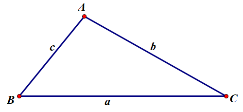
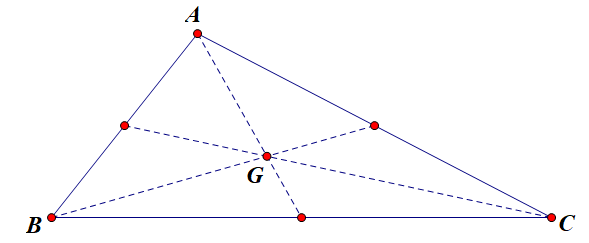

- [三角形 triangles](#三角形-triangles)
  - [一、解三角形](#一解三角形)
    - [1.1 正弦定理 law of sines](#11-正弦定理-law-of-sines)
    - [1.2 余弦定理 law of cosines](#12-余弦定理-law-of-cosines)
  - [二、三角形的六心](#二三角形的六心)
    - [2.1 内心](#21-内心)
    - [2.2 外心](#22-外心)
    - [2.3 重心](#23-重心)
    - [2.4 垂心](#24-垂心)
    - [2.5 中心](#25-中心)
    - [2.6 旁心](#26-旁心)
  - [三、构成三角形的条件](#三构成三角形的条件)
    - [3.1 已知三边 $a\\leqslant b \\leqslant c$, 构成三角形的条件： $a+b \\gt c$](#31-已知三边-aleqslant-b-leqslant-c-构成三角形的条件-ab-gt-c)
    - [3.2 已知内角 $A\\lt B$](#32-已知内角-alt-b)
  - [四、三角形面积](#四三角形面积)
    - [4.1 行列式形式](#41-行列式形式)

# 三角形 triangles

## 一、解三角形

1. $A+B+C=\pi$
2. 大边对大角，小边对小角

### 1.1 正弦定理 law of sines 
   
$\frac a{\sin A} = \frac b {\sin B} = \frac c {\sin C} = 2R$ （ $R$ 为外接圆半径）

$S = \frac 1 2 ab\sin C$

### 1.2 余弦定理 law of cosines

$c = \sqrt{a^2+b^2-2ab\cos C}$

可以从已知的两边和夹角计算出三角形的第三条边.

$\cos C = \frac{a^2+b^2-c^2}{2ab}$
   
可以从三角形的三边计算出三角形的三个角.

## 二、三角形的六心

### 2.1 内心

1. 内切圆的圆心
2. 三条角分线的交点
3. 到三边距离相等
4. $r = \frac {2S}{a+b+c}$

$$
\begin{align}
S_{\triangle ABC} & = S_{\triangle AOB} + S_{\triangle BOC} + S_{\triangle AOC} \\
& = \frac 1 2 ar + \frac 1 2 br + \frac 1 2 cr \\
& = \frac 1 2r(a+b+c) \\
\implies r & = \frac{2S}{a+b+c}
\end{align}
$$

### 2.2 外心

1. 外接圆的圆心
2. 三边中垂线的交点
3. 到三个顶点距离相等
4. $R=\frac a {2\sin A} = \frac b{2\sin B} = \frac c{2\sin C}$

过圆心 $O$ 作 $AO$ 的延长线交圆于点 $A'$，则 $AO=A'O = R, AA' = 2R, \angle ACA' = 90^\degree$.

由圆周角定理 $\angle ABC = \angle AA'C$，所以 $\sin B = \sin A' =  \frac b{2R} \implies R = \frac b{2\sin B}$

由正弦定理, $R=\frac a {2\sin A} = \frac b{2\sin B} = \frac c{2\sin C}$

### 2.3 重心

1. 三条中线交点
2. 分中线比例 $2 : 1$
3. 重心坐标 $(x_G, y_G) = (\frac 1 3 (x_A+x_B+x_C), \frac 1 3 (y_A+y_B+y_C))$
4. 到三个顶点距离平方和最小

**证明4**

设 $A,B,C,G$ 四点坐标分别为 $(x_1,y_1), (x_2,y_2), (x_3,y_3), (x_0,y_0)$

$$
\begin{align}
|\overrightarrow{GA}|^2 + |\overrightarrow{GB}|^2 + |\overrightarrow{GC}|^2 & = (x_0 - x_1)^2 + (y_0-y_1)^2 + (x_0-x_2)^2 + (y_0-y_2)^2 + (x_0-x_3)^2 + (y_0-y_3)^2 \\
& = 3x_0^2 - 2(x_1+x_2+x_3)x_0 + x_1^2+x_2^2+x_3^2 + 3y_0^2 - 2(y_1+y_2+y_3)y_0 + y_1^2+y_2^2+y_3^2 
\end{align}
$$

记 $f(x_0) = 3x_0^2 - 2(x_1+x_2+x_3)x_0 + x_1^2+x_2^2+x_3^2$， $f(x_0)$ 为开口向上的二次函数，在对称轴 $x_0=\frac 1 3(x_1+x_2+x_3)$ 处取得最小值;

记 $f(y_0) = 3y_0^2 - 2(y_1+y_2+y_3)y_0 + y_1^2+y_2^2+y_3^2$, $f(y_0)$ 为开口向上的二次函数，在对称轴 $y_0=\frac 1 3(y_1+y_2+y_3)$ 处取得最小值;

故 $|\overrightarrow{GA}|^2 + |\overrightarrow{GB}|^2 + |\overrightarrow{GC}|^2$ 在点 $(\frac 1 3(x_1+x_2+x_3), \frac 1 3(y_1+y_2+y_3))$ 取得最小值，得证.

   
### 2.4 垂心

三条垂线交点.

### 2.5 中心

正三角形四心重合称为中心.

### 2.6 旁心

1. 角分线与外角分线交点
2. 到三边距离相等（到三角形三边距离相等的点有4个，一个内心，三个旁心）

## 三、构成三角形的条件

### 3.1 已知三边 $a\leqslant b \leqslant c$, 构成三角形的条件： $a+b \gt c$

1. 构成直角三角形： $a^2+b^2=c^2$
2. 构成锐角三角形： $a^2+b^2\gt c^2$
3. 构成钝角三角形： $a^2+b^2\lt c^2$

### 3.2 已知内角 $A\lt B$

1. $A \lt B \iff \sin A \lt \sin B$
2. $A \lt B \iff \cos A \gt \sin B$
3. $A \lt B \nLeftrightarrow \tan A \lessgtr \tan B$

## 四、三角形面积

### 4.1 行列式形式

[三角形面积的行列式形式-castelu](https://www.bilibili.com/video/BV1RU4y1d72J)

$\triangle ABC$ 顶点坐标分别为 $A(x_1, y_1), B(x_2,y_2), C(x_3,y_3)$，面积为

$$
S_{\triangle ABC} = \frac 1 2
\begin{Vmatrix}
x_1 & y_1 & 1 \\
x_2 & y_2 & 1 \\
x_3 & y_3 & 1
\end{Vmatrix}
$$

**证**

由于三角形必有内角为锐角，不妨设 $\angle A$ 为锐角.

把已知点的坐标带入斜率公式和向量坐标公式，可得

$$
K_{AB} = \frac{y_2-y_1}{x_2-x_1}, K_{AC} = \frac{y_3-y_1}{x_3-x_1}
$$

$$
\overrightarrow{AB} = (x_2-x_1, y_2-y_1), \overrightarrow{AC} = (x_3-x_1, y_3-y_1)
$$

由到角公式

$$
\begin{align}
\tan A & = |\frac{K_{AC} - K_{AB}}{1+ K_{AC}K_{AB}}| \\
& = |\frac{(y_3-y_1)(x_2-x_1) - (y_2-y_1)(x_3-x_1)}{(x_3-x_1)(x_2-x_1)+(y_3-y_1)(y_2-y_1)}|
\end{align}
$$

由数量积公式

$$
\overrightarrow{AB} \cdot \overrightarrow{AC} = (x_2-x_1)(x_3-x_1) + (y_2-y_1)(y_3-y_1)
$$

由三角形面积公式

$$
\begin{align}
S_{\triangle ABC} & = \frac 1 2 |\overrightarrow{AB}||\overrightarrow{AC}|\sin A \\
& = \frac 1 2 \overrightarrow{AB} \cdot \overrightarrow{AC} \tan A \\
& = \frac 1 2|(y_3-y_1)(x_2-x_1) - (y_2-y_1)(x_3-x_1)|
\end{align}
$$

又因为

$$
\frac 1 2
\begin{Vmatrix}
x_1 & y_1 & 1 \\
x_2 & y_2 & 1 \\
x_3 & y_3 & 1
\end{Vmatrix}
=\frac 1 2
\begin{Vmatrix}
x_1 & y_1 & 1 \\
x_2-x_1 & y_2-y_1 & 0 \\
x_3-x_1 & y_3-y_1 & 0
\end{Vmatrix}
$$

按第一行第三列展开，有

$$
\frac 1 2
\begin{Vmatrix}
x_1 & y_1 & 1 \\
x_2-x_1 & y_2-y_1 & 0 \\
x_3-x_1 & y_3-y_1 & 0
\end{Vmatrix}
= \frac 1 2|(y_3-y_1)(x_2-x_1) - (y_2-y_1)(x_3-x_1)|
$$

于是

$$
S_{\triangle ABC} = \frac 1 2
\begin{Vmatrix}
x_1 & y_1 & 1 \\
x_2 & y_2 & 1 \\
x_3 & y_3 & 1
\end{Vmatrix}
$$