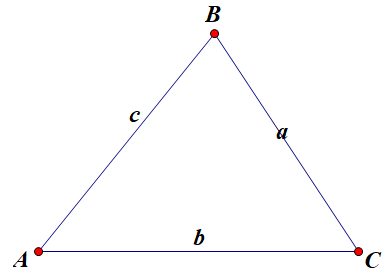

# 三角形面积

## 行列式形式

[三角形面积的行列式形式-castelu](https://www.bilibili.com/video/BV1RU4y1d72J)

$\triangle ABC$ 顶点坐标分别为 $A(x_1, y_1), B(x_2,y_2), C(x_3,y_3)$，面积为

$$
S_{\triangle ABC} = \frac 1 2
\begin{Vmatrix}
x_1 & y_1 & 1 \\
x_2 & y_2 & 1 \\
x_3 & y_3 & 1
\end{Vmatrix}
$$

**证**

由于三角形必有内角为锐角，不妨设 $\angle A$ 为锐角.

把已知点的坐标带入斜率公式和向量坐标公式，可得

$$
K_{AB} = \frac{y_2-y_1}{x_2-x_1}, K_{AC} = \frac{y_3-y_1}{x_3-x_1}
$$

$$
\overrightarrow{AB} = (x_2-x_1, y_2-y_1), \overrightarrow{AC} = (x_3-x_1, y_3-y_1)
$$

