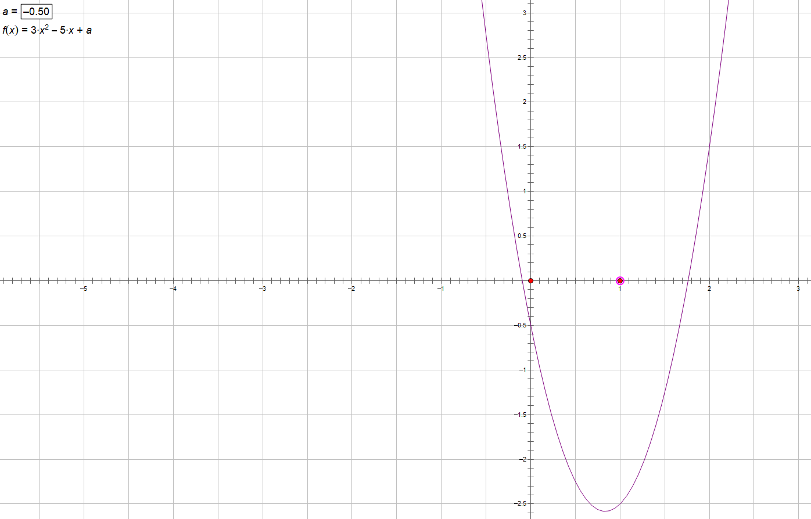
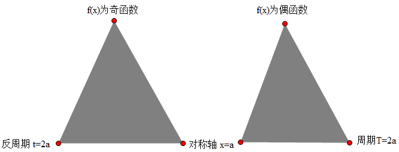

- [函数](#函数)
  - [一、集合与逻辑](#一集合与逻辑)
  - [二、基本初等函数](#二基本初等函数)
    - [2.1 指数函数](#21-指数函数)
    - [2.2 对数函数](#22-对数函数)
    - [2.3 指数函数和对数函数比较大小问题的步骤](#23-指数函数和对数函数比较大小问题的步骤)
    - [2.4 函数图像的平移](#24-函数图像的平移)
  - [三、函数值域的求法](#三函数值域的求法)
    - [3.1 图像法](#31-图像法)
      - [3.1.1 $y=\frac{ax+b}{cx+d}$](#311-yfracaxbcxd)
        - [3.1.1.1 反解法, 很麻烦](#3111-反解法-很麻烦)
        - [3.1.1.2 换元法, 简洁](#3112-换元法-简洁)
      - [3.1.2 $y=ax+\frac b x$](#312-yaxfrac-b-x)
    - [3.2 导数法](#32-导数法)
      - [步骤](#步骤)
      - [多项式函数的特殊性质](#多项式函数的特殊性质)
    - [3.3 含有参数的等式（二次方程）](#33-含有参数的等式二次方程)
      - [图像法](#图像法)
      - [分离参数法](#分离参数法)
    - [3.4 含参数的不等式](#34-含参数的不等式)
      - [图像法](#图像法-1)
      - [分离变量法](#分离变量法)
      - [最值法](#最值法)
  - [四、函数图像的切线](#四函数图像的切线)
  - [五、函数的对称性，周期性，奇偶性](#五函数的对称性周期性奇偶性)
    - [5.1 轴对称](#51-轴对称)
    - [5.2 中心对称](#52-中心对称)
    - [5.3 奇函数](#53-奇函数)
      - [几个常用的奇函数](#几个常用的奇函数)
        - [1. $f(x) = \lg\frac{m+x}{m-x}$](#1-fx--lgfracmxm-x)
        - [2. $f(x) = \lg\frac{m-x}{m+x}$](#2-fx--lgfracm-xmx)
        - [3. $f(x) = \lg(\sqrt{x^2+1}+x)$](#3-fx--lgsqrtx21x)
        - [4. $f(x) = \lg(\sqrt{x^2+1}-x)$](#4-fx--lgsqrtx21-x)
    - [5.4 偶函数](#54-偶函数)
    - [5.5 周期性](#55-周期性)
    - [5.6 对称性、奇偶性、周期性之间的关系](#56-对称性奇偶性周期性之间的关系)
  - [六、函数的其他性质](#六函数的其他性质)
    - [6.1 凸凹性](#61-凸凹性)

# 函数

## 一、集合与逻辑

1. 集合的3个特点：确定性，互异性，无序性
2. 集合的关系
   1. 子集 subset: $A \subset B$
   2. 交集 intersection set: $A \cap B$
   3. 并集 union set: $A \cup B$
   4. 补集 complementary set: $\complement_UA$
3. 有限集中元素的个数：cardinal - 基数. 如 $A=\{1,2,3\}, card(A) = 3$
4. 有限集的子集个数: $card(A) = n$, 则 $A$ 的子集个数为 $2^n$
   1. 分步： $2\times 2 \times \cdots 2 = 2^n$
   2. 分类： $C_n^0 + C_n^1 + \cdots + C_n^n = 2^n$
5. 集合与逻辑的关系
   1. $A \subset B \iff A\rightarrow B$
      1. A 是 B 的充分条件
      2. B 是 A 的必要条件
      3. 例 母亲 $\subset$ 女人，则 是母亲一定是女人
6. 公式
   1. $A\cap (B\cup C) = (A \cap B) \cup (A \cup C)$

      记忆法 $\cap \rightarrow \times, \cup \rightarrow+$

      $A \times (B+C) = A\times B + A \times C$
    2. $\complement_U(A\cap B) = \complement_UA \cup \complement_UB$
    3. $\complement_U(A\cup B) = \complement_UA \cap \complement_UB$
    4. $A\cap B = A \iff A \subset B$
    5. $A\cup B = A \iff B \subset A$ 
   
## 二、基本初等函数

### 2.1 指数函数

$y=a^x(a\gt 0, a \ne 1)$

1. 定义域 $R$
2. 值域 $\R_+$
3. 特殊点 $(0, 1)$
4. $a\gt 1$ 时单增， $0\lt a \lt 1$ 时单减
5. $y=a^x, y=(\frac 1 a)^x$ 关于 $y$ 轴对称
6. 第一象限内，按逆时针 $a$ 变大
7. 公式
   1. $a^{mn} = (a^m)^n$
   2. $a^{\frac m n} = \sqrt[n]{a^m}$
   3. $a^{m+n} = a^m \cdot a^n$
   4. $a^{m-n} = \frac{a^m}{a^n}$
   5. $a^{-m} = \frac 1 {a^m}$

### 2.2 对数函数

$y=\log_ax(a\gt 0, a\ne 1)$

1. 定义域 $\R_+$
2. 值域 $\R$
3. 特殊点 $(1,0)$
4. $a\gt 1$ 时单增， $0\lt a \lt 1$ 时单减
5. $\log_ax, \log_{\frac 1 a}x$ 关于 $x$ 轴对称
6. 第一象限内，按顺时针 $a$ 变大
7. 公式
   1. $a^b = N \iff b = \log_aN$
   2. $\log_ab = \frac{\log_cb}{\log_ca}$
   3. $\log_a(mn) = \log_am + \log_an$
   4. $\log_a(\frac m n) = \log_am - \log_an$
   5. $\log_a(n^k) = k \log_an$
   6. $\log_{a^k}n = \frac 1 k\log_an$
   7. $\log_ab = \frac 1{\log_ba}$
   8. $n = a^{\log_an}$
8. 几个典型的奇函数
   1. $f(x)=\lg\frac{m+x}{m-x}$

      1. 定义域关于原点对称

         $\frac{m+x}{m-x} \gt 0 \implies (x+m)(x-m) \gt 0 \implies -m \lt x \lt m$
      
      2. $f(x) + f(-x) = \lg\frac{m+x}{m-x} + \lg\frac{m-x}{m+x} = \lg 1 = 0$
   2. $f(x) = \lg\frac{m-x}{m+x}$
   3. $f(x) = \lg(\sqrt{x^2+1} + x)$
   4. $f(x) = \lg(\sqrt{x^2+1} - x)$

### 2.3 指数函数和对数函数比较大小问题的步骤

口诀：**底真同，对数正；底真异，对数负**

- $a^b = N, b=\log_aN$
- $a$ 底数 $(0,1), (1,+\infty)$
- $N, a^b$ 真数 $(0,1), (1,+\infty)$
- $b, \log_aN$ 对数 $(-\infty, 0), (0, +\infty)$

步骤：

1. 使用口诀
2. 将 $(0,+\infty)$ 拆分为 $(0,1), (1,+\infty)$
3. 作图
   - $a^b$ 作 $f(x) = a^x$ 的图形， $x=b$ 处为函数值
   - $\log_ab$ 作 $f(x) = \log_ax$的图形， $x=b$ 处为函数值

**例** 比较 $\log_{\frac 1 2}3, \log_{\frac 1 2}\frac 1 3, 2^{-3}$ 的大小

**解**

1. 使用口诀，得出大致区间
   - $\log_{\frac 1 2}3 \in (-\infty, 0)$
   - $\log_{\frac 1 2}\frac 1 3 \in (0,+\infty)$
   - $2^{-3} \in (0, 1)$
   
   可知 $\log_{\frac 1 2}3$ 最小，下面将 $\log_{\frac 1 2}\frac 1 3$ 拆分以便与 $2^{-3}$ 比较
2. 拆分
   
   $\log_{\frac 1 2}\frac 1 3 \gt \log_{\frac 1 2}\frac 1 2 = 1$

   $\therefore \log_{\frac 1 2}\frac 1 3 \gt 2^{-3} \gt \log_{\frac 1 2}3$

### 2.4 函数图像的平移

1. 显函数 $y=f(x)$ 
   
   - 左移 a: $f(x+a)$
   - 右移 a: $f(x-a)$
   - 上移 a: $f(x) + a$
   - 下移 a: $f(x) - a$

2. 隐函数 $f(x, y) = 0$ 按向量 $(a,b)$ 移动： $f(x-a, y-b) = 0$
   
   例，向左平移1，向上平移2，对应向量 $(-1,2)

   - $y=2x+1 \xrightarrow{(-1,2)}y-2 = 2(x+1) + 1 \implies y=2x+5$
   - $x^2+y^2 = 4 \xrightarrow{(-1,2)} (x+1)^2 + (y-2)^2 = 4$
   - $x=\frac 1 2 \xrightarrow{(-1,2)} x+1=\frac 1 2 \implies x=-\frac 1 2$

## 三、函数值域的求法

### 3.1 图像法

#### 3.1.1 $y=\frac{ax+b}{cx+d}$
   

- 图像是双曲线
- $x\ne -\frac d c$
- $y\ne \frac a c$
- 特殊点 $(0, \frac b d)$
- 例 $y=\frac{4+3\sin x}{2-\sin x}$ 的值域是？
   
##### 3.1.1.1 反解法, 很麻烦
      
$$
\begin{align}
2y-y\sin x & = 4+3\sin x \\
\sin x &= \frac{2y-4}{3+y} \\
& \implies \\
-1 & \leqslant \frac{2y-4}{3+y} \leqslant 1 \\
-1 \leqslant \frac{2y-4}{3+y} &\implies y \in (-\infty, -3) \cup [\frac 1 3, +\infty) \\
\frac{2y-4}{3+y} \leqslant 1 & \implies y \in (-3, 7] \\
\therefore y & \in [\frac 1 3, 7]
\end{align}
$$

##### 3.1.1.2 换元法, 简洁

令 $t = \sin x \in [-1, 1]$, 则 $y = \frac{4+3t}{2-t}, t \in [-1,1]$，作图

易知 $y$ 在 $[-1,1]$ 内单增，带入端点值即可解得 $y\in[\frac 1 3, 7]$.

#### 3.1.2 $y=ax+\frac b x$

- 图像是： $a,b$同号时为双勾， $a,b$异号时为双撇
- 特殊点横坐标： $|ax| = |\frac b x|$
- 图像画法：画出 $y=ax$ 和 $y=\frac b x$，相加

### 3.2 导数法

#### 步骤

1. 求导数
2. 求根（因式分解）
3. 穿根（奇穿偶不穿）
4. 作图

#### 多项式函数的特殊性质

$f(x) = a_0+a_1x + a_2x^2 + \cdots + a_nx^n$

- 若 $f(x)$ 为奇函数，则偶次项系数 $a_0 = a_2 = \cdots = a_{2k} =0$
- 若 $f(x)$ 为偶函数，则奇次项系数 $a_1 = a_3 = a_{2k-1} = 0$
- 若即有奇次项又有偶次项，则 $f(x)$ 为非奇非偶函数
- 三次函数在某点出现极值的条件是：导函数有两个不同的根，即判别式大于0

### 3.3 含有参数的等式（二次方程）

例如 $x^2-ax+1=0$，根在 $(1,2),(3,4)$，求 $a$ 的范围.

1. 已知某范围内仅有一个根或有两个根：图像法
2. 已知某范围内有根：分离变量法

#### 图像法

1. 端点值
2. 判别式
3. 对称轴

**例** 设关于 $x$ 的方程 $3x^2-5x+a=0$ 的一个根大于-2小于0，另一个根大于1小于3，求 $a$ 的取值范围.

**解** 令 $f(x) = 3x^2-5x+a$，有:

$$
\begin{align}
f(-2) = 22+a\gt 0 & \implies a \gt -22 \\
f(0) = a \lt 0 & \implies a \lt 0 \\
f(1) = a-2 \lt 0 & \implies a \lt 2 \\
f(3) = 12+a \gt 0 & \implies a \gt -12 \\
\therefore -12 & \lt a \lt 0
\end{align}
$$

#### 分离参数法

1. 将自变量与参数分离
2. 对自变量一侧求值域

**只能用在 “有根” 的条件下**

**例** 若关于 $x$ 的一元二次方程 $4^x + a\cdot 2^x + a + 1 = 0$ 有实数根，求实数 $a$ 的取值范围.

**解** 令 $t=2^x, t \in (0, +\infty)$，则

$$
\begin{align}
t^2+at + a + 1 & = 0 \\
t^2 +1 & = -a(t+1) \\
-a & = \frac{t^2+1}{t+1}
\end{align}
$$

令 $u = t+1 \in (1, +\infty)$，则

$$
\begin{align}
-a & = \frac{(u-1)^2 + 1}{u} \\
& = u + \frac 2 u - 2 \\
& \geqslant 2\sqrt 2 - 2 \\
\therefore a &\leqslant 2-2\sqrt 2
\end{align}
$$

### 3.4 含参数的不等式

$x^2 + ax + 1 \gt 0$ 在 $[1,2]$ 恒成立，求 $a$ 的范围.

#### 图像法

端点值，判别式，对称轴

#### 分离变量法

1. 将自变量与参数分离
2. 对自变量一侧求最值
3. 列不等式

#### 最值法
 
求最值，列不等式

## 四、函数图像的切线

1. 函数 $y=f(x)$ 图像上的切线定义为：与函数有公共点，且斜率为曲线在某公共点的导数的直线.
2. 和函数 $y=f(x)$ 切于点 $(a,b)$ 的直线的求法：
   1. 求导数 $y' = f'(x)$
   2. 求斜率 $k = f'(a)$
   3. 求直线 $y-b = k(x-a)$
3. 过点 $(a,b)$ 且和函数 $y=f(x)$ 相切的直线的求法
   1. 设切点 $(x_0, y_0)$
   2. 求导数 $y' = f'(x)$
   3. 求斜率 $k = f'(x_0)$
   4. 求直线 $y-y_0 = k(x-x_0)$
   5. 带入 $(a,b)$ 求 $x_0$: $b-y_0 = k(a-x_0)$
4. 平行于某直线且和函数 $y=f(x)$ 相切的直线的求法
   1. 设切点
   2. 求导
   3. 已知斜率求直线

## 五、函数的对称性，周期性，奇偶性

### 5.1 轴对称

$f(x)$ 关于 $x=a$ 对称 $\iff$ $\forall x_1, x_2$，若 $\frac{x_1+x_2}2 = a$，有 $f(x_1) = f(x_2)$

### 5.2 中心对称

$f(x)$ 关于点 $(a,b)$ 对称 $\iff$ $\forall x_1,x_2$, 若 $\frac{x_1+x_2}2 = a$， 有 $\frac{f(x_1)+f(x_2)}2 = b$

**例** 设函数 $y=f(x)$ 是定义在 $\R$ 上的函数，则函数 $y=f(x-1)$ 与函数 $y=f(1-x)$ 的图像关于_____对称.

**解1** 

没有相等关系，构造相等关系.

令 $g(x) = f(x-1), h(x) = f(1-x)$

$f(t) = g(t+1) = h(1-t)$

$\therefore g(t+1)$ 与 $h(1-t)$ 关于 $x=1$ 对称.

**解2**

因为没有相等关系，不妨设 $f(x) = x^2$，则

$f(x-1) = (x-1)^2$

$f(1-x) = (x-1)^2$

易知 $(x-1)^2$ 关于 $x=1$ 对称.

### 5.3 奇函数

1. 定义域关于原点对称
2. $f(-x) = -f(x)$
3. 图像关于原点对称
4. 若 $f(0)$ 存在， $f(0) = 0$

#### 几个常用的奇函数

##### 1. $f(x) = \lg\frac{m+x}{m-x}$

**证**

$$
\begin{align}
& \frac{m+x}{m-x} \gt 0 \\
& \implies (x+m)(x-m) \lt 0 \\
& \implies -m \lt x \lt m
\end{align}
$$

$\therefore f(x)$ 的 定义域关于原点对称.

$$
\begin{align}
f(x)+f(-x) & = \lg\frac{m+x}{m-x} + \lg\frac{m-x}{m+x} \\
& = \lg(\frac{m+x}{m-x} \cdot \frac{m-x}{m+x}) \\
& = \lg 1 \\
& = 0 \\
\therefore f(-x) & = -f(x)
\end{align}
$$

得证.

##### 2. $f(x) = \lg\frac{m-x}{m+x}$
##### 3. $f(x) = \lg(\sqrt{x^2+1}+x)$

**证**

$f(x)$ 定义域为 $\R$ 关于原点对称.

$$
\begin{align}
f(x)+f(-x) & = \lg(\sqrt{x^2+1}+x) + \lg(\sqrt{x^2+1}-x) \\
& = \lg[(\sqrt{x^2+1}+x) \cdot (\sqrt{x^2+1}-x)] \\
& = \lg(x^2+1-x^2) \\
& = \lg 1\\
& = 0 \\
\therefore f(-x) & = -f(x)
\end{align}
$$

得证.

##### 4. $f(x) = \lg(\sqrt{x^2+1}-x)$

### 5.4 偶函数

1. 定义域关于原点对称
2. $f(-x) = f(x)$
3. 图像关于 $x=0$ 对称

### 5.5 周期性

1. 函数 $f(x)$ 以 $T$ 为周期 $\iff$ $\forall x_1,x_2, x_1-x_2=T$，有 $f(x_1) = f(x_2)$
2. 函数 $f(x)$ 以 $t$ 为反周期 $\iff$ $\forall x_1,x_2, x_1-x_2=t$，有 $f(x_1) = -f(x_2)$

### 5.6 对称性、奇偶性、周期性之间的关系

例证 若 $f(x)$ 为偶函数且对称轴为 $x=a$，则周期为 $2a$

**证** 

$$
\begin{align}
& \because f(x) 对称轴为 x=a \\
& \therefore f(x) = f(2a-x) \\
又 & \because f(x) 为偶函数 \\
& \therefore f(2a-x) = f(x-2a) \\
& \therefore f(x) = f(x-2a) \\
& \therefore f(x) 以 2a 为周期
\end{align}
$$

若上述方法不能处理，可以使用找对应函数的方法，找到一个函数如 $\sin x$ 符合题意，计算即可.

## 六、函数的其他性质

### 6.1 凸凹性

1. 下凸

   $f(\frac{x_1+x_2}2) \lt \frac{f(x_1)+f(x_2)}2$

2. 上凸

   $f(\frac{x_1+x_2}2) \gt \frac{f(x_1)+f(x_2)}2$

3. 口诀：**芬达下凸**

   $f(\frac{x_1+x_2}2)$是自变量合起来的， $\frac{f(x_1)+f(x_2)}2$ 是自变量分开的。如果自变量分开的式子比较大，就是下凸，反之就是上凸.