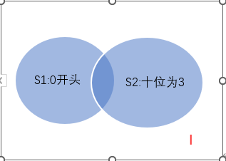

*题目来自李永乐高三数学100讲*

2. (北京高考试题) 1,2,3,4,5 这5个数字组成的没有重复的三位数，各位数字之和为奇数的共有多少个？

    A. 36 $\kern5em$ B. 24 $\kern5em$ C. 18 $\kern5em$ D. 6

    **解** 

    **先取后排，分步相乘**

    取：3位数字之和为奇数分为2种方法：三个数都是奇数( $C_3^3$ )、二偶一奇 ( $C_3^1$ )。

    排：3个数字全排列 $A_3^3$

    即 $(C_3^3 + C_3^1)*A_3^3 = 24$

4. (北京高考试题) 从黄瓜，白菜，油菜，扁豆四种蔬菜中任取三种，分别种在不同质的三块土地上，其中黄瓜必须种植，则不同的种植方法有多少种？

    A. 24 $\kern5em$ B. 18 $\kern5em$ C. 12 $\kern5em$ D. 6

    **解**

    **先取后排，分步相乘**

    取：黄瓜已定，从剩下的3种蔬菜中任取2种为 $C_3^2 = 3$

    排：将上数进行全排列即 $A_3^3 = 6$

    即 18 种

8. (全国高考) 同宿舍四个人每人写了一张贺年片，集中到一起之后每人抽取一张其他人送出的贺年片，则共有多少种分配方法？

    A. 6 $\kern5em$ B. 9 $\kern5em$ C. 11 $\kern5em$ D. 23

    **解**

    **树状图穷举**

    甲乙丙丁写了 ABCD 四张卡，则：

    |甲|乙|丙|丁|
    |--|--|--|--|
    |B|A|D|C|
    | |C|D|A|
    | |D|A|C|

    以上为甲取B的方法共3种，同理取C有3种，取D有3种，分类相加得9种

9. 甲乙丙三人踢毽子，甲发球，三人一共要传递5次，最后还要回到甲，问毽子一共有多少种不同的传递路径？

    **解**

    **树状图穷举**

    **不能传给自己！**

    

    共10种。

11. 用 0,1,2,3,4 五个数字能组成多少不重复且 3 不在十位上的五位数？

    **解**

    **排列数问题之限制条件问题，作图相减法**

    

    1. 元素：0,1,2,3,4；位置：万千百十个；限制：0不在万，3不在十
    2. 忽略所有限制画全集 $I=A_5^5=120$ 
    3. 分别画出限制集 $S_1$ 表示 0 在万位，以及 $S_2$ 表示 3 在十位；两者有交集
    4. 设 $S_1, S_2$ 的并集为 $S$，则

        $$
        \begin{align}
        S & = S_1 \cup S_2 \\
        & = S_1 + S_2 - (S_1 \cap S_2) \\
        & = A_4^4 + A_4^4 - A_3^3 \\
        & = 42
        \end{align}
        $$

    5. 因此 $I-S=120-42=78$，即一共78种可能

12. (全国高考试题) 由数字0,1,2,3,4,5所组成的没有重复的4位数中，不能被5整除的有多少个？

    **解**

    **排列数问题之限制条件问题，分类讨论法**

    1. 分清元素，位置，条件，限制

        元素：0,1,2,3,4,5

        位置：千百十个

        条件：无

        限制条件：0不在末尾，5不在末尾，0不在首位

    2. 决定从元素还是位置开始讨论

        位置4 < 元素数量5，因此先从位置开始讨论

    3. 首位有1个限制，末位有2个限制，因此从末位开始讨论

        末位有4种可能

        首位有（6-非末-非0）4种可能。

        **注意** 这里 非末 和 非0 是不重合的，因为题意限制了0不在末位，因此可以运用这种方法，如果限制条件有重合，就不能使用分类讨论法了，要使用作图相减法。

    4. 余下

        2个位置，4个元素，共 $A_4^2$ 种可能

    因此，一共是 $4\times 4 \times A_4^2= 192$ 种

13. (全国高考试题) 从班委会5名成员中选出3名，分别担任学习委员、文娱委员、体育委员，其中甲乙二人不能担任文娱委员，那么不同的选择方法有多少种？

    **解**

    **排列数问题之限制条件问题，分类讨论法**

    1. 元素：甲乙丙丁戊；位置：X,W,T

        限制：甲不在W，乙不在W
    2. 先从位置讨论
    3. 先从W讨论，共3种
    4. 没有次多，余下为4个人选2个位置为 $A_4^2$

    因此，一共 $3\times A_4^2 = 36$ 种可能。

14. A,B,C,D,E,F,G 这七个人要排成一队，A和B不能站在一起，有多少种排法？

    **解**

    **排列数问题之限制条件问题，插队法**

    1. 处理无限制条件：CDEFG 5个人排队，共 $A_5^5$ 种方法
    2. 处理限制条件：5个人有6个空隙，A、B分别插入6个空隙，有 $A_6^2$ 种方法。

    因此，一共 $A_5^5 \times A_6^2 = 3600$ 种方法 

15. A,B,C,D,E,F,G 这七人要排成一队，AB不站在一起，CD站在一起，有多少种排法？

    **解**

    **排列数问题之限制条件问题，插队法**

    1. 处理无限制条件：CD EFG 排队，CD 共 $A_2^2$ 种方法；将 CD E F G 排序，共 $A_4^4$ 种方法；一共是 $A_2^2 \times A_4^4 = 48$ 种方法
    2. 处理限制条件：CD E F G 有5个空隙，A、B分别插入5个空隙，有 $A_5^2$ 种方法。

    因此，一共 $48 \times A_5^2 = 960$ 种方法 
