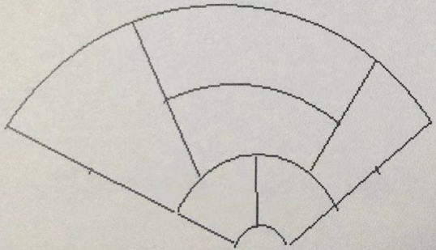
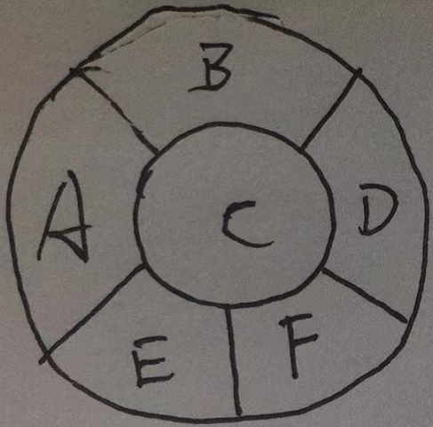
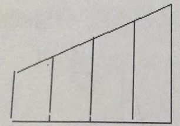

*题目来自李永乐高三数学100讲*

1. 略

2. (北京高考试题) 1,2,3,4,5 这5个数字组成的没有重复的三位数，各位数字之和为奇数的共有多少个？

    A. 36 $\kern5em$ B. 24 $\kern5em$ C. 18 $\kern5em$ D. 6

    **解** 

    **先取后排，分步相乘**

    取：3位数字之和为奇数分为2种方法：三个数都是奇数( $C_3^3$ )、二偶一奇 ( $C_3^1$ )。

    排：3个数字全排列 $A_3^3$

    即 $(C_3^3 + C_3^1)*A_3^3 = 24$

3. 略

4. (北京高考试题) 从黄瓜，白菜，油菜，扁豆四种蔬菜中任取三种，分别种在不同质的三块土地上，其中黄瓜必须种植，则不同的种植方法有多少种？

    A. 24 $\kern5em$ B. 18 $\kern5em$ C. 12 $\kern5em$ D. 6

    **解**

    **先取后排，分步相乘**

    取：黄瓜已定，从剩下的3种蔬菜中任取2种为 $C_3^2 = 3$

    排：将上数进行全排列即 $A_3^3 = 6$

    即 18 种

5. 略

6. 略

7. 略

8. (全国高考) 同宿舍四个人每人写了一张贺年片，集中到一起之后每人抽取一张其他人送出的贺年片，则共有多少种分配方法？

    A. 6 $\kern5em$ B. 9 $\kern5em$ C. 11 $\kern5em$ D. 23

    **解**

    **树状图穷举**

    甲乙丙丁写了 ABCD 四张卡，则：

    |甲|乙|丙|丁|
    |--|--|--|--|
    |B|A|D|C|
    | |C|D|A|
    | |D|A|C|

    以上为甲取B的方法共3种，同理取C有3种，取D有3种，分类相加得9种

9. 甲乙丙三人踢毽子，甲发球，三人一共要传递5次，最后还要回到甲，问毽子一共有多少种不同的传递路径？

    **解**

    **树状图穷举**

    **不能传给自己！**

    

    共10种。

10. 略

11. 用 0,1,2,3,4 五个数字能组成多少不重复且 3 不在十位上的五位数？

    **解**

    **排列数问题之限制条件问题，作图相减法**

    

    1. 元素：0,1,2,3,4；位置：万千百十个；限制：0不在万，3不在十
    2. 忽略所有限制画全集 $I=A_5^5=120$ 
    3. 分别画出限制集 $S_1$ 表示 0 在万位，以及 $S_2$ 表示 3 在十位；两者有交集
    4. 设 $S_1, S_2$ 的并集为 $S$，则

        $$
        \begin{align}
        S & = S_1 \cup S_2 \\
        & = S_1 + S_2 - (S_1 \cap S_2) \\
        & = A_4^4 + A_4^4 - A_3^3 \\
        & = 42
        \end{align}
        $$

    5. 因此 $I-S=120-42=78$，即一共78种可能

12. (全国高考试题) 由数字0,1,2,3,4,5所组成的没有重复的4位数中，不能被5整除的有多少个？

    **解**

    **排列数问题之限制条件问题，分类讨论法**

    1. 分清元素，位置，条件，限制

        元素：0,1,2,3,4,5

        位置：千百十个

        条件：无

        限制条件：0不在末尾，5不在末尾，0不在首位

    2. 决定从元素还是位置开始讨论

        位置4 < 元素数量5，因此先从位置开始讨论

    3. 首位有1个限制，末位有2个限制，因此从末位开始讨论

        末位有4种可能

        首位有（6-非末-非0）4种可能。

        **注意** 这里 非末 和 非0 是不重合的，因为题意限制了0不在末位，因此可以运用这种方法，如果限制条件有重合，就不能使用分类讨论法了，要使用作图相减法。

    4. 余下

        2个位置，4个元素，共 $A_4^2$ 种可能

    因此，一共是 $4\times 4 \times A_4^2= 192$ 种

13. (全国高考试题) 从班委会5名成员中选出3名，分别担任学习委员、文娱委员、体育委员，其中甲乙二人不能担任文娱委员，那么不同的选择方法有多少种？

    **解**

    **排列数问题之限制条件问题，分类讨论法**

    1. 元素：甲乙丙丁戊；位置：X,W,T

        限制：甲不在W，乙不在W
    2. 先从位置讨论
    3. 先从W讨论，共3种
    4. 没有次多，余下为4个人选2个位置为 $A_4^2$

    因此，一共 $3\times A_4^2 = 36$ 种可能。

14. A,B,C,D,E,F,G 这七个人要排成一队，A和B不能站在一起，有多少种排法？

    **解**

    **排列数问题之限制条件问题，插队法**

    1. 处理无限制条件：CDEFG 5个人排队，共 $A_5^5$ 种方法
    2. 处理限制条件：5个人有6个空隙，A、B分别插入6个空隙，有 $A_6^2$ 种方法。

    因此，一共 $A_5^5 \times A_6^2 = 3600$ 种方法 

15. A,B,C,D,E,F,G 这七人要排成一队，AB不站在一起，CD站在一起，有多少种排法？

    **解**

    **排列数问题之限制条件问题，插队法**

    1. 处理无限制条件：CD EFG 排队，CD 共 $A_2^2$ 种方法；将 CD E F G 排队，共 $A_4^4$ 种方法；一共是 $A_2^2 \times A_4^4 = 48$ 种方法
    2. 处理限制条件：CD E F G 有5个空隙，A、B分别插入5个空隙，有 $A_5^2$ 种方法。

    因此，一共 $48 \times A_5^2 = 960$ 种方法 

16. 略

17. 书架上有6本书，现在要插入3本书，共有多少种不同的插法？

    **解**

    **排列数问题之插书问题**

    书不同，分先后。先插入第一本，有7个位置；再插入第二本，有8个位置；再插入第三本，有9个位置。即一共 $7 \times 8 \times 9$ 个位置

    拓展：

    上述情况可以归结为 
    
    * **书不同，可相邻** $\implies 7 \times 8 \times 9$
    * **书不同，不相邻** $\implies A_7^3$
    * **书相同，可相邻** $\implies \frac {7 \times 8 \times 9}{A_3^3} $
    * **书相同，不相邻** $\implies \frac {A_7^3}{A_3^3}$

18. 

19. 

20. 

21. 

22. 

23. 

24. 

25. 

26. 

27. 

28. 

29. 

30. 

31. 

32. 

33. 

34. [全国高考试题](#p34) 某城市在中心广场建设了一个花园，分为6个部分，现在要栽种4种不同颜色的花，每部分栽种一种且相邻部分不能栽种相同颜色的花，不同的栽种方法有__种？

    

    **解**

    **组合数问题之分组排序问题之类型二四色地图**

    题图等价于：

    

    明显 C 与其他各个部分都相邻，因此6可以分为:

    * C A BF DE
    * C B AF DE
    * C D AF BE
    * C E AD BF
    * C F AD BE

    共5种分组方法，排序数为 $A_4^4$，因此一共 $5\times A_4^4 = 120$ 种方法。

35. [天津高考试题](#p35) 用6种不同的颜色给图中的4个格子涂色，每个格子涂1种颜色，要求最多使用3种颜色，且相邻的两个格子颜色不同，则不同的涂色方法共有__种？

    

    **解**

    **组合数问题之分组排序问题之类型二四色地图**

    1. 先分类讨论使用2种颜色和使用3种颜色的情况。
    2. 使用2种颜色时，假设4个格子分别命名为ABCD，分两组且同组不相邻时，只能分为 AC, BD 一种分法。排序数为 $A_6^2$。即使用2种颜色时有 $1 \times A_6^2 = 30$ 种涂法
    3. 使用3种颜色时，分3组且同组不相邻，有 (AC, B, D), (AD, B, C), (A, BD, C) 3种分法。排序数为 $A_6^3$。即使用3种颜色时有 $3 \times A_6^3 = 360$ 种涂法。
    4. 因此一共 $30+360=390$ 种涂法。

36. 略

37. (1) 把7封同样的信扔到5个邮筒里面，一共有多少种方法？
    (2) 不同的信呢？
    (3) 同样的信，但是每个邮筒里至少有1封信呢？

    **解**

    **组合数之插棍问题**

    (1) $a+b+c+d+e = 7$ 的非负整数解，即 $C_{11}^4$

    (2) $5^7$

    (3) $a+b+c+d+e = 7$ 的正整数解，即 $C_{6}^4$