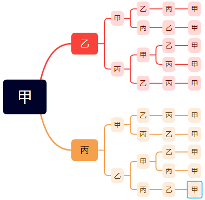

*题目来自李永乐高三数学100讲*

2. (北京高考试题) 1,2,3,4,5 这5个数字组成的没有重复的三位数，各位数字之和为奇数的共有多少个？

A. 36 $\kern5em$ B. 24 $\kern5em$ C. 18 $\kern5em$ D. 6

**解** 

**先取后排，分步相乘**

取：3位数字之和为奇数分为2种方法：三个数都是奇数( $C_3^3$ )、二偶一奇 ( $C_3^1$ )。

排：3个数字全排列 $A_3^3$

即 $(C_3^3 + C_3^1)*A_3^3 = 24$

4. (北京高考试题) 从黄瓜，白菜，油菜，扁豆四种蔬菜中任取三种，分别种在不同质的三块土地上，其中黄瓜必须种植，则不同的种植方法有多少种？

A. 24 $\kern5em$ B. 18 $\kern5em$ C. 12 $\kern5em$ D. 6

**解**

**先取后排，分步相乘**

取：黄瓜已定，从剩下的3种蔬菜中任取2种为 $C_3^2 = 3$

排：将上数进行全排列即 $A_3^3 = 6$

即 18 种

8. (全国高考) 同宿舍四个人每人写了一张贺年片，集中到一起之后每人抽取一张其他人送出的贺年片，则共有多少种分配方法？

A. 6 $\kern5em$ B. 9 $\kern5em$ C. 11 $\kern5em$ D. 23

**解**

**树状图穷举**

甲乙丙丁写了 ABCD 四张卡，则：

|甲|乙|丙|丁|
|--|--|--|--|
|B|A|D|C|
| |C|D|A|
| |D|A|C|

以上为甲取B的方法共3种，同理取C有3种，取D有3种，分类相加得9种

9. 甲乙丙三人踢毽子，甲发球，三人一共要传递5次，最后还要回到甲，问毽子一共有多少种不同的传递路径？

**解**

**树状图穷举**

**不能传给自己！**

共10种。

12. (全国高考试题) 由数字0,1,2,3,4,5所组成的没有重复的4位数中，不能被5整除的有多少个？

    **解**

    **排列数问题之限制条件问题**

    1. 分清元素，位置，条件，限制

    元素：0,1,2,3,4,5

    位置：千百十个

    条件：无

    限制条件：0不在末尾，5不在末尾，0不在首位

    2. 决定从元素还是位置开始讨论

    位置4 < 元素数量5，因此先从位置开始讨论

    3. 
