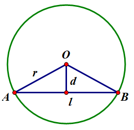
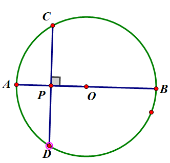
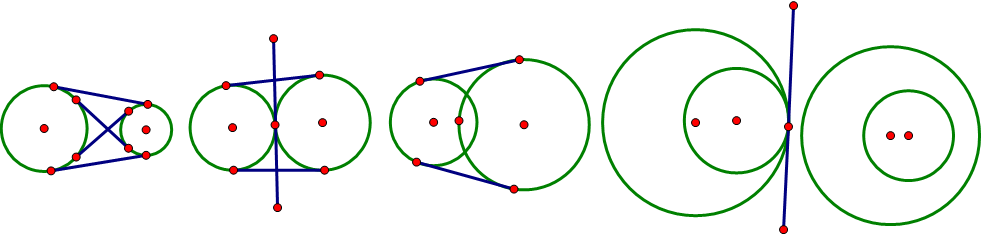
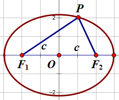
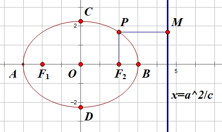
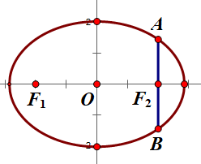
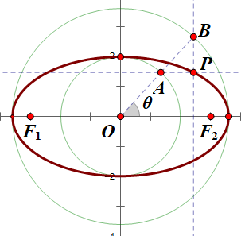

- [解析几何](#解析几何)
  - [一、直线](#一直线)
    - [1.1 倾斜角和斜率](#11-倾斜角和斜率)
    - [1.2 直线方程](#12-直线方程)
      - [1.2.1 点斜式](#121-点斜式)
      - [1.2.2 斜截式](#122-斜截式)
      - [1.2.3 两点式](#123-两点式)
      - [1.2.4 截距式](#124-截距式)
      - [1.2.5 一般式](#125-一般式)
    - [1.3 直线与象限](#13-直线与象限)
      - [1.3.1 过三个象限的直线](#131-过三个象限的直线)
      - [1.3.2 过两个象限的直线](#132-过两个象限的直线)
      - [1.3.3 过一个象限的直线](#133-过一个象限的直线)
      - [1.3.4 一个象限也不经过的直线](#134-一个象限也不经过的直线)
    - [1.4 中点与对称轴](#14-中点与对称轴)
      - [1.4.1 中点坐标公式](#141-中点坐标公式)
      - [1.4.1 对称轴（中垂线）](#141-对称轴中垂线)
    - [1.5 点到直线距离](#15-点到直线距离)
    - [1.6 线性规划](#16-线性规划)
    - [1.7 判定两直线是否平行、垂直](#17-判定两直线是否平行垂直)
      - [平行](#平行)
      - [垂直](#垂直)
    - [1.8 平行直线的距离](#18-平行直线的距离)
    - [1.9 线外一点在直线上的投影](#19-线外一点在直线上的投影)
    - [1.10 线外一点关于直线的对称点](#110-线外一点关于直线的对称点)
    - [1.11 直线关于线外一点的对称直线](#111-直线关于线外一点的对称直线)
    - [1.12 直线关于直线的对称直线](#112-直线关于直线的对称直线)
    - [1.13 到角与倾斜角](#113-到角与倾斜角)
    - [1.14 到角公式与夹角公式](#114-到角公式与夹角公式)
  - [二、圆](#二圆)
    - [2.1 圆的方程](#21-圆的方程)
      - [2.1.1 圆的标准方程 (standard equation of circle)](#211-圆的标准方程-standard-equation-of-circle)
      - [2.1.2 圆的一般方程 (general equation of circle)](#212-圆的一般方程-general-equation-of-circle)
      - [2.1.3 圆的参数方程 (parameter equation of circle)](#213-圆的参数方程-parameter-equation-of-circle)
    - [2.2 直线与圆的关系](#22-直线与圆的关系)
    - [2.3 切线的性质](#23-切线的性质)
      - [2.3.1 圆心到切线距离为半径](#231-圆心到切线距离为半径)
      - [2.3.2 $PA \\bot OA$](#232-pa-bot-oa)
      - [2.3.3 弦切角等于同弧圆周角](#233-弦切角等于同弧圆周角)
      - [2.3.4 过同一点的两条切线长度相等](#234-过同一点的两条切线长度相等)
      - [2.3.5 过一点 $P$ 作两条切线，连接 $PO$, 则 $PO$ 是两条切线的一条角平分线](#235-过一点-p-作两条切线连接-po-则-po-是两条切线的一条角平分线)
    - [2.4 切线长度求法](#24-切线长度求法)
      - [2.4.1 $|PA|=\\sqrt{|PO|^2 - |OA|^2}$](#241-pasqrtpo2---oa2)
      - [2.4.2 $|PA|=\\sqrt{|PA|\\cdot |PB|}$](#242-pasqrtpacdot-pb)
    - [2.5 弦长](#25-弦长)
      - [2.5.1 弦长公式](#251-弦长公式)
      - [2.5.2 过圆内固定一点的最长和最短的弦](#252-过圆内固定一点的最长和最短的弦)
    - [2.6 求圆关于直线对称的圆](#26-求圆关于直线对称的圆)
    - [2.7 求圆上到直线最近和最远的点](#27-求圆上到直线最近和最远的点)
    - [2.8 圆与圆的关系](#28-圆与圆的关系)
  - [三、椭圆](#三椭圆)
    - [3.1 第一定义](#31-第一定义)
    - [3.2 标准方程](#32-标准方程)
    - [3.3 第二定义](#33-第二定义)
    - [3.4 性质](#34-性质)
      - [3.4.1 基本量](#341-基本量)
      - [3.4.2 对称性](#342-对称性)
      - [3.4.3 离心率](#343-离心率)
      - [3.4.5 焦准距](#345-焦准距)
      - [3.4.6 通径](#346-通径)
    - [3.5 参数方程](#35-参数方程)

# 解析几何

## 一、直线

### 1.1 倾斜角和斜率

倾斜角 $\theta \in [0, \pi)$

1. 已知倾斜角求斜率， $k=\tan \theta$
2. 已知斜率求倾斜角：
   1. $k=0, \theta =0$
   2. $k\gt 0, \theta = \arctan k$
   3. $k\lt 0, \theta = \pi+\arctan k$

### 1.2 直线方程

#### 1.2.1 点斜式

已知直线上一点坐标 $(x_0,y_0)$ 和斜率 $k$，直线方程为：

$$
y-y_0=k(x-x_0)
$$

**无法表示垂直于 $x$ 轴的直线**

#### 1.2.2 斜截式

已知直线斜率 $k$ 和在 $y$ 轴上的截距 $b$. 实际上是过点 $(0,b)$ 的点斜式特例.

$$
y=kx+b
$$

**无法表示垂直于 $x$ 轴的直线**

#### 1.2.3 两点式

已知直线过两点 $(x_1,y_1), (x_2,y_2)$

$$
\frac{y-y_1}{y_2-y_1} = \frac{x-x_1}{x_2-x_1}
$$

**无法表示垂直于 $x$ 轴或 $y$ 轴的直线**

#### 1.2.4 截距式

已知直线在 $x$ 轴截距为 $a$，在 $y$ 轴截距为 $b$. 实际上是过两点 $(a,0),(0,b)$ 的两点式特例.

$$
\frac x a + \frac y b = 1
$$

**无法表示垂直于 $x$ 轴或 $y$ 轴与过原点的直线**

#### 1.2.5 一般式

$$
ax+by+c=0
$$

$a,b$ 不能同时为 $0$

### 1.3 直线与象限

#### 1.3.1 过三个象限的直线

不横，不竖，不过原点，即可以用截距式表示的直线

#### 1.3.2 过两个象限的直线

横的，竖的，过原点且斜率存在不为0的

1. 横的 $y=a, (a\ne 0)$
2. 竖的 $x=a, (a\ne 0)$
3. 过原点且斜率存在不为0的 $y=kx, (k\ne 0, k\ne \infty)$

#### 1.3.3 过一个象限的直线

不存在

#### 1.3.4 一个象限也不经过的直线

即 $x$ 轴和 $y$ 轴

### 1.4 中点与对称轴

#### 1.4.1 中点坐标公式

已知两点坐标 $(x_1, y_1), (x_2,y_2)$，则中点坐标为

$$
(\frac{x_1+x_2}2, \frac{y_1+y_2}2)
$$

#### 1.4.1 对称轴（中垂线）

1. 算出中点坐标 $(x_0,y_0)$，以两点坐标得出两点所在直线斜率 $k_1$，得出中垂线斜率 $k_2=-\frac 1{k_1}$，得到点斜式方程 $y-y_0=k_2(x-x_0)$

2. 轨迹法，设中垂线任意一点坐标为 $x,y$，根据中垂线性质，直线上任意一点到原来两点的距离相等，得 $\sqrt{(x-x_1)^2 + (y-y_1)^2} = \sqrt{(x-x_2)^2 + (y-y_2)^2}$

### 1.5 点到直线距离

已知点 $(x_0,y_0)$, 直线 $ax+by+c=0$, 距离为

$$
d=\frac{|ax_0+by_0+c|}{\sqrt{a^2+b^2}}
$$

**证**

由直线斜率 $k_1=-\frac b a$ 得点与直线的垂线斜率为 $k_2=\frac a b$，得垂线所在直线方程为 $y-y_0=\frac a b(x-x_0)$. 设垂线与直线交点为 $M(x_1,y_1)$，则点到点 $M$ 的距离即为点到直线的距离.

联立方程组

$$
\begin{cases}
y_1-y_0=\frac a b(x_1-x_0) \\
ax_1 + by_1 + c = 0
\end{cases}
$$

解得

$$
\begin{align}
x_1 & = \frac{b^2x_0-aby_0-ac}{a^2+b^2} \\
y_1 & = \frac{a^2y_0-abx_0-bc}{a^2+b^2}
\end{align}
$$

则点到直线的距离为

$$
\begin{align}
d & = \sqrt{(x_1-x_0)^2 + (y_1-y_0)^2} \\
& = \sqrt{(\frac{b^2x_0-aby_0-ac}{a^2+b^2} - x_0)^2 + (\frac{a^2y_0-abx_0-bc}{a^2+b^2} - y_0)^2} \\
& = \sqrt{\frac{(ax_0+by_0+c)^2}{a^2+b^2}} \\
& = \frac{|ax_0+by_0+c|}{\sqrt{a^2+b^2}}
\end{align}
$$

### 1.6 线性规划

**例** 设一元二次不等式组

$$
\begin{cases}
x+2y-19 & \geqslant 0 \\
x-y+8 & \geqslant 0 \\
2x+y-14 & \leqslant 0
\end{cases}
$$

所表示的平面区域为 $M$，使函数 $y=a^x(a\gt 0, a\ne 1)$ 的图像过区域 $M$ 的 $a$ 的取值范围是多少.

**解**

快速作图确定区域 $M$ 并算出三个交点坐标，结合指数函数知识解得 $a\in [2,9]$.

### 1.7 判定两直线是否平行、垂直

设两条直线 $l_1: a_1x + b_1 y + c_1 = 0, l_2: a_2x + b_2y + c_2 = 0$

#### 平行

- $\impliedby k_1 = k_2$
- $\iff a_1b_2 - a_2b_1 = 0$

#### 垂直

- $\impliedby k_1k_2 = -1$
- $\iff a_1a_2 + b_1b_2 = 0$

### 1.8 平行直线的距离

两条直线 $l_1: ax + b y + c_1 = 0, l_2: ax + by + c_2 = 0$ 平行，距离为

$$
d = \frac{|c_1 - c_2|}{\sqrt{a^2+b^2}}
$$

### 1.9 线外一点在直线上的投影

已知直线 $l: ax+by+c=0$ 及线外一点 $A(x_0, y_0)$, 求点 $A$ 在 $l$ 上的投影 $M(x_1, y_1)$ 的坐标.

点 $M$ 在直线上， 直线 $AM \bot l$，建立方程组

$$
\begin{cases}
ax_1+by_1+c = 0 \\
\frac{y1-y_0}{x1-x_0} = \frac b a
\end{cases}
$$

解得

$$
\begin{align}
x_1 & = \frac{b^2x_0-aby_0-ac}{a^2+b^2} \\
y_1 & = \frac{a^2y_0-abx_0-bc}{a^2+b^2}
\end{align}
$$

### 1.10 线外一点关于直线的对称点

已知直线 $l: ax+by+c=0$ 及线外一点 $A(x_0, y_0)$, 求点 $A$ 关于 $l$ 的对称点 $A'(x_1, y_1)$ 的坐标.

$AA' \bot l$, $AA'$ 中点在 $l$ 上，建立方程组

$$
\begin{cases}
\frac{y1-y_0}{x1-x_0} = \frac b a \\
a \cdot \frac {x_1+x_0}2 + b\cdot \frac{y_1+y_0}2 + c = 0
\end{cases}
$$

解得

$$
\begin{align}
x_1 & = \frac{(b^2-a^2)x_0 - 2aby_0 - 2ac}{a^2+b^2} \\
y_1 & = \frac{(a^2-b^2)y_0 - 2abx_0 - 2bc}{a^2+b^2}
\end{align}
$$

### 1.11 直线关于线外一点的对称直线

已知直线 $l: ax+by+c=0$ 及线外一点 $A(x_0, y_0)$, 求点 $l$ 关于 $A$ 的对称直线方程 $l'$.

设 $l': ax+by+c'=0$, 则点 $A$ 到两条直线距离相等

$$
\begin{align}
\frac{|ax_0+by_0+c|}{\sqrt{a^2+b^2}} & = \frac{|ax_0+by_0+c'|}{\sqrt{a^2+b^2}} \\
\implies |ax_0+by_0+c| & = |ax_0+by_0+c'| \\
\implies (ax_0+by_0+c)^2 & = (ax_0+by_0+c')^2 \\
\implies {c'}^2 + 2(ax_0+by_0)c' - (c^2+2acx_0 + 2bcy_0) & = 0
\end{align}
$$

解得 $c' = -(ax_0 + by_0) \pm |ax_0+by_0+c|, c'\ne c$

### 1.12 直线关于直线的对称直线

已知直线 $l_1: a_1x+b_1y+c_1=0$ 及直线 $l_2: a_2x+b_2y+c_2$, 求 $l_1$ 关于 $l$ 的对称直线方程 $l_1'$.

联立两条直线求出交点 $O(x_0, y_0)$，在 $l_1$ 任取非 $O$ 的一点 $P(x_1,y_1)$，计算 $P$ 关于 $l_2$ 的对称点 $P'(x_2, y_2)$，根据两点式得出 $l_1'$ 方程.

联立两条直线求出点 $O(x_0, y_0)$ 为

$$
\begin{align}
x_0 & = \frac{b_1c_2-b_2c_1}{a_1b_2-a_2b_1} \\
y_0 & = \frac{a_2c_1-a_1c_2}{a_1b_2-a_2b_1}
\end{align}
$$

在 $l_1$ 任取非 $O$ 的一点 $P(x_1,y_1)$，计算 $P$ 关于 $l_2$ 的对称点 $P'(x_2, y_2)$

$$
\begin{align}
x_2 & = \frac{(b_2^2-a_2^2)x_1 - 2a_2b_2y_1 - 2a_2c_2}{a_2^2+b_2^2} \\
y_2 & = \frac{(a_2^2-b_2^2)y_1 - 2a_2b_2x_1 - 2b_2c_2}{a_2^2+b_2^2}
\end{align}
$$

根据两点式得出 $l_1'$ 方程

$$
\frac{y-y_0}{y_2-y_0} = \frac{x-x_0}{x_2-x_0}
$$

即

$$
(y_0-y_2)x+(x_2-x_0)y+x_0y_2-x_2y_0 = 0
$$

记 $l_1': a'x+b'y+c'=0$，代入点 $O(x_0,y_0), P'(x_2,y_2)$ 得

$$
\begin{align}
a' & =\frac{a_2c_1-a_1c_2}{a_1b_2-a_2b_1} - \frac{(a_2^2-b_2^2)y_1 - 2a_2b_2x_1 - 2b_2c_2}{a_2^2+b_2^2}\\
b' & = \frac{(b_2^2-a_2^2)x_1 - 2a_2b_2y_1 - 2a_2c_2}{a_2^2+b_2^2}-\frac{b_1c_2-b_2c_1}{a_1b_2-a_2b_1} \\
c' & = \frac{b_1c_2-b_2c_1}{a_1b_2-a_2b_1} \cdot \frac{(a_2^2-b_2^2)y_1 - 2a_2b_2x_1 - 2b_2c_2}{a_2^2+b_2^2} - \frac{(b_2^2-a_2^2)x_1 - 2a_2b_2y_1 - 2a_2c_2}{a_2^2+b_2^2} \cdot \frac{a_2c_1-a_1c_2}{a_1b_2-a_2b_1}
\end{align}
$$

### 1.13 到角与倾斜角

到角：若直线 $l_1$ 逆时针旋转 $\theta$ 角度后与 $l_2$ 重合， $\theta$ 称为 $l_1$ 到 $l_2$ 的到角，范围 $[0, \pi)$.

倾斜角是到角的一种特例.

若已知 $l_1, l_2$ 倾斜角分别为 $\alpha, \beta$，则 $l_1$ 到 $l_2$ 的到角为：

1. $\alpha \leqslant \beta, \theta = \beta - \alpha$
2. $\alpha \gt \beta, \theta = \pi+\beta-\alpha$

### 1.14 到角公式与夹角公式

到角公式

$$
\tan \theta = \frac{k_2-k_1}{1+k_1k_2}
$$

夹角公式

$$
\tan \theta = |\frac{k_2-k_1}{1+k_1k_2}|
$$

其中， $\theta \ne \frac \pi 2$，即两直线不能垂直.

## 二、圆

### 2.1 圆的方程

#### 2.1.1 圆的标准方程 (standard equation of circle)

$$
(x-a)^2 + (y-b)^2 = r^2
$$

$(a,b)$ 为圆心， $r$ 为半径

#### 2.1.2 圆的一般方程 (general equation of circle)

$$
x_2 + y_2 + Dx + Ey + F = 0, (D^2 + E^2 -4F \gt 0)
$$

#### 2.1.3 圆的参数方程 (parameter equation of circle)

圆的半径为 $r$，圆心 $O(a,b)$，圆上一点 $A$ 到 $O$ 的直线 $AO$ 的倾斜角为 $\theta \in [0, 2\pi)$，则动点 $A$ 的轨迹可以用参数方程来表示圆

$$
\begin{cases}
x & = a + r\cos \theta, \\
y & = b + r\sin \theta.
\end{cases}
$$

**例** 已知点 $P(0,1)$ 和圆 $x^2+y^2=4$ 上的一个动点 $A$，连接 $PA$ 至 $Q$，使得 $|AQ| = 2|PA|$，求点 $Q$ 的轨迹方程.

**解**

易知圆半径为 2.

设 $PA$ 与 $x$ 轴夹角为 $\theta$，记 $A(x_a,y_a)$, 则点 $A$ 的轨迹方程为 

$$
\begin{cases}
x_a & = 2\cos \theta \\
y_a & = 2\sin \theta
\end{cases}
$$

由于 $\frac{\overrightarrow{AQ}}{\overrightarrow{QP}} = -\frac 2 3$，记 $Q(x_q, y_q)$，则由定比分点公式

$$
\begin{cases}
x_q & = \frac{x_a + 0 \cdot (-\frac 2 3)}{1+(-\frac 2 3)} = 6\cos \theta \\
y_q & = \frac{y_a + 1 \cdot (-\frac 2 3)}{1+(-\frac 2 3)} = 6\sin\theta - 2
\end{cases}
\implies x_q^2 + (y_q+2)^2 = 36
$$

### 2.2 直线与圆的关系

圆半径 $r$，圆心到直线距离 $d$

- $d \gt r$ 相离，无交点
- $d = r$ 相切，一个交点
- $d \lt r$ 相交，两个交点

### 2.3 切线的性质

#### 2.3.1 圆心到切线距离为半径

一般用来求切线方程.

#### 2.3.2 $PA \bot OA$

#### 2.3.3 弦切角等于同弧圆周角

由于同弧圆周角相等，不妨取 $AC$ 过圆心 $O$，则 $\angle ABC=90\degree, \theta'+\angle BAC = 90\degree$，而 $\theta + \angle BAC = 90\degree, \therefore \theta = \theta'$

#### 2.3.4 过同一点的两条切线长度相等

$$
|PA| = |PB|
$$

#### 2.3.5 过一点 $P$ 作两条切线，连接 $PO$, 则 $PO$ 是两条切线的一条角平分线

$$
\theta = \theta'
$$

### 2.4 切线长度求法

#### 2.4.1 $|PA|=\sqrt{|PO|^2 - |OA|^2}$

#### 2.4.2 $|PA|=\sqrt{|PA|\cdot |PB|}$

由弦切角 $\angle PAN =$ 圆周角 $\angle PCA$, $\triangle PAB \backsim \triangle PCA \implies \frac{PA}{PC}=\frac{PB}{PA}\implies PA=\sqrt{PB \cdot PC}$

### 2.5 弦长

#### 2.5.1 弦长公式

$$
l = 2\sqrt{r^2-d^2}
$$

#### 2.5.2 过圆内固定一点的最长和最短的弦

过点 $P$ 的直径 $AB$ 最长，与 $AB$ 垂直的弦 $CD$ 最短.

### 2.6 求圆关于直线对称的圆

求出圆心关于直线的对称点为新圆的圆心，半径相等.

### 2.7 求圆上到直线最近和最远的点

过圆心作直线的垂线，与圆交于两点.

### 2.8 圆与圆的关系

$d$ 表示圆心距.

|关系|判定|公共切线数量|
|---|----|-----------|
|相离| $d>r_1+r_2$ | 4|
|外切| $d=r_1+r_2$ | 3|
|相交| $\vert r_1-r_2\vert \lt d \lt r1+r_2$ | 2|
|内切| $d=\vert r_1-r_2 \vert$ | 1|
|内含| $d\lt \vert r_1-r_2\vert$ | 0|

## 三、椭圆

### 3.1 第一定义

平面内到**定点** $F_1, F_2$ 距离等于**定长** (大于 $|F_1F_2|$) 的点的集合.

**定点**：焦点，两个焦点距离称为焦距 $|F_1F_2| = 2c$

**定长**：长轴长度， $|PF_1| + |PF_2| = 2a$

**注意**：对于椭圆定义，有方程 $|PF_1| + |PF_2| = 2a$, $a$ 为常数.

1. $2a \gt |F_1F_2|$, $P$ 轨迹为椭圆
2. $2a = |F_1F_2|$, $P$ 轨迹为线段 $F_1F_2$
3. $2a \lt |F_1F_2|$, $P$ 轨迹不存在.

### 3.2 标准方程

$$
\frac{x^2}{a^2} + \frac{y^2}{b^2} = 1(a \gt b \gt 0)
$$

或

$$
\frac{x^2}{b^2} + \frac{y^2}{a^2} = 1(a \gt b \gt 0)
$$

**推导**

如图建立坐标系，设 $F_1,F_2$ 坐标分别为 $(-c,0), (c,0)$，椭圆上任意一点 $P$ 坐标为 $(x,y)$.

根据椭圆定义， $|PF_1| + |PF_2| = 2a$

因为 $|PF_1| = \sqrt{(x+c)^2 + y^2}, |PF_2|=\sqrt{(x-c)^2+y^2}$

所以 

$$
\sqrt{(x+c)^2 + y^2} + \sqrt{(x-c)^2+y^2} = 2a \implies \sqrt{(x+c)^2+y^2} = 2a- \sqrt{(x-c)^2+y^2}
$$

等式两边同时平方，得

$$
(x+c)^2 + y^2 = 4a^2 - 4a\sqrt{(x-c)^2+y^2} + (x-c)^2 + y^2
$$

即

$$
a^2 - cx = a\sqrt{(x-c)^2+y^2}
$$

上式两边再平方，得

$$
a^4 - 2a^2cx + c^2x^2 = a^2x^2-2a^2cx + a^2c^2 + a^2y^2
$$

即

$$
(a^2-c^2)x^2+a^2y^2 = a^2(a^2-c^2)
$$

两边同时除以 $a^2(a^2-c^2)$，得

$$
\frac{x^2}{a^2} + \frac{y^2}{a^2-c^2} = 1
$$

由于 $2a\gt 2c \implies a \gt c \implies a^2 \gt c^2$，记 $b = \sqrt{a^2 - c^2}$，得

$$
\frac{x^2}{a^2} + \frac{y^2}{b^2} = 1, (a\gt b \gt 0)
$$

### 3.3 第二定义

[【圆锥曲线2】椭圆第二定义＆椭圆基本性质、基本量](https://www.bilibili.com/video/BV14q4y1D7y5)

平面内到定点的距离与到定直线的距离之比为定值（大于0小于1）的点的集合.

比值即离心率，定点为椭圆的一个焦点，定直线为该焦点一侧椭圆的准线.

$x=\frac{a^2}{c}$ 为右准线， $x=-\frac{a^2}c$ 为左准线.

利用标准方程的推导结果

$$
\begin{align}
a^2 - cx & = a\sqrt{(x-c)^2+y^2} \\
\implies a-\frac c a x & = \sqrt{(x-c)^2+y^2} \\
\implies \frac c a(\frac{a^2}c - x) & = \sqrt{(x-c)^2+y^2} \\
\implies \frac c a & = \frac{\sqrt{(x-c)^2+y^2}}{\frac{a^2}c - x} 
\end{align}
$$

其中, $\frac c a = e$ 为离心率， $\sqrt{(x-c)^2+y^2}$ 为 $P$ 到右焦点 $F_2$ 的距离 $|PF_2|$,  $\frac{a^2}c - x$ 为 $P$ 到右准线的距离 $|PM|$，即

$$
e = \frac{|PF_2|}{|PM|}
$$

### 3.4 性质

#### 3.4.1 基本量

- $a$ 半长轴
- $b$ 半短轴
- $c$ 半焦距
- $a^2=b^2+c^2$
- $a\gt b, a\gt c, b\lesseqgtr c$
- 焦点在长轴上，坐标为 $(\pm c, 0)$ 或 $(0, \pm c)$

#### 3.4.2 对称性

- 椭圆关于 $x$ 轴对称
- 椭圆关于 $y$ 轴对称
- 椭圆关于原点对称

#### 3.4.3 离心率

- 离心率 $e=\frac c a, e \in (0, 1)$
- $e$ 越小越圆，越大越扁
- $e$ 相同的椭圆相似
- 由于圆的离心率 $e=0$，所以所有圆都相似
- 由于抛物线的离心率 $e=1$，所以所有抛物线都相似

#### 3.4.5 焦准距

$$
p = \frac{b^2}c
$$

焦准距为焦点到同侧准线的距离 $p = \frac{a^2}c - c = \frac{b^2}c$

#### 3.4.6 通径

过焦点且垂直于长轴的弦称为通径，长度记为 

$$
d=2ep
$$

设 $A(c,y_1), B(c,y_2)$，则

$$
\frac{c^2}{a^2} + \frac{y^2}{b^2} = 1 \implies \frac{y^2}{b^2} = 1-\frac{c^2}{a^2} = \frac{b^2}{a^2} \implies y = \pm \frac{b^2}a
$$

即 $|AB| = \frac{2b^2}a = 2 \cdot \frac c a \cdot \frac{b^2}c = 2ep$

### 3.5 参数方程

