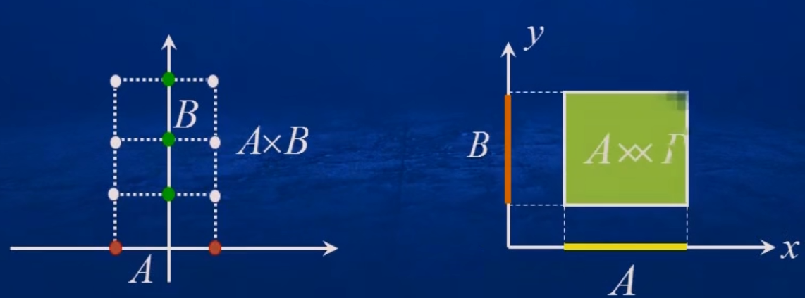

- 集合论 Georg Cantor 康托尔 [德] 1845-1918
- $A = B \iff A \subset B 且 B \subset A$
- 笛卡尔积(直积) $A\times B = \lbrace (x,y)|x \in A, y \in B \rbrace$
  
  几何意义：

  

- 有理数集 $\Q = \lbrace \frac p q | p \in \Z, q \in \N_+, p 与 q 互质 \rbrace$
- 实数集的性质：有序性，连续性或完备性（对应的点可以填满实轴）
- 数集的上界和上确界
  
  设 $E$ 是一个非空实数集， $M$ 是一个实常数，如果对于 $E$ 中的任何元素 $x$ 均有 $x \leqslant M$，则称 $M$ 为数集 $E$ 的一个**上界**，并称 $E$ 有上界

  如果一个实数集 $E$ 有上界，称 $E$ 的最小上界为**上确界**，即为 $\sup E$ (`supremum`)

  - 连续性公理：一个非空有上界的实数集必有上确界
  
- 数集的下界和下确界
  
  设 $E$ 是一个非空实数集， $M$ 是一个实常数，如果对于 $E$ 中的任何元素 $x$ 均有 $x \geqslant M$，则称 $M$ 为数集 $E$ 的一个**下界**，并称 $E$ 有下界

  如果一个实数集 $E$ 有下界，称 $E$ 的最大下界为**下确界**，即为 $\inf E$ (`infimum`)

  - 连续性公理：一个非空有下界的实数集必有下确界
- 邻域：以点 $a$ 为中心的任何开区间，记作 $U(a)$
  - $\delta$ 邻域： $U(a, \delta) = (a-\delta, a+\delta) = \lbrace x| \kern1px |x-a| \lt \delta \rbrace$, 其中 $a$ 称为邻域中心， $\delta$ 称为邻域半径.
  - 去心邻域： $\mathring{U}(a, \delta) = \lbrace x | 0 \lt |x-a| \lt \delta\rbrace$，包括左邻域 $(a-\delta, a)$ 和右邻域 $(a,a+\delta)$.
- 设 $A,B$ 是两个集合，若存在一个一一映射 $\varphi:A\rightarrow B$，则称集 $A$ 与集 $B$ 是**等势**的
  - 两个有限集是等势的 $\iff$ 它们的元素个数相等
  - 设 $E=\lbrace 2n|n\in \N\rbrace$ 是全体偶数的集合，那么它与自然数集 $\N$ 是等势的
    - *偶数与自然数的个数“一样多”*
    - 无限集与其真子集（无限集）的个数可以一样多
  - $\varphi:\N\rightarrow \Z$, $\varphi(n)=\frac{1+(-1)^n(2n-1)}4$，自然数集 $\N$ 和整数集 $\Z$ 是等势的
  - 有理数集 $\Q$ 与自然数 $\N$ 是等势的
  - 无理数集 $\R\backslash\Q$ 与自然数集 $\N$ 是不等势的
  - 无理数集 $\R\backslash\Q$ 与有理数集 $\Q$ 是不等势的 (*无理数比有理数“个数多”*)