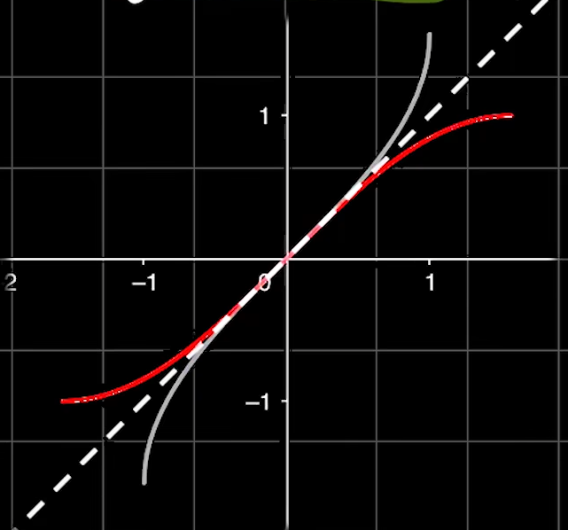
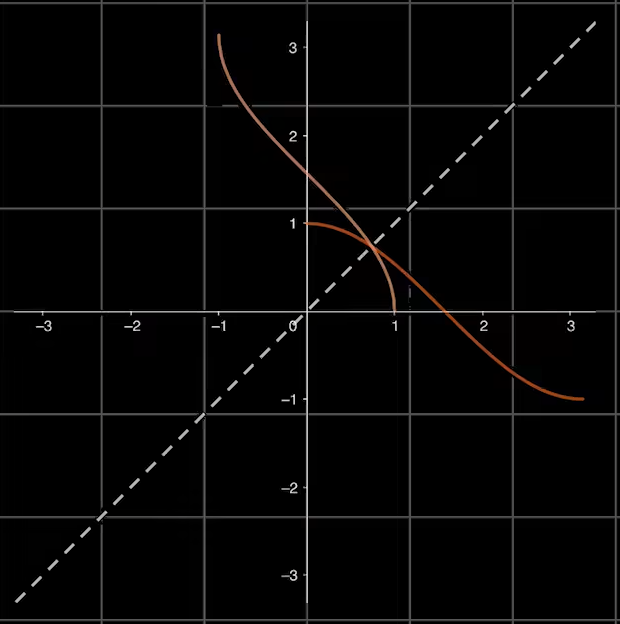
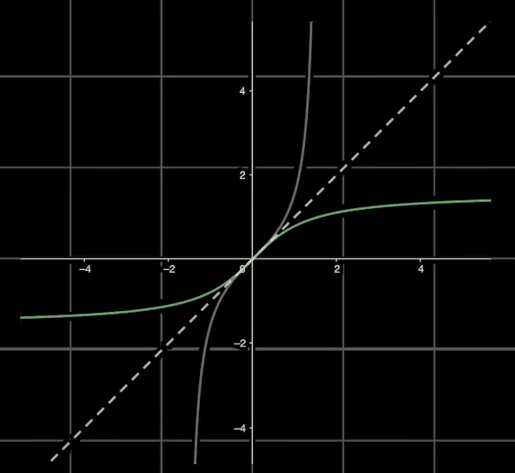
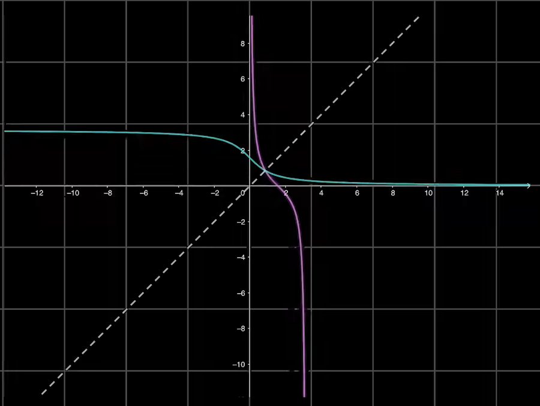

- [反三角函数](#反三角函数)
  - [1. sin, arcsin](#1-sin-arcsin)
  - [2. cos, arccos](#2-cos-arccos)
  - [3. tan, arctan](#3-tan-arctan)
  - [4. cot, arccot](#4-cot-arccot)

# 反三角函数

由于三角函数并不是单调函数，因此只截取一段单调区间来定义反函数.

## 1. sin, arcsin

直接函数 $y=\sin x, x \in [-\frac \pi 2, \frac \pi 2], y \in [-1, 1]$

反函数 $y=\arcsin, x \in [-1, 1], y\in [-\frac \pi 2, \frac \pi 2]$

## 2. cos, arccos

直接函数 $y=\cos x, x \in [0, \pi], y\in [-1, 1]$

反函数 $y=\arccos x, x \in [-1, 1], y \in [0, \pi]$

$\arcsin x + \arccos x = \frac \pi 2$

## 3. tan, arctan

直接函数 $y=\tan x, x \in (-\frac \pi 2, \frac \pi 2), y \in \R$

反函数 $y=\arctan x, x \in \R, y \in (-\frac \pi 2, \frac \pi 2)$

## 4. cot, arccot

直接函数 $y=\cot x, x \in (0, \pi), y \in \R$

反函数 $y=arccot x, x \in \R, y\in (0, \pi)$

$\arctan x + \arccot x = \frac \pi 2$