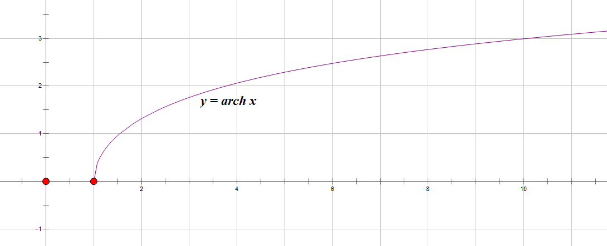

- [双曲函数](#双曲函数)
  - [双曲正弦](#双曲正弦)
  - [双曲余弦](#双曲余弦)
  - [双曲正切](#双曲正切)
  - [公式](#公式)
    - [证1](#证1)
    - [证2](#证2)
    - [证3](#证3)
    - [证4](#证4)
    - [证5](#证5)
    - [证6](#证6)
    - [证7](#证7)
  - [反双曲正弦](#反双曲正弦)
    - [自然对数形式推导](#自然对数形式推导)
  - [反双曲余弦](#反双曲余弦)
    - [自然对数形式推导](#自然对数形式推导-1)
  - [反双曲正切](#反双曲正切)
    - [自然对数形式推导](#自然对数形式推导-2)

# 双曲函数

## 双曲正弦

$\sinh x = \frac{e^x - e^{-x}} 2$

- 定义域 $\R$
- 值域 $\R$
- 奇函数
- 过原点
- 单增
- 当 $x \rightarrow +\infty$ 时，图形在第一象限接近于曲线 $y=\frac 1 2 e^x$
- 当 $x \rightarrow -\infty$ 时，图形在第三象限接近于曲线 $y=-\frac 1 2 e^{-x}$

## 双曲余弦

$\cosh x = \frac{e^x + e^{-x}} 2$

- 定义域 $\R$
- 值域 $[1,+\infty]$
- 偶函数
- 过 $(0,1)$
- 在 $(-\infty, 0)$ 单减
- 在 $(0, +\infty)$ 单增
- 当 $x \rightarrow +\infty$ 时，图形在第一象限接近于曲线 $y=\frac 1 2 e^x$
- 当 $x \rightarrow -\infty$ 时，图形在第二象限接近于曲线 $y=-\frac 1 2 e^{-x}$

## 双曲正切

$\tanh x = \frac {\sinh x} {\cosh x} = \frac{e^x-e^{-x}}{e^x + e^{-x}}$

- 定义域 $\R$
- 值域 $(-1, 1)$
- 奇函数
- 过原点
- 单增
- 当 $x \rightarrow +\infty$ 时，图形在第一象限接近于直线 $y=1$
- 当 $x \rightarrow -\infty$ 时，图形在第三象限接近于直线 $y=-1$

## 公式

1. $\sinh(x+y) = \sinh x \cosh y + \cosh x \sinh y$
2. $\sinh(x-y) = \sinh x \cosh y - \cosh x \sinh y$
3. $\cosh(x+y) = \cosh x \cosh y + \sinh x \sinh y$
4. $\cosh(x-y) = \cosh x \cosh y - \sinh x \sinh y$
5. $\cosh^2 x - \sinh^2 x = 1$
6. $\sinh 2x = 2 \sinh x \cosh x$
7. $\cosh 2x = \cosh^2 x + \sinh^2 x$

### 证1 

$\sinh(x+y) = \sinh x \cosh y + \cosh x \sinh y$

$$
\begin{align}
& \kern12px \sinh x \cosh y + \cosh x \sinh y \\
& = \frac{e^x - e^{-x}} 2 \cdot \frac{e^y + e^{-y}} 2 + \frac{e^x + e^{-x}} 2 \cdot \frac{e^y - e^{-y}} 2 \\
& = \frac{e^{x+y} + e^{x-y} - e^{y-x} - e^{-(x+y)}} 4 + \frac{e^{x+y} - e^{x-y} + e^{y-x} - e^{-(x+y)}} 4 \\
& = \frac{e^{x+y} - e^{-(x+y)}} 2 \\
& = \sinh(x+y)
\end{align}
$$

### 证2 

$\sinh(x-y) = \sinh x \cosh y - \cosh x \sinh y$

$$
\begin{align}
& \kern12px \sinh x \cosh y - \cosh x \sinh y \\
& = \frac{e^x - e^{-x}} 2 \cdot \frac{e^y + e^{-y}} 2 - \frac{e^x + e^{-x}} 2 \cdot \frac{e^y - e^{-y}} 2 \\
& = \frac{e^{x+y} + e^{x-y} - e^{y-x} - e^{-(x+y)}} 4 - \frac{e^{x+y} - e^{x-y} + e^{y-x} - e^{-(x+y)}} 4 \\
& = \frac{e^{x-y} - e^{-(x-y)}} 2 \\
& = \sinh(x-y)
\end{align}
$$

### 证3

$\cosh(x+y) = \cosh x \cosh y + \sinh x \sinh y$

$$
\begin{align}
& \kern12px \cosh x \cosh y + \sinh x \sinh y \\
& = \frac{e^x + e^{-x}} 2 \cdot \frac{e^y + e^{-y}} 2 + \frac{e^x - e^{-x}} 2 \cdot \frac{e^y - e^{-y}} 2 \\
& = \frac{e^{x+y} + e^{x-y} + e^{y-x} + e^{-(x+y)}} 4 + \frac{e^{x+y} - e^{x-y} - e^{y-x} + e^{-(x+y)}} 4 \\
& = \frac{e^{x+y} + e^{-(x+y)}} 2 \\
& = \cosh(x+y)
\end{align}
$$

### 证4

$\cosh(x-y) = \cosh x \cosh y - \sinh x \sinh y$

$$
\begin{align}
& \kern12px \cosh x \cosh y - \sinh x \sinh y \\
& = \frac{e^x + e^{-x}} 2 \cdot \frac{e^y + e^{-y}} 2 - \frac{e^x - e^{-x}} 2 \cdot \frac{e^y - e^{-y}} 2 \\
& = \frac{e^{x+y} + e^{x-y} + e^{y-x} + e^{-(x+y)}} 4 - \frac{e^{x+y} - e^{x-y} - e^{y-x} + e^{-(x+y)}} 4 \\
& = \frac{e^{x-y} + e^{-(x-y)}} 2 \\
& = \cosh(x-y)
\end{align}
$$

### 证5

$\cosh^2 x - \sinh^2 x = 1$

$$
\begin{align}
\cosh^2 x - \sinh^2 x & = \cosh x \cosh x - \sinh x \sinh x \\
& = \cosh (x-x) \\
& = \cosh 0 \\
& = 1
\end{align}
$$

### 证6

$\sinh 2x = 2 \sinh x \cosh x$

$$
\begin{align}
\sinh 2x & = \sinh (x+x) \\
& = \sinh x \cosh x + \cosh x \sinh x \\
& = 2 \sinh x \cosh x
\end{align}
$$

### 证7

$\cosh 2x = \cosh^2 x + \sinh^2 x$

$$
\begin{align}
\cosh 2x & = \cosh (x+x) \\
& = \cosh x \cosh x + \sinh x \sinh x \\
& = \cosh^2 x + \sinh^2 x
\end{align}
$$

## 反双曲正弦

$y=\text{sinh} x = \ln(x+\sqrt{x^2+1})$

- 直接函数 $y=\sinh x (x\in \R)$
- 定义域 $\R$
- 值域 $\R$
- 奇函数
- 过原点
- 单增

### 自然对数形式推导

由 $x=\text{sinh} y$, 有

$$
x=\frac{e^y-e^{-y}}2
$$

令 $u=e^y$，得

$$
u^2-2xu-1=0
$$

这是一个关于 $u$ 的一个二次方程，它的根为

$$
u=x\pm \sqrt{x^2+1}
$$

因 $u=e^y \gt 0$，故上式根号前应取正号，于是

$$
u=x+\sqrt{x^2+1}
$$

由于 $y=\ln u$，故

$$
y=\text{arsh} x = \ln(x+\sqrt{x^2+1})
$$

## 反双曲余弦

$y=\text{arch} x = \ln(x+\sqrt{x^2-1})$

- 直接函数 $y=\cosh x, x\in [0, +\infty)$
- 定义域 $[1,+\infty)$
- 值域 $[0, +\infty)$
- 过 $(1,0)$
- 非奇非偶
- 单增

### 自然对数形式推导

由 $x=\cosh y (y\geqslant 0)$，有

$$
x=\frac{e^y+e^{-y}}2, y\geqslant 0
$$

令 $u=e^y$，得

$$
u^2-2xy+1=0
$$

这是一个关于 $u$ 的一个二次方程，它的根为

$$
u=x\pm \sqrt{x^2-1}
$$

故 $y=\ln u =\ln(x\pm \sqrt{x^2-1})$

由于 $x\geqslant 1$，而平方根前的符号由于 $y\geqslant 0$ 应取正，故

$$
y=\ln(x+\sqrt{x^2-1})
$$

## 反双曲正切

$y=\text{arth} x = \frac 1 2 \ln\frac{1+x}{1-x}$

- 直接函数 $y=\tanh x, x\in R$
- 定义域 $(-1, 1)$
- 值域 $\R$
- 奇函数
- 过原点
- 单增

### 自然对数形式推导

由 $x=\tanh y$，有

$$
x=\frac{e^y-e^{-y}}{e^y+e^{-y}}, y\in (-1, 1)
$$

令 $u=e^y$，有

$$
(1-x)u^2-(1+x) = 0
$$

解得 

$$
u=\frac{\pm \sqrt{(1-x)(1+x)}}{1-x}
$$

由于 $u=e^y \gt 0$，故上式根号前应取正号，于是

$u=\sqrt{\frac{1+x}{1-x}}$

由于 $y=\ln u$，得

$$
y=\frac 1 2 \ln\frac {1+x}{1-x}
$$

