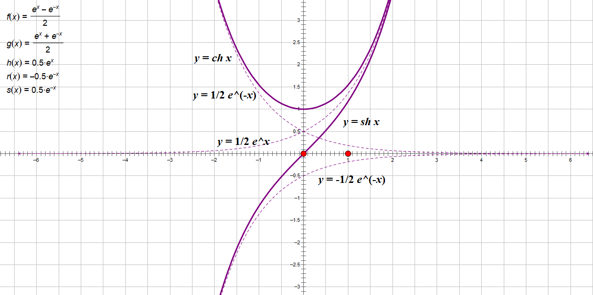

- [双曲函数](#双曲函数)
  - [双曲正弦](#双曲正弦)
  - [双曲余弦](#双曲余弦)
  - [双曲正切](#双曲正切)
  - [公式](#公式)
    - [证1](#证1)
    - [证2](#证2)
    - [证3](#证3)
    - [证4](#证4)
    - [证5](#证5)
    - [证6](#证6)
    - [证7](#证7)
  - [反双曲正弦](#反双曲正弦)

# 双曲函数

## 双曲正弦

$$
\let\sh=\sinh
$$

$\sh x = \frac{e^x - e^{-x}} 2$

- 定义域 $\R$
- 值域 $\R$
- 奇函数
- 过原点
- 单增
- 当 $x \rightarrow +\infty$ 时，图形在第一象限接近于曲线 $y=\frac 1 2 e^x$
- 当 $x \rightarrow -\infty$ 时，图形在第三象限接近于曲线 $y=-\frac 1 2 e^{-x}$

## 双曲余弦

$\ch x = \frac{e^x + e^{-x}} 2$

- 定义域 $\R$
- 值域 $[1,+\infty]$
- 偶函数
- 过 $(0,1)$
- 在 $(-\infty, 0)$ 单减
- 在 $(0, +\infty)$ 单增
- 当 $x \rightarrow +\infty$ 时，图形在第一象限接近于曲线 $y=\frac 1 2 e^x$
- 当 $x \rightarrow -\infty$ 时，图形在第二象限接近于曲线 $y=-\frac 1 2 e^{-x}$

## 双曲正切

$\th x = \frac {\sh x} {\ch x} = \frac{e^x-e^{-x}}{e^x + e^{-x}}$

- 定义域 $\R$
- 值域 $(-1, 1)$
- 奇函数
- 过原点
- 单增
- 当 $x \rightarrow +\infty$ 时，图形在第一象限接近于直线 $y=1$
- 当 $x \rightarrow -\infty$ 时，图形在第三象限接近于直线 $y=-1$

## 公式

1. $\sh(x+y) = \sh x \ch y + \ch x \sh y$
2. $\sh(x-y) = \sh x \ch y - \ch x \sh y$
3. $\ch(x+y) = \ch x \ch y + \sh x \sh y$
4. $\ch(x-y) = \ch x \ch y - \sh x \sh y$
5. $\ch^2 x - \sh^2 x = 1$
6. $\sh 2x = 2 \sh x \ch x$
7. $\ch 2x = \ch^2 x + \sh^2 x$

### 证1 

$\sh(x+y) = \sh x \ch y + \ch x \sh y$

$$
\begin{align}
& \kern12px \sh x \ch y + \ch x \sh y \\
& = \frac{e^x - e^{-x}} 2 \cdot \frac{e^y + e^{-y}} 2 + \frac{e^x + e^{-x}} 2 \cdot \frac{e^y - e^{-y}} 2 \\
& = \frac{e^{x+y} + e^{x-y} - e^{y-x} - e^{-(x+y)}} 4 + \frac{e^{x+y} - e^{x-y} + e^{y-x} - e^{-(x+y)}} 4 \\
& = \frac{e^{x+y} - e^{-(x+y)}} 2 \\
& = \sh(x+y)
\end{align}
$$

### 证2 

$\sh(x-y) = \sh x \ch y - \ch x \sh y$

$$
\begin{align}
& \kern12px \sh x \ch y - \ch x \sh y \\
& = \frac{e^x - e^{-x}} 2 \cdot \frac{e^y + e^{-y}} 2 - \frac{e^x + e^{-x}} 2 \cdot \frac{e^y - e^{-y}} 2 \\
& = \frac{e^{x+y} + e^{x-y} - e^{y-x} - e^{-(x+y)}} 4 - \frac{e^{x+y} - e^{x-y} + e^{y-x} - e^{-(x+y)}} 4 \\
& = \frac{e^{x-y} - e^{-(x-y)}} 2 \\
& = \sh(x-y)
\end{align}
$$

### 证3

$\ch(x+y) = \ch x \ch y + \sh x \sh y$

$$
\begin{align}
& \kern12px \ch x \ch y + \sh x \sh y \\
& = \frac{e^x + e^{-x}} 2 \cdot \frac{e^y + e^{-y}} 2 + \frac{e^x - e^{-x}} 2 \cdot \frac{e^y - e^{-y}} 2 \\
& = \frac{e^{x+y} + e^{x-y} + e^{y-x} + e^{-(x+y)}} 4 + \frac{e^{x+y} - e^{x-y} - e^{y-x} + e^{-(x+y)}} 4 \\
& = \frac{e^{x+y} + e^{-(x+y)}} 2 \\
& = \ch(x+y)
\end{align}
$$

### 证4

$\ch(x-y) = \ch x \ch y - \sh x \sh y$

$$
\begin{align}
& \kern12px \ch x \ch y - \sh x \sh y \\
& = \frac{e^x + e^{-x}} 2 \cdot \frac{e^y + e^{-y}} 2 - \frac{e^x - e^{-x}} 2 \cdot \frac{e^y - e^{-y}} 2 \\
& = \frac{e^{x+y} + e^{x-y} + e^{y-x} + e^{-(x+y)}} 4 - \frac{e^{x+y} - e^{x-y} - e^{y-x} + e^{-(x+y)}} 4 \\
& = \frac{e^{x-y} + e^{-(x-y)}} 2 \\
& = \ch(x-y)
\end{align}
$$

### 证5

$\ch^2 x - \sh^2 x = 1$

$$
\begin{align}
\ch^2 x - \sh^2 x & = \ch x \ch x - \sh x \sh x \\
& = \ch (x-x) \\
& = \ch 0 \\
& = 1
\end{align}
$$

### 证6

$\sh 2x = 2 \sh x \ch x$

$$
\begin{align}
\sh 2x & = \sh (x+x) \\
& = \sh x \ch x + \ch x \sh x \\
& = 2 \sh x \ch x
\end{align}
$$

### 证7

$\ch 2x = \ch^2 x + \sh^2 x$

$$
\begin{align}
\ch 2x & = \ch (x+x) \\
& = \ch x \ch x + \sh x \sh x \\
& = \ch^2 x + \sh^2 x
\end{align}
$$

## 反双曲正弦

$y=\arsh x = \ln(x+\sqrt{x^2+1})$

- 直接函数 $y=\sh x (x\in \R)$
- 定义域 $\R$
- 值域 $\R$
- 奇函数
- 过原点
- 单增

###