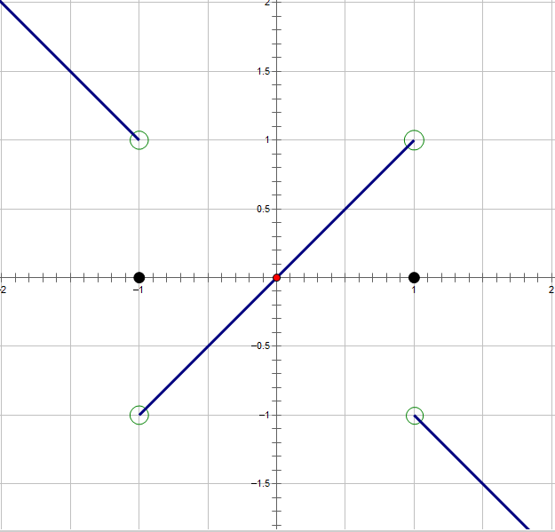

# 第一章函数与极限习题课

## 一、连续性问题

1. 讨论函数 $f(x) = \lim\limits_{n\rightarrow \infty}\frac{1-x^{2n}}{1+x^{2n}}x$ 的连续性.
   
   **解**

   1. 当 $|x| \lt 1$ 时
      
      $\lim\limits_{n\rightarrow \infty}x^{2n} = 0$

      $\lim\limits_{n\rightarrow \infty}\frac{1-x^{2n}}{1+x^{2n}} = \frac{1-0}{1+0} = 1$

      $f(x) = \lim\limits_{n\rightarrow \infty}\frac{1-x^{2n}}{1+x^{2n}}x = x$

   2. 当 $|x| = 1$ 时

      $\lim\limits_{n\rightarrow \infty}\frac{1-x^{2n}}{1+x^{2n}} = \frac{1-1}{1+1} = 0$

      $f(x) = \lim\limits_{n\rightarrow \infty}\frac{1-x^{2n}}{1+x^{2n}}x = 0$

   3. 当 $|x| \gt 1$ 时

      $\lim\limits_{n\rightarrow \infty}\frac{1-x^{2n}}{1+x^{2n}} = \frac{\frac 1 {x^{2n}} - 1}{\frac 1 {x^{2n}}+1} = -1$

      $f(x) = \lim\limits_{n\rightarrow \infty}\frac{1-x^{2n}}{1+x^{2n}}x = -x$
   
   综上，

   $$
   f(x) = \begin{cases}
   x & , |x| \lt 1, \\
   0 & , |x| = 1, \\
   -x & , |x| \gt 1
   \end{cases}
   $$

   函数图像如下.

   

   $\lim\limits_{x\rightarrow 1^+}f(x) =\lim\limits_{x\rightarrow 1^+}-x = -1$

   $\lim\limits_{x\rightarrow 1^-}f(x) = \lim\limits_{x\rightarrow 1^-}x = 1$

   $\lim\limits_{x\rightarrow -1^+}f(x) = \lim\limits_{x\rightarrow -1^+}x = -1$

   $\lim\limits_{x\rightarrow -1^-}f(x) = \lim\limits_{x\rightarrow -1^-}-x = 1$

   $\therefore x=1, x=-1$ 都是 $f(x)$ 的跳跃间断点，属于第一类间断点. 
   
   由初等函数的连续性，$f(x)$ 在 $(-\infty, -1), (-1, 1), (1,+\infty)$ 上连续.
   
2. 讨论 $f(x) = \frac 1{1-e^{\frac x{1-x}}}$ 的连续性

   **注意** 
   
   - $\lim\limits_{x\rightarrow +\infty}e^x = +\infty$
   - $\lim\limits_{x\rightarrow -\infty}e^x = 0$
   - $\lim\limits_{x\rightarrow 0^+}\arctan \frac 1 x = \frac \pi 2$
   - $\lim\limits_{x\rightarrow 0^-}\arctan \frac 1 x = -\frac \pi 2$
   - $\lim\limits_{x\rightarrow +\infty}arccot \kern2px x = 0$
   - $\lim\limits_{x\rightarrow -\infty}arccot \kern2px x = \pi$

   **解** 不连续的点为: 

   1. $1-x=0$ 即 $x=1$
   2. $1-e^\frac x{1-x}=0$ 即 $x=0$

   当 $x=1$ 时，

   $$
   \begin{align}
   \lim\limits_{x\rightarrow 1^+}f(x) & = \lim\limits_{x\rightarrow 1^+}\frac 1{1-e^{\frac x{1-x}}} \\
   & = \lim\limits_{x\rightarrow 1^+}\frac 1{1-0} \\
   & = 1
   \end{align}
   $$

   $$
   \begin{align}
   \lim\limits_{x\rightarrow 1^-}f(x) & = \lim\limits_{x\rightarrow 1^-}\frac 1{1-e^{\frac x{1-x}}} \\
   & = \lim\limits_{x\rightarrow 1^-}\frac 1 {-\infty} \\
   & = 0
   \end{align}
   $$

   $\therefore x=1$ 为 $f(x)$ 的跳跃间断点，属于第一类间断点

   当 $x=0$ 时，

   $$
   \begin{align}
   \lim\limits_{x\rightarrow 0}f(x) & = \lim\limits_{x\rightarrow 0}\frac 1{1-e^{\frac x{1-x}}} \\
   & = \lim\limits_{x\rightarrow 0}\frac 1{1-1} \\
   & = \infty
   \end{align}
   $$

   $\therefore x=0$ 为 $f(x)$ 的无穷间断点，属于第二类间断点.

   由初等函数的连续性，$f(x)$ 在 $(-\infty, 0), (0, 1), (1,+\infty)$ 上连续.

## 二、求极限

1. 求 $\lim\limits_{x\rightarrow 0}\frac{x^2\cos \sqrt{\sin x^2 + e^{\frac 1 x} + 1}}{1+x}$
   
   **解** “有界函数与无穷小的乘积是无穷小”

   $$
   \begin{align}
   \lim\limits_{x\rightarrow 0}\frac{x^2\cos \sqrt{\sin x^2 + e^{\frac 1 x} + 1}}{(1+x)\sin x} & = \lim\limits_{x\rightarrow 0}\frac{x^2}{(1+x) x} \cdot \cos \sqrt{\sin x^2 + e^{\frac 1 x} + 1} \\
   & = 0
   \end{align}
   $$

2. 求 $\lim\limits_{n\rightarrow \infty}n(e^\frac 1 n - 1)$
   
   **解** 

   $$
   \begin{align}
   \lim\limits_{n\rightarrow \infty}n(e^\frac 1 n - 1) & = \lim\limits_{n\rightarrow \infty}n \cdot \frac 1 n \\
   & = 1
   \end{align}
   $$

3. 求 $\lim\limits_{x\rightarrow 0}\frac {\ln(1-2\sin x)} {3x}$
   
   **解**

   $$
   \begin{align}
   \lim\limits_{x\rightarrow 0}\frac {\ln(1-2\sin x)} {3x} & = \lim\limits_{x\rightarrow 0} \frac{-2\sin x}{3x} \\
   & = -\frac 2 3
   \end{align}
   $$

4. 求 $\lim\limits_{x\rightarrow 0}(x^2\sin \frac 1 {x^2} + \frac{\sin 2x}x)$
   
   **解** “如果 $\lim f(x)=A, \lim g(x)=B$，那么 $\lim [f(x) \pm g(x)] = \lim f(x) \pm \lim g(x) = A \pm B$;”

   $$
   \begin{align}
   \lim\limits_{x\rightarrow 0}(x^2\sin \frac 1 {x^2} + \frac{\sin 2x}x) & = \lim\limits_{x\rightarrow 0}x^2\sin \frac 1 {x^2} + \lim\limits_{x\rightarrow 0}\frac{\sin 2x}x \\
   & = 0+\lim\limits_{x\rightarrow 0}\frac{\sin 2x}{2x} \cdot 2 \\
   & = 2
   \end{align}
   $$

5. 求 $\lim\limits_{x\rightarrow \infty}x(\sqrt{1+\sin \frac 2 x} - 1)$

   **解**

   $$
   \begin{align}
   \lim\limits_{x\rightarrow \infty}x(\sqrt{1+\sin \frac 2 x} - 1) & = \lim\limits_{x\rightarrow \infty} x \cdot \frac 1 2 \cdot \sin \frac 2 x \\
   & = \lim\limits_{x\rightarrow \infty} x \cdot \frac 1 2 \cdot \frac 2 x \\
   & = 1
   \end{align}
   $$

6. 求 $\lim\limits_{x\rightarrow 0}(\frac{1+\tan x}{1+\sin x})^{\frac 1 {x^3}}$
   
   **解** 非0的定型因子，即极限存在且不为0的因子，可以提前计算出来放一边，降低复杂度

   $$
   \begin{align}
   & \kern11px \lim\limits_{x\rightarrow 0}(\frac{1+\tan x}{1+\sin x})^{\frac 1 {x^3}} \\
   & = \lim\limits_{x\rightarrow 0}(\frac{1+\sin x - \sin x + \tan x}{1+\sin x})^{\frac 1 {x^3}} \\
   & = \lim\limits_{x\rightarrow 0}(1+\frac{\tan x - \sin x}{1+\sin x})^{\frac 1 {x^3}} \\
   & = \lim\limits_{x\rightarrow 0}e^{\frac{1}{x^3}\ln(1+\frac{\tan x - \sin x}{1+\sin x})} \\
   & = \lim\limits_{x\rightarrow 0}e^{\frac 1{x^3} \cdot \frac{\tan x - \sin x}{1+\sin x}} \\
   & = e^{\lim\limits_{x\rightarrow 0}\frac 1{1+\sin x} \cdot \frac{\tan x - \sin x}{x^3}} \\
   & = e^{\lim\limits_{x\rightarrow 0}\frac 1{1+\sin x} \cdot \lim\limits_{x\rightarrow 0}\frac{\tan x - \sin x}{x^3}} \\
   & = e^{1 \cdot \lim\limits_{x\rightarrow 0}\frac{\tan x(1-\cos x)}{x^3}} \\
   & = e^{\lim\limits_{x\rightarrow 0}\frac{x\cdot \frac 1 2 x^2}{x^3}} \\
   & = e^{\frac 1 2}
   \end{align}
   $$

7. 求 $\lim\limits_{x\rightarrow \frac \pi 4}(\tan x)^{\tan 2x}$
   
   **解1** 凑重要极限

   $$
   \begin{align}
   \lim\limits_{x\rightarrow \frac \pi 4}(\tan x)^{\tan 2x} & = \lim\limits_{x\rightarrow \frac \pi 4}(1+\tan x - 1)^{\frac{2\tan x}{1-\tan^2 x}} \\
   & = \lim\limits_{x\rightarrow \frac \pi 4}(1+\tan x - 1)^{\frac 1 {\tan x - 1} \cdot \frac {(\tan x - 1) \cdot 2\tan x}{(1+\tan x)(1-\tan x)}} \\
   & = \lim\limits_{x\rightarrow \frac \pi 4}e^{ \frac {- 2\tan x}{1+\tan x}} \\
   & = \lim\limits_{x\rightarrow \frac \pi 4}e^{-1} \\
   & = e^{-1}
   \end{align}
   $$

   **解2** 等价无穷小代换

   $$
   \begin{align}
   \lim\limits_{x\rightarrow \frac \pi 4}(\tan x)^{\tan 2x} & = \lim\limits_{x\rightarrow \frac \pi 4} e^{\tan 2x \ln \tan x} \\
   & = \lim\limits_{x\rightarrow \frac \pi 4}e^{\tan 2x \ln(1+\tan x - 1)} \\
   & = \lim\limits_{x\rightarrow \frac \pi 4}e^{\tan 2x \cdot (\tan x - 1)} \\
   & = \lim\limits_{x\rightarrow \frac \pi 4}e^{\frac {(2\tan x)(\tan x - 1)}{(1+\tan x)(1-\tan x)}} \\
   & = \lim\limits_{x\rightarrow \frac \pi 4}e^{\frac{-2\tan x}{1+\tan x}} \\
   & = e^{-1}
   \end{align}
   $$

8. 求 $\lim\limits_{n\rightarrow \infty}\frac{a^{\frac 1 n} - a^{\frac 1{n+1}}}{\frac 1 {n^2}}(a\gt 0)$
   
   **解**

   $$
   \begin{align}
   \lim\limits_{n\rightarrow \infty}\frac{a^{\frac 1 n} - a^{\frac 1{n+1}}}{\frac 1 {n^2}}(a\gt 0) & = \lim\limits_{n\rightarrow \infty} n^2 \cdot a^{\frac 1 {n+1}}(a^{\frac 1 n - \frac 1{n+1}} - 1) \\
   & = \lim\limits_{n\rightarrow \infty}a^{\frac 1{n+1}} \cdot \lim\limits_{n\rightarrow \infty}n^2 \cdot (a^{\frac 1{n^2+n}} - 1) \\
   & = \lim\limits_{n\rightarrow \infty} n^2 \cdot \frac 1{n^2+n} \cdot \ln a \\
   & = \ln a
   \end{align}
   $$

9. 设 $\lim\limits_{n\rightarrow \infty}\frac{n^\alpha}{n^\beta - (n-1)^\beta}=2010$，求 $\alpha, \beta$.
    
   **解**
   
   $$
   \begin{align}
   \lim\limits_{n\rightarrow \infty}\frac{n^\alpha}{n^\beta - (n-1)^\beta} & = \lim\limits_{n\rightarrow \infty}\frac{n^{\alpha - \beta}}{1-(1-\frac 1 n)^{\beta}} \\
   & = \lim\limits_{n\rightarrow \infty}\frac{n^{\alpha-\beta}}{-[(1+\frac {-1} n)^{\beta} - 1]} \\
   & = \lim\limits_{n\rightarrow \infty}\frac{n^{\alpha-\beta}}{-(\beta \cdot \frac {-1}n)} \\
   & = \lim\limits_{n\rightarrow \infty}\frac{n^{\alpha-\beta}}{\frac \beta n} \\
   & = \lim\limits_{n\rightarrow \infty}\frac{n^{\alpha-\beta + 1}}{\beta}
   \end{align}
   $$

   $$
   \implies
   \begin{cases}
   \alpha - \beta + 1 & = 0 \\
   \frac 1 \beta & = 2010
   \end{cases}
   $$

   $$
   \therefore \beta = \frac 1 {2010}, \alpha = -\frac {2009}{2010}
   $$
   

10. $\lim\limits_{x\rightarrow \infty}(\sqrt[3]{1+2x^2+x^3}-ax-b) = 0$, 求常数 $a, b$
    
    **解**

    $$
    \begin{align}
    \lim\limits_{x\rightarrow \infty}(\sqrt[3]{1+2x^2+x^3}-ax-b) & = \lim\limits_{x\rightarrow \infty}x(\sqrt[3]{\frac 1 {x^3} + \frac 2 x + 1} - a - \frac b x) = 0 \\
    \implies \lim\limits_{x\rightarrow \infty}(\sqrt[3]{\frac 1 {x^3} + \frac 2 x + 1} - a - \frac b x) & = 0 \\
    \implies 1-a & = 0 \\
    \implies a & = 1
    \end{align}
    $$

    那么 $\lim\limits_{x\rightarrow \infty}(\sqrt[3]{1+2x^2+x^3}-x-b) = 0$，

    $$
    \begin{align}
    b & = \lim\limits_{x\rightarrow \infty}(\sqrt[3]{1+2x^2+x^3}-x) \\
    & = \lim\limits_{x\rightarrow \infty}x(\sqrt[3]{1+(\frac x 2 + \frac 1 {x^3})} - 1) \\
    & = \lim\limits_{x\rightarrow \infty}x \cdot \frac 1 3 \cdot (\frac 2 x + \frac 1 {x^3}) \\
    & = \lim\limits_{x\rightarrow \infty} \frac 1 3 (2 + \frac 1 {x^2}) \\
    & = \frac 2 3
    \end{align}
    $$

    **注意** 
    
    一般地，若 $\lim\limits_{x\rightarrow \infty}(f(x) - ax - b) = 0$，则直线 $y=ax+b$ 称为函数 $y=f(x)$ 的**斜渐近线**.

    $$
    \begin{align}
    \lim\limits_{x\rightarrow \infty}(f(x) - ax - b) & = \lim\limits_{x\rightarrow \infty}x(\frac{f(x)} x - a - \frac b x) = 0 \\
    \implies \lim\limits_{x\rightarrow \infty}(\frac{f(x)} x - a - \frac b x) & = 0 \\
    \implies a & = \lim\limits_{x\rightarrow \infty}\frac{f(x)} x \\
    b & = \lim\limits_{x\rightarrow \infty}(f(x) - ax)
    \end{align}
    $$

    若 $a,b$ 这两个极限值存在，说明 $f(x)$ 在 $+\infty, -\infty$ 方向上都有同一条斜渐近线 $y=ax+b$。

    有时不要求两边同时有斜渐近线，即可能讨论 $x\rightarrow +\infty$ 或  $x\rightarrow -\infty$时， $f(x)$ 有斜渐近线 $y=ax+b$.
