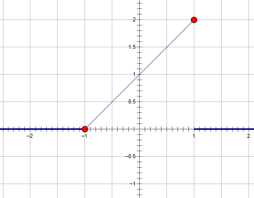
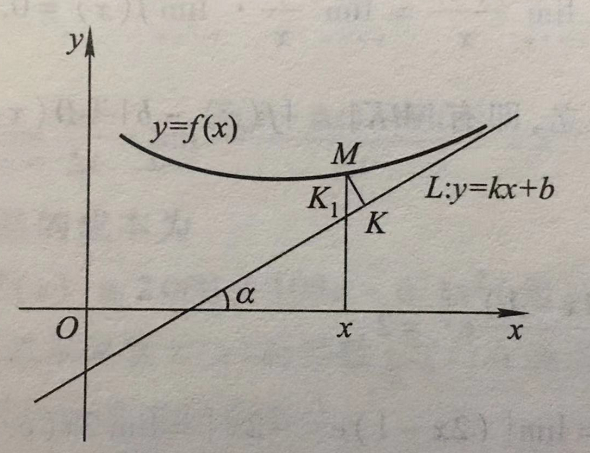
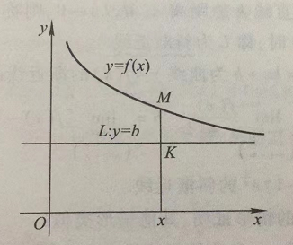

# 总习题一

1. 略
2. 略
3. 选择题
   
   (1) 设 $f(x)=2^x+3^x-2$，则当 $x\rightarrow 0$时，有( )

   $f(x)$ 与 $x$ 是同阶但非等价无穷小 

   **解**

$$
\begin{align}
\lim\limits_{x\rightarrow 0}\frac{2^x+3^x-2}x & = \lim\limits_{x\rightarrow 0}\frac{2^x-1}{x} + \lim\limits_{x\rightarrow 0}\frac{3^x-1}{x} \\
& = \ln 2 + \ln 3 \\
& = \ln 6
\end{align}
$$

   $\therefore$ 两者是同阶但非等价无穷小

   (2) 设 $f(x) = \frac{e^{\frac 1 x} - 1}{e^{\frac 1 x} + 1}$，则 $x=0$ 是 $f(x)$ 的（跳跃间断点）

   **解**

$$
\begin{align}
\lim\limits_{x\rightarrow 0^+}\frac{e^{\frac 1 x} - 1}{e^{\frac 1 x} + 1} & = \lim\limits_{x\rightarrow 0^+}\frac{1-e^{-\frac 1 x}}{1+e^{-\frac 1 x}} \\
& = \frac{1-0}{1+0} \\
& = 1 \\
\lim\limits_{x\rightarrow 0^-}\frac{e^{\frac 1 x} - 1}{e^{\frac 1 x} + 1} & = \frac{0-1}{0+1} \\
& = -1
\end{align}
$$

   $\therefore x=0$ 是 $f(x)$ 的跳跃间断点，属于第一类间断点

4. 设 $f(x)$ 的定义域是 $[0, 1]$，求（3） $f(\arctan x)$ 的定义域
   
   **解** $0\leqslant \arctan x \leqslant 1 \implies 0\leqslant x \leqslant \tan 1$

5. 略
6. 略
7. 略
8. $\forall \varepsilon \gt 0, \exists \delta \gt 0$，当 $0\lt |x-3| \lt \delta$ 时，注意 " $0\lt$ " 一定不能少，极限的定义要求去心邻域，极限在某点连续才可去掉 " $0\lt$ ".
9. 求下列极限
   
   (6) $\lim\limits_{x\rightarrow \frac \pi 4}(\sin x)^{\tan x}$

   **解**

$$
\begin{align}
\lim\limits_{x\rightarrow \frac \pi 2}(\sin x)^{\tan x} & = \lim\limits_{x\rightarrow \frac \pi 2} e^{\tan x \cdot \ln \sin x} \\
& = \lim\limits_{x\rightarrow \frac \pi 2}e^{\tan x \cdot \ln (1+\sin x - 1)} \\
& = \lim\limits_{x\rightarrow \frac \pi 2}e^{\tan x \cdot (\sin x - 1)} \\
而 \lim\limits_{x\rightarrow \frac \pi 2}\tan x \cdot (\sin x - 1) & = \lim\limits_{x\rightarrow \frac \pi 2}\sin x \cdot \frac{\sin x - \sin {\frac \pi 2}}{\sin (x+\frac \pi 2)} \\
& = \lim\limits_{x\rightarrow \frac \pi 2}\sin x \cdot \frac{2\sin(\frac{x-\frac \pi 2}2)\cos(\frac{x+\frac \pi 2}2)}{2\sin(\frac{x+\frac \pi 2}2)\cos(\frac{x+\frac \pi 2}2)} \\
& = \lim\limits_{x\rightarrow \frac \pi 2}\sin x \cdot \frac{\sin(\frac{x-\frac \pi 2}2)}{\sin(\frac{x+\frac \pi 2}2)} \\
& = 0 \cdot \frac{0}{1} \\
& = 0 \\
\therefore \lim\limits_{x\rightarrow \frac \pi 2}(\sin x)^{\tan x} & = e^{0} \\
& = 1
\end{align}
$$

10. 略
11. 设 $f(x)=\lim\limits_{n\rightarrow \infty}\frac{1+x}{1+x^{2n}}$，求 $f(x)$ 的间断点.
    
    **解**

    当 $|x| \lt 1$ 时， $\lim\limits_{n\rightarrow \infty}\frac{1+x}{1+x^{2n}}=1+x$;

    当 $|x| \gt 1$ 时， $\lim\limits_{n\rightarrow \infty}\frac{1+x}{1+x^{2n}}=\lim\limits_{n\rightarrow \infty}\frac{\frac 1 x + 1}{\frac 1 x + x^{2n-1}}=\frac{0+1}{0+\infty} = 0$;

    当 $x=-1$ 时， $\lim\limits_{n\rightarrow \infty}\frac{1+x}{1+x^{2n}}=\frac{1-1}{1+1} = 0$;

    当 $x=1$ 时， $\lim\limits_{n\rightarrow \infty}\frac{1+x}{1+x^{2n}}=\frac{1+1}{1+1} = 1$

$$
\therefore f(x) = 
\begin{cases}
1+x & , |x| \lt 1, \\
0 & , |x| \gt 1 或 x=-1, \\
1 & , x=1.
\end{cases}
$$

图形如下：

在 $x=-1$ 处， $\lim\limits_{x\rightarrow -1}f(x) = 0$，为连续点；

在 $x=1$ 处， $\lim\limits_{x\rightarrow 1^+}f(x) = 0, \lim\limits_{x\rightarrow 1^-}f(x) = 2$，为跳跃间断点，属于第一类间断点.

12. 题目说了要证明，就别求值了，老老实实用夹逼准则去证.
13. 略
14. 如果存在直线 $L:y=kx+b$，使得当 $x\rightarrow \infty$ 时，曲线 $y=f(x)$ 上的动点 $M(x,y)$ 到直线 $L$ 的距离 $d(M,L)\rightarrow 0$，则称 $L$ 为曲线 $y=f(x)$ 的渐近线. 当直线 $L$ 的斜率 $k\ne 0$ 时，称 $L$ 为斜渐近线.
    
    (1) 证明：直线 $L:y=kx+b$ 为曲线 $y=f(x)$ 的渐近线的充分必要条件是

    $k=\lim\limits_{x\rightarrow \infty}\frac{f(x)}{x}, b = \lim\limits_{x\rightarrow \infty}[f(x) - kx]$;

    (2) 求曲线 $y=(2x-1)e^{\frac 1 x}$ 的渐近线

    **解**

    (1) 

    1. 若 $x\rightarrow +\infty$
       
       设 $L:y=kx+b$ 为曲线 $y=f(x)$ 的渐近线.

       1. 若 $k\ne 0$

    如上图所示， $k=\tan \alpha$ ($\alpha$ 为 $L$ 的倾角, $\alpha \ne \frac \pi 2$)，曲线 $y=f(x)$ 上动点 $M(x,y)$ 到直线 $L$ 的距离为 $|MK|$. 过 $M$ 作横轴的垂线，交直线 $L$ 于点 $K_1$，则 $|MK_1| = \frac{|MK|}{\cos \alpha}$.

    显然 $|MK| \rightarrow 0(x\rightarrow +\infty)$ 与 $|MK_1|\rightarrow 0(x\rightarrow +\infty)$ 等价，而 $|MK_1| = |f(x) - (kx+b)|$.

    因为 $L:y=kx+b$ 是曲线 $y=f(x)$ 的渐近线，所以

    $|MK| \rightarrow 0(x\rightarrow +\infty) \implies |MK_1| \rightarrow 0(x\rightarrow +\infty)$

    即 
    
    $$
    \begin{align}
    \lim\limits_{x\rightarrow +\infty}[f(x)-(kx+b)] = 0 & ①
    \end{align}
    $$

    从而 

    $$
    \begin{align}
    \lim\limits_{x\rightarrow +\infty}[f(x)-kx] &= \lim\limits_{x\rightarrow +\infty}[f(x) - (kx+b)] = 0+b = b & ②\\
    \lim\limits_{x\rightarrow +\infty}\frac{f(x)}x &= \lim\limits_{x\rightarrow +\infty}\frac 1 x[f(x) - kx] + k = 0+k = k & ③
    \end{align}
    $$

    反之，若②，③成立，则①成立，即 $L:y=kx+b$ 是曲线 $y=f(x)$ 的渐近线.

1. 若 $k=0$

设 $L:y=b$ 是曲线 $y=f(x)$ 的水平渐近线，如上图. 按定义有 $|MK| \rightarrow 0(x\rightarrow +\infty)$，而 $|MK| = |f(x) - b|$，故有

$$
\begin{align}
\lim\limits_{x\rightarrow +\infty}f(x) &= b & ④ \\
\lim\limits_{x\rightarrow +\infty}\frac{f(x)}x & = \lim\limits_{x\rightarrow +\infty} \frac 1 x \cdot \lim\limits_{x\rightarrow +\infty}f(x) = 0+b = 0 & ⑤
\end{align}
$$

反之，若④、⑤成立，即有 $|MK| = |f(x) - b| = \rightarrow 0(x\rightarrow +\infty)$，故 $y=b$ 是曲线 $y=f(x)$ 的水平渐近线.

1. 若 $x\rightarrow -\infty$

设 $L:y=kx+b$ 为曲线 $y=f(x)$ 的渐近线.

1. 若 $k\ne 0$

2. 若 $k=0$

