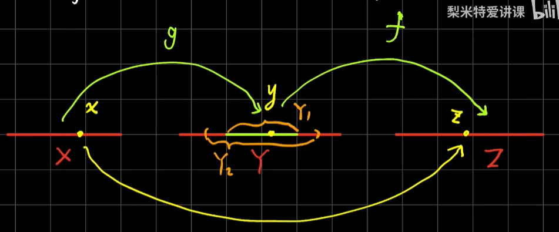
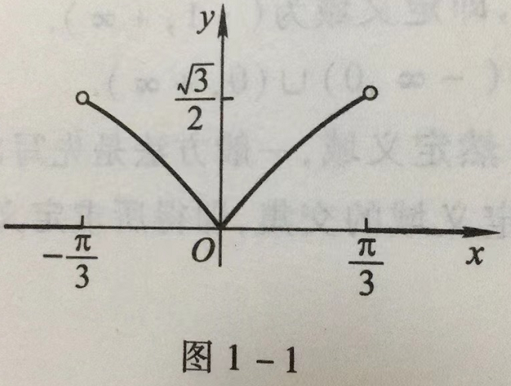
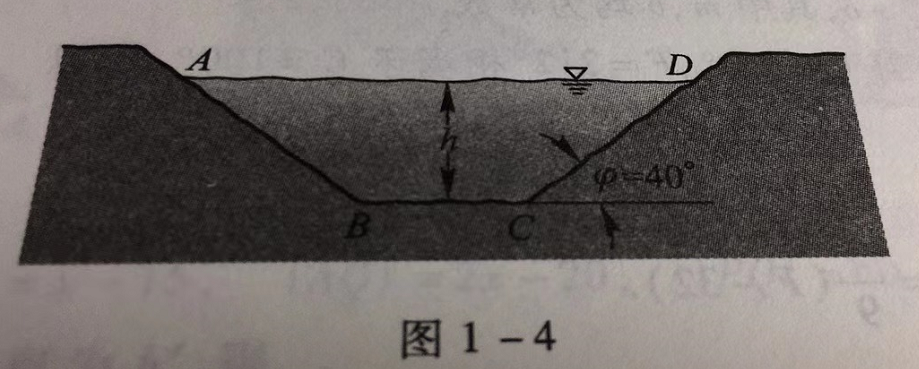
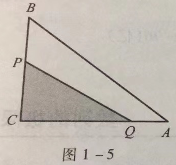
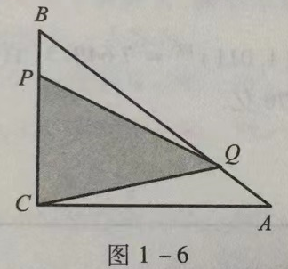
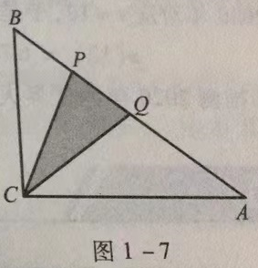

- [第一章 函数与极限](#第一章-函数与极限)
  - [一、映射](#一映射)
    - [1.1 映射概念](#11-映射概念)
      - [1.1.1 定义](#111-定义)
      - [1.1.2 注意](#112-注意)
      - [1.1.3 单射，满射，一一映射](#113-单射满射一一映射)
    - [1.2 逆映射与复合映射](#12-逆映射与复合映射)
      - [1.2.1 逆映射](#121-逆映射)
        - [定义](#定义)
        - [注意](#注意)
      - [1.2.2 复合映射](#122-复合映射)
  - [二、函数](#二函数)
    - [2.1 函数的概念](#21-函数的概念)
      - [2.1.1 定义](#211-定义)
      - [2.1.2 注意](#212-注意)
      - [2.1.3 函数的图形](#213-函数的图形)
      - [2.1.4 注意](#214-注意)
      - [2.1.5 几个重要函数](#215-几个重要函数)
    - [2.2 函数的几种特性](#22-函数的几种特性)
      - [2.2.1 函数的有界性](#221-函数的有界性)
      - [2.2.2 函数的单调性](#222-函数的单调性)
      - [2.2.3 函数的奇偶性](#223-函数的奇偶性)
      - [2.2.4 函数的周期性](#224-函数的周期性)
  - [习题1-1 映射与函数](#习题1-1-映射与函数)

# 第一章 函数与极限

## 一、映射

### 1.1 映射概念

#### 1.1.1 定义

设 $X、Y$是两个非空集合，如果存在一个法则 $f$，使得对 $X$ 中的每个元素 $x$，按对应法则 $f$，在 $Y$ 中有唯一确定的元素 $y$ 与之对应，那么称 $f$ 为从 $X$ 到 $Y$ 的映射，记作

$$
f:X\rightarrow Y
$$

其中 $y$ 称为元素 $x$ (在映射 $f$ 下的像)，并记作 $f(x)$，即

$$
y = f(x)
$$

而元素 $x$ 称为元素 $y$ (在映射 $f$ 下) 的一个原象；集合 $X$ 称为映射 $f$ 的定义域 (Domain)，记作 $D_f$，即 $D_f = X$； $X$ 中所有元素的像所组成的集合称为映射 $f$ 的值域 (Range)，记作 $R_f$ 或 $f(X)$，即

$$
R_f = f(X) = \lbrace f(x) | x \in X\rbrace
$$

#### 1.1.2 注意

1. $X、Y$ 不一定是数集
2. 映射的三要素：定义域、值域、对应法则

#### 1.1.3 单射，满射，一一映射

设有映射 $f:X\rightarrow Y$：

1. 若 $R_f = Y$，则称 $f$ 为满射
2. 若对 $x_1, x_2 \in X$，当 $x_1 \ne x_2$ 时，有 $f(x_1) \ne f(x_2)$，则称 $f$ 为单射
3. 既是单射又是满射的映射，称为一一映射（或双射）

### 1.2 逆映射与复合映射

#### 1.2.1 逆映射

##### 定义
设有单射 $f:X\rightarrow Y$，定义新映射 $f^{-1}:R_f \rightarrow X$ 为：对每个 $y\in R_f$， $y$ 在 $f^{-1}$ 之下的像就是 $x$。这里 $x, y$ 满足 $y=f(x)$，称 $f^{-1}$ 为 $f$ 的逆映射。

##### 注意

1. $f^{-1}$ 的定义域是 $f$ 的值域 $R_f$
2. $f^{-1}$ 的值域是 $f$ 的定义域 $D_f = X$

#### 1.2.2 复合映射

设有两个映射

$g:X\rightarrow Y_1, \kern5em f:Y_2 \rightarrow Z$

其中 $Y_1 \subset Y_2$，则由映射 $g$ 和 $f$ 可以定义出一个从 $X$ 到 $Z$ 的对应法则，它将每个 $x\in X$ 映射成 $f[g(x)] \in Z$。显然，这个对应法则确定了一个从 $X$ 到 $Z$ 的映射，这个映射称为映射 $g$ 和 $f$ 构成的复合映射，记作 $f\circ g: X \rightarrow Z, (f\circ g)(x) = f[g(x)], x \in X$

## 二、函数

### 2.1 函数的概念

#### 2.1.1 定义

设**数集** $D\subset \R$，则称映射 $f:D\rightarrow \R$ 为定义在 $D$ 上的函数，通常简记为 

$$
y=f(x), x\in D
$$

其中 $x$ 称为自变量， $y$ 称为因变量， $D$ 称为定义域，记作 $D_f$，即 $D_f = D$

#### 2.1.2 注意

1. 函数的两要素：定义域，对应法则
2. 定义域分为
   1. 自然定义域，如 $y=\ln x$ 自然表明 $x \gt 0$
   2. 实际问题定义域，如自由落体运动，落地时刻为 $T$， $s = \frac 1 2 gt^2, t \in [0, T]$

#### 2.1.3 函数的图形

$\lbrace P(x,y) | y=f(x), x \in D\rbrace$

#### 2.1.4 注意

$y=f(x)$ 在 $D$ 上为单调函数 $\implies$ 映射 $y=f(x)$ 为单射

#### 2.1.5 几个重要函数

1. 常值函数

    $y=c, D = \R, R_f = \lbrace c\rbrace$

2. 绝对值函数

    $$
    y=|x|=
    \begin{cases}
    -x, & x \lt 0 \\
    x, & x \geqslant 0
    \end{cases}, 
    D = \R, R_f = [0, +\infty)
    $$

3. 符号函数

    $$
    y=sgn x = 
    \begin{cases}
    -1, & x\lt 0, \\
    0, & x = 0, \\
    1, & x \gt 0
    \end{cases},
    D = \R, R_f = \lbrace-1, 0, 1\rbrace
    $$

    $|x| = sgn x \cdot x$

4. 取整函数

    $y=[x], D=\R, R_f = \Z$

    $x-1 \lt [x] \leqslant x \lt [x+1]$

### 2.2 函数的几种特性

#### 2.2.1 函数的有界性

**定义** 设函数 $f(x)$ 的定义域为 $D$，数集 $X\subset D$。

如果存在数 $K_1$，使得

$$
f(x) \leqslant K_1
$$

对任一 $x\in X$ 都成立，那么称函数 $f(x)$在 $X$ 上有**上界**，而 $K_1$ 称为函数 $f(x)$在 $X$ 上的一个上界。

如果存在 $K_2$，使得

$$
f(x) \geqslant K_2
$$
 
对任一 $x\in X$ 都成立，那么称函数 $f(x)$在 $X$ 上有**下界**，而 $K_2$ 称为函数 $f(x)$在 $X$ 上的一个下界。

**注意** 上界、下界不是唯一的

如果存在正数 $M$，使得

$$
|f(x)| \leqslant M
$$

对任一 $x\in X$ 都成立，那么称函数 $f(x)$ 在 $X$ 上**有界**。

如果这样的 $M$ 不存在，就称函数 $f(x)$ 在 $X$ 上**无界**

$f(x)$ 在 $X$ 上无界 $\iff$ $\forall x \in X, \exists M \gt 0, 使得 |f(x)| \gt M$

$f(x)$ 在 $X$ 上有界 $\iff$ $\forall x \in X, \exists M \gt 0, 使得 |f(x)| \leqslant M$

**必要性证明**

设 $f(x)$ 在 $X$ 上有界，则 $\exists K_1, K_2 \in \R$，使得 $K_1 \leqslant f(x) \leqslant K_2$。 $\forall x \in X$，取 $M = \max \lbrace |K_1|, |K_2| \rbrace$，则 $K_2 \leqslant |K_2| \leqslant M, K_1 \geqslant -|K_1| \geqslant -M$，即 $-M \leqslant K_1 \leqslant f(x) \leqslant K_2 \leqslant M$，从而 $|f(x)| \leqslant M$。

**充分性证明**

设 $\forall x \in X$，有 $|f(x) \leqslant M$，则 $-M \leqslant f(x) \leqslant M$，取 $K_1 = -M, K_2 = M$, 则 $f(x) \geqslant K_1$，有下界； $f(x) \leqslant K_2$，有上界。所以 $f(x)$ 既有上界又有下界，即 $f(x)$ 有界。

**注意** 说函数是否有界，一定是对于某个区间来说明的，可能该函数在某区间无界，但在另一个区间有界。

#### 2.2.2 函数的单调性

设函数 $f(x)$的定义域为 $D$，区间 $I\subset D$。

如果对于区间 $I$ 上任意两点 $x_1, x_2$，当 $x_1 \lt x_2$时，恒有 $f(x_1) \lt f(x_2)$，那么称函数 $f(x)$ 在区间 $I$ 上是**单调增加**的；

如果对于区间 $I$ 上任意两点 $x_1, x_2$，当 $x_1 \lt x_2$时，恒有 $f(x_1) \gt f(x_2)$，那么称函数 $f(x)$ 在区间 $I$ 上是**单调减少**的；

单调增加和单调减少的函数统称为**单调函数**。

#### 2.2.3 函数的奇偶性

设函数 $f(x)$的定义域 $D$ **关于原点对称**。

如果对任意 $x\in D$，有 $f(-x) = f(x)$，那么称函数 $f(x)$为**偶函数**；

如果对任意 $x\in D$，有 $f(-x) = -f(x)$，那么称函数 $f(x)$为**奇函数**。

**注意**

1. 若 $f(x)$ 为奇函数且在 0 处有定义，则 $f(0) = 0$
2. 常值函数是偶函数（对称区间）

#### 2.2.4 函数的周期性

设函数 $f(x)$ 的定义域为 $D$。如果存在一个正整数 $l$，使得对于任一 $x\in D$有 $(x+l) \in D$，且 $f(x+l) = f(x)$恒成立，那么称 $f(x)$为**周期函数**， $l$ 称为函数 $f(x)$的**周期**，通常我们说周期函数的周期是指**最小正周期**。

**注意**

1. 若 $f(x)$ 的周期为 $T$，则 $f(kx)(k \in \Z)$的周期为 $\frac T k$
2. 若 $f(x)$的周期为 $T_1$, 函数 $g(x)$ 的周期为 $T_2$，则 $f(x)+g(x)$ 的周期为 $T_1, T_2$ 的最小公倍数

**不是所有周期函数都有最小正周期**

如狄利克雷(Dirichlet)函数

$$
D(x)=
\begin{cases}
1, & x \in Q, \\
0, & x \in Q^C
\end{cases}
$$

## 习题1-1 映射与函数

1. 求下列函数的自然定义域：

    (1) $y=\sqrt{3x+2}$; (2) $y=\frac{1}{1-x^2}$; 

    (3) $y=\frac{1}{x}-\sqrt{1-x^2}$; (4) $y=\frac{1}{\sqrt{4-x^2}}$; 

    (5) $y=\sin \sqrt x$ ; (6) $y=\tan (x+1)$; 

    (7) $y=\arcsin (x-3)$; (8) $y=\sqrt {3-x} + \arctan \frac 1 x$;

    (9) $y=\ln (x+1)$; (10) $y=e^{\frac 1 x}$.

    **解**：(1) $3x+2 > 0 \implies x \geqslant -\frac 2 3$，即定义域为 $[-\frac 2 3, +\infty)$.

    (2) $1-x^2 \ne 0 \implies x \ne \pm 1$，即定义域为 $(-\infty, -1) \cup (-1,1) \cup (1,+\infty)$.

    (3) $x \ne 0 且 1-x^2 \geqslant 0 \implies x \ne 0 且 |{x^2}| \leqslant 1$，即定义域为 $[-1, 0) \cup (0, 1]$.

    (4) $4-x^2 \gt 0 \implies |x| < 2$，即定义域为 $(-2, 2)$.

    (5) $x \geqslant 0$，即定义域为 $[0, +\infty)$.

    (6) $x+1 \ne k\pi + \frac \pi 2(k \in Z)$，即定义域为 $\{x | x \in R 且 x \ne (k+\frac 1 2) \pi - 1, k \in Z \}$.

    (7) $|x-3| \leqslant 1 \implies 2 \leqslant x \leqslant 4$，即定义域为 $[-2,2]$.

    (8) $3-x \geqslant 0 且 x \ne 0$，即定义域为 $(-\infty, 0) \cup (0, 3]$.

    (9) $x+1 \gt 0 \implies x \gt -1$，即定义域为 $(-1, +\infty)$.

    (10) $x \ne 0$, 即定义域为 $(-\infty, 0) \cup (0, +\infty)$.

    注 本题是求函数的自然定义域，一般方法是先写出构成所求函数的个个简单函数的定义域，再求出这些定义域的交集，即得所求定义域。下列简单函数及其定义域是经常用到的：

    * $y=\frac{Q(x)}{P(x)}, P(x) \ne 0$
    * $y=\sqrt[2n]{x}, x \geqslant 0$
    * $y=\log_a x, x \gt 0$
    * $y=\tan x, x \ne (k+\frac 1 2)\pi, k \in Z$
    * $y=\cot x, x \ne k\pi, k \in Z$
    * $y=\arcsin x, |x| \leqslant 1$
    * $y=\arccos x, |x| \leqslant 1$

2. 下列各题中，函数 $f(x)$ 和 $g(x)$ 是否相同？为什么？

    (1) $f(x)=\lg x^2, g(x)=2 \lg x$;
    (2) $f(x)=x, g(x)=\sqrt{x^2}$;
    (3) $f(x)=\sqrt[3]{x^4-x^3}, g(x)=x \sqrt[3]{x-1}$;
    (4) $f(x)=1, g(x)=\sec ^2 x - \tan ^2 x$.

    **解**：(1) 不同，因为定义域不同。

    (2) 不同，因为对应法则不同， 

    $$
    g(x)= \sqrt{x^2}= 
    \begin{cases} 
    x, & x \geqslant 0, \\
    -x, & x \lt 0.
    \end{cases}
    $$

    (3) 相同，因为定义域、对应法则均相同。

    (4) 不同，因为定义域不同。

3. 设

    $$
    \varphi (x) = 
    \begin{cases}
        |\sin x| &\text{, } |x| < \frac \pi 3, \\
        0 &\text{, } |x| \geqslant \frac \pi 3,
    \end{cases}
    $$

    求 $\varphi(\frac{\pi}{6})$, $\varphi(\frac{\pi}{4})$, $\varphi(-\frac{\pi}{4})$, $\varphi(-2)$，并作出函数 $y=\varphi(x)$的图形。

    **解**： $\varphi(\frac \pi 6)=|sin(\frac \pi 6)|=\frac{1}{2}$, $\varphi(\frac \pi 4)=|sin(\frac \pi 4)=\frac{\sqrt{2}}{2}$, $\varphi(-\frac{\pi}{4})=|sin(-\frac{\pi}{4})|=\frac{\sqrt{2}}{2}$, $\varphi(-2)=0$ .

    $y=\varphi (x)$ 的图形如图1-1所示。

    

4. 试证下列函数在指定区间内的单调性：

    (1) $y=\frac{x}{1-x}, (-\infty, 1)$;

    (2) $y=x+\ln{x}, (0, +\infty)$.

    **证**：

    (1) $y=f(x)=-1+\frac{1}{1-x}$。

    设 $x_1 \lt x_2 \lt 1$，因为：

    $f(x_2)-f(x_1)=\frac{1}{1-x_2}-\frac{1}{1-x_1}=\frac{x_2-x_1}{(1-x_1)(1-x_2)}>0$,

    所以 $f(x_2) > f(x_1)$，即 $f(x)$ 在 $(0,+\infty)$ 内单调增加。

    (2) $y=f(x)=x+\ln x, (0,+\infty)$,

    设 $0 < x_1 < x_2$ 。因为：

    $f(x_2)-f(x_1)=x_2+\ln x_2 - x_1 - \ln x_1 = x_2 - x_1 - \ln \frac{x_2}{x_1}>0$ ,

    所以 $f(x_2)>f(x_1)$，即 $f(x)$ 在 $(0,+\infty)$ 内单调增加。

5. 设 $f(x)$ 为定义在 $(-l,l)$ 内的奇函数，若 $f(x)$ 在 $(0,l)$ 内单调增加，证明 $f(x)$ 在 $(-l,0)$ 内也单调增加。

    **证**：设 $-l < x_1 < x_2 < 0$，则 $0 < -x_2 < -x_1 < l$，由于 $f(x)$ 是奇函数，得 $f(x_2) - f(x_1) = -f(-x_2) + f(-x_1)$。因为 $f(x)$ 在 $(0,l)$ 内单调增加，所以 $f(-x_1)-f(-x_2) > 0$，从而 $f(x_2)>f(x_1)$，即 $f(x)$ 在 $(-l,0)$ 内也单调增加。

6. 设下面所考虑的函数都是定义在区间 $(-l,l)$ 上的。证明：

    (1) 两个偶函数的和是偶函数，两个奇函数的和是奇函数；
    (2) 两个偶函数的乘积是偶函数，两个奇函数的乘积是偶函数，偶函数与奇函数的乘积是奇函数。

    **证**：(1) 设 $f_1(x),f_2(x)$ 均为偶函数，则 $f_1(-x)=f_1(x),f_2(-x)=f_2(x)$ 。令 $F(x)=f_1(x)+f_2(x)$，于是

    $$
    F(-x)=f_1(-x)+f_2(-x)=f_1(x)+f_2(x)=F(x),
    $$

    故 $F(x)$ 为偶函数。

    设 $g_1(x), g_2(x)$ 均为奇函数，则 $g_1(-x)=-g_1(x), g_2(-x)=-g_2(x)$，令 $G(x)=g_1(x)+g_2(x)$，于是：

    $$
    G(-x) = g_1(-x) + g_2(-x) = -g_1(x) - g_2(x) = -G(x)
    $$

    故 $G(x)$ 为奇函数。

    (2) 设 $f_1(x), f_2(x)$ 均为偶函数，则 $f_1(-x)=f_1(x), f_2(-x)=f_x(x)$。令 $F(x)=f_1(x)\cdot f_2(x)$，于是：

    $$
    F(-x)=f_1(-x)\cdot f_2(-x)=f_1(x)\cdot f_2(x)=F(x)
    $$

    故 $F(x)$ 为偶函数。

    设 $g_1(x), g_2(x)$ 均为奇函数，则 $g_1(-x)=-g_1(x), g_2(-x)=-g_2(x)$，令 $G(x)=g_1(x)\cdot g_2(x)$，于是：

    $$
    G(-x) = g_1(-x)\cdot g_2(-x)=[(-g_1(x))\cdot (-g_2(x))]=g_1(x)\cdot g_2(x)=G(x)
    $$

    故 $G(x)$ 为偶函数。

    设 $f(x)$ 为偶函数， $g(x)$ 为奇函数，则 $f(-x)=f(x), g(-x)=-g(x)$，令 $H(x)=f(x)\cdot g(x)$，于是：

    $$
    H(-x)=f(-x)\cdot g(-x)=f(x)\cdot [-g(x)]=-f(x)\cdot g(x)=-H(x)
    $$

    故 $H(x)$ 为奇函数。

7. 下列函数中哪些是偶函数，哪些是奇函数，哪些既非偶函数又非奇函数？

    (1) $y=x^2(1-x^2)$; (2) $y=3x^2-x^3$; (3) $y=\frac{1-x^2}{1+x^2}$; (4) $y=x(x-1)(x+1)$; (5) $y=\sin x - \cos x + 1$; (6) $y=\frac{a^x+a^{-x}}{2}$.

    **解**：(1) $y=f(x)=x^2(1-x^2)$，因为 $f(-x)=(-x)^2[1-(-x)^2]=x^2(1-x^2)=f(x)$，所以 $f(x)$ 为偶函数。

    (2) $y=f(x)=3x^2-x^3$, 因为 $f(-x)=3(-x)^2-(-x)^3=3x^2+x^3, f(-x)\ne f(x) 且 f(-x)\ne -f(x)$，所以 $f(x)$ 既非偶函数又非奇函数。

    (3) $y=f(x)=\frac{1-x^2}{1+x^2}$，因为 $f(-x)=\frac{1-(-x)^2}{1+(-x)^2}=\frac{1-x^2}{1+x^2}=f(x)$，所以 $f(x)$ 为偶函数。

    (4) $y=f(x)=x(x-1)(x+1)$，因为 $f(-x)=(-x)(-x-1)(-x+1)=-x(x+1)(x-1)=-f(x)$，所以 $f(x)$ 为奇函数。

    (5) $y=f(x)=\sin x - \cos x + 1$，因为 $f(-x)=\sin (-x) - \cos (-x) + 1=- \sin x - \cos x + 1, f(-x) \ne f(x) 且 f(-x) \ne -f(x)$，所以 $f(x)$ 既非偶函数又非奇函数。

    (6) $y=f(x)=\frac{a^x+a^{-x}}{2}$，因为 $f(-x)=\frac{a^{-x}+a^x}{2}=f(x)$，所以 $f(x)$ 为偶函数。

8. 下列各函数中哪些是周期函数？对于周期函数，指出其周期：

    (1) $y=\cos(x-2)$; (2) $y=\cos 4x$;
    (3) $y=1+\sin{\pi x}$; (4) $y=x\cos x$; (5) $y=\sin ^2 x$.

    **解**：(1) 是周期函数，周期 $l=2 \pi$.

    (2) 是周期函数，周期 $l=\frac \pi 2$.

    (3) 是周期函数，周期 $l=2$.

    (4) 不是周期函数.

    (5) 是周期函数，周期 $l=\pi$.

9. 求下列函数的反函数：

    (1) $y=\sqrt[3]{x+1}$; 

    (2) $y=\frac{1-x}{1+x}$; 

    (3) $y=\frac{ax+b}{cx+d}, (ad-bc \ne 0)$; 

    (4) $y=2\sin{3x}, (-\frac \pi 6 \leqslant x \leqslant \frac \pi 6)$;

    (5) $y=1+\ln(x+2)$;

    (6) $y=\frac{2^x}{2^x+1}$.

    **分析** 函数 $f$ 存在反函数的前提条件为： $f:D \to f(D)$ 是单射。本题中所给出的各函数易证均为单射，特别(1) 、(4) 、(5) 、(6) 中的函数均为单调函数，故都存在反函数。

    **解** (1) 由 $y=\sqrt[3]{x+1}$ 解得 $x=y^3-1$，即反函数为 $y=x^3-1$.

    (2) 由 $y=\frac{1-x}{1+x}$ 解得 $x=\frac{1-y}{1+y}$，即反函数为 $y=\frac{1-x}{1+x}$.

    (3) 由 $y=\frac{ax+b}{cx+d}$ 解得 $x=\frac{-dy+b}{cy-a}$，即反函数为 $y=\frac{-dx+b}{cx-a}$.

    (4) 由 $y=2\sin{3x}, (-\frac \pi 6 \leqslant x \leqslant \frac \pi 6)$ 解得 $x=\frac 1 3 \arcsin {\frac y 2}$，即反函数为 $y=\frac 1 3 \arcsin \frac x 2$.

    (5) 由 $y=1+\ln(x+2)$ 解得 $x=e^{y-1}-2$，即反函数为 $y=e^{x+1}-2$.

    (6) 由 $y=\frac{2^x}{2^x+1}$ 解得 $x=\log_2{\frac{y}{1-y}}$，即反函数为 $y=\log_2{\frac{x}{1-x}}$.

10. 设函数 $f(x)$ 在数集 $X$ 上有定义，试证：函数 $f(x)$ 在 $X$ 上有界的充分必要条件是它在 $X$ 上既有上界又有下界。

    **解** 设 $f(x)$ 在 $X$ 上有界，即存在 $M \gt 0$，使得

    $$
    |f(x)| \leqslant M, x \in X,
    $$

    故

    $$
    -M \leqslant f(x) \leqslant M, x \in X,
    $$

    即 $f(x)$ 在 $X$ 上有上界 $M$, 下界 $-M$。

    反之，设 $f(x)$ 在 $X$ 上有上界 $K_1$, 下界 $K_2$，即

    $$
    K_2 \leqslant f(x) \leqslant K_1, x \in X,
    $$

    取 $M=max||K_1|, |K_2||$，则有

    $$
    |f(x)| \leqslant M, x \in X,
    $$

    即 $f(x)$ 在 $X$ 上有界。

11. 在下列各题中，求所给函数构成的复合函数，并求这函数分别对应于给定自变量值 $x_1, x_2$ 的函数值：

    (1) $y=u^2, u=\sin x, x_1=\frac \pi 6, x_2=\frac \pi 3$;

    (2) $y=\sin u, u=2x, x_1=\frac \pi 8, x_2=\frac \pi 4$;

    (3) $y=\sqrt u, u=1+x^2, x_1=1, x_2=2$;

    (4) $y=e^u, u=x^2, x_1=0, x_2=1$;

    (5) $y=u^2, u=e^x, x_1=1, x_2=-1$;

    **解**

    (1) $y=\sin^2 x, y_1=\frac 1 4, y_2=\frac 3 4$.

    (2) $y=\sin 2x, y_1=\frac{\sqrt 2}{2}, y_2=1$.

    (3) $y=\sqrt{1+x^2},y_1=\sqrt 2, y_2=\sqrt 5$.

    (4) $y=e^{x^2}, y_1=1, y_2=e$.

    (5) $y=e^{2x}, y_1=e^2, y_2=e^{-2}$.

12. 设 $f(x)$ 的定义域 $D=[0,1]$，求下列各函数的定义域：

    (1) $f(x^2)$; 

    (2) $f(\sin x)$; 

    (3) $f(x+a), (a \gt 0)$;

    (4) $f(x+a)+f(x-a), (a \gt 0)$;

    **解** 

    (1) $0 \leqslant x^2 \leqslant 1 \implies x \in [-1, 1]$.

    (2) $0 \leqslant \sin x \leqslant 1 \implies x \in [2n\pi, (2n+1)\pi], n \in Z$.

    (3) $0 \leqslant x+a \leqslant 1 \implies x \in [-a, 1-a]$.

    (4) 

    $$
    \begin{cases}
    0 \leqslant x+a \leqslant 1, \\
    0 \leqslant x-a \leqslant 1.
    \end{cases}
    \implies 当0 \lt a \leqslant \frac 1 2 时，x \in [a, 1-a]; 
    当 a \gt \frac 1 2 时，定义域为 \varnothing
    $$

13. 设

    $$
    f(x)=
    \begin{cases}
    1, & |x| \lt 1, \\
    0, & |x| = 1, g(x)=e^x, \\
    -1, & |x| \gt 1,
    \end{cases}
    $$

    求 $f[g(x)]$ 和 $g[f(x)]$, 并作出这两个函数的图形.

    **解**

    $$
    f[g(x)]=f(e^x)=\begin{cases}
    1, & x \lt 0, \\
    0, & x=0, \\
    -1, & x \gt 0.
    \end{cases}
    $$

    $$
    g[f(x)]=e^{f(x)}=\begin{cases}
    e, & |x| \lt 1, \\
    1, & |x| = 1, \\
    e^{-1}, & |x| \gt 1.
    \end{cases}
    $$

    $f[g(x)]$ 和 $g[f(x)]$ 的图形依次如图1-2，图1-3 所示。

    

14. 已知水渠的横断面为等腰梯形，斜角 $\varphi=40\degree$ (图1-4)。当过水断面 $ABCD$ 的面积为定值 $S_0$ 时，求湿周 $L(L=AB+BC+CD)$ 与水深 $h$ 之间的函数关系式，并指明其定义域。

    

    **解**

    $$
    AB=CD=\frac{h}{\sin{40\degree}},
    $$

    又

    $$
    S_0=\frac{1}{2}h[BC+(BC+2\cot{40\degree} \cdot h)],
    $$

    得

    $$
    BC=\frac{S_0}{h}-\cot{40\degree}\cdot h,
    $$

    所以

    $$
    L=\frac{S_0}{h} + \frac{2- \cos {40 \degree}}{\sin{40\degree}} \cdot h,
    $$

    而 $h \gt 0 且 BC \gt 0 即 \frac{S_0}{h}-\cot{40\degree} \gt 0$，因此湿周函数的定义域为 $(0, \sqrt{S_0 \tan{40\degree}})$.

15. 设 $xOy$ 平面上有正方形 $D=\{(x,y)|0 \leqslant x \leqslant 1, 0 \leqslant y \leqslant 1\}$ 及直线 $l:x+y=t(t \geqslant 0)$. 若 $S(t)$ 表示正方形 $D$ 位于直线 $l$ 左下方部分的面积，试求 $S(t)$ 与 $t$ 之间的函数关系。

    **解**

    当 $0\leqslant t \leqslant 1$ 时， $S(t)=\frac{1}{2}t^2$,

    当 $1\lt t \leqslant 2$ 时， $S(t)=1-\frac{1}{2}(2-t)^2=-\frac{1}{2}t^2+2t-1$,

    当 $t \gt 2$ 时， $S(t)=1$.

    故

    $$
    S(t)=
    \begin{cases}
    \frac{1}{2}t^2, & 0\leqslant t \leqslant 1,\\
    -\frac{1}{2}t^2 +2t-1, & 1 \lt t \leqslant 2,\\
    1, & t \gt 2.
    \end{cases}
    $$

16. 求联系华氏温度(用 $F$ 表示) 和摄氏温度(用 $C$ 表示) 的转换公式，并求

    (1) $90 \degree F$ 的等价摄氏温度和 $-5\degree C$的等价华氏温度；
    (2) 是否存在一个温度值，使华氏温度和摄氏温度计的读数是一样的？如果存在，那么该温度值是多少？

    **解**

    设 $F=mC+b$，其中 $m,b$ 均为常数。

    因为 $F=32\degree$ 相当于 $C=0\degree$， $F=212\degree$ 相当于 $C=100\degree$，所以

    $$
    b=32,m=\frac{212-32}{100}=1.8
    $$

    故 $F=1.8C+32$ 或 $C=\frac{5}{9}(F-32)$.

    (1) $F=90\degree, C=\frac 5 9 (90-32)=32.2\degree$

    $C=-5\degree, F=1.8 \times (-5) + 32=23\degree$

    (2) 设温度值 $t$ 符合题意，则有：

    $$
    t=1.8t+32, t=-40.
    $$

    即华氏 $-40\degree$ 恰好也是摄氏 $-40\degree$.

17. 已知 $Rt\triangle ABC$ 中，直角边 $AC,BC$ 的长度分别为 $20,15$，动点 $P$ 从 $C$ 出发，沿三角形边界按 $C\rightarrow B \rightarrow A$ 方向移动；动点 $Q$ 从 $C$ 出发，沿三角形边界按 $C\rightarrow A \rightarrow B$ 方向移动，移动到两动点相遇时为止，且点 $Q$ 移动的速度是点 $P$ 移动的速度的 $2$ 倍。设动点 $P$ 移动的距离为 $x$, $\triangle CPQ$ 的面积为 $y$，试求 $y$ 与 $x$ 的函数关系。

    **解**

    因为 $AC=20,BC=15$, 所以 $AB=\sqrt{20^2+15^2}=25$.

    由 $20\lt 2 \times 15 \lt 20+25$ 可知，点 $P,Q$ 在斜边 $AB$ 上相遇。

    令 $x+2x=15+20+25$，得 $x=20$。即当 $x=20$ 时，点 $P,Q$ 相遇。因此所求函数的定义域为 $(0,20)$。

    (1) 当 $0\lt x \lt 10$ 时，点 $P$ 在 $CB$ 上，点 $Q$ 在 $CA$ 上(图1-5) 。

    

    由 $|CP|=x,|CQ|=2x$，得

    $$
    y=x^2.
    $$

    (2) 当 $10\leqslant x \leqslant 15$ 时，点 $P$ 在 $CB$ 上，点 $Q$ 在 $AB$ 上(图1-6) 

    

    $$
    |CP|=x, |AQ|=2x-20
    $$

    设点 $Q$ 到 $BC$ 的距离为 $h$，交点为 $M$，由 $\triangle BMQ \backsim \triangle BCA$，则

    $$
    \frac{|MQ|}{|CA|}=\frac{|BQ|}{|BA|} \implies \frac{h}{20}=\frac{|BQ|}{25}=\frac{45-2x}{25} \implies h=\frac 4 5 (45-2x).
    $$

    故

    $$
    y=\frac 1 2 xh=\frac 2 5 x(45-2x)=-\frac 4 5 x^2 + 18x
    $$

    (3) 当 $15 \lt x \lt 20$ 时，点 $P,Q$ 都在 $AB$ 上(图1-7) 。

    

    $$
    |BP|=x-15, |AQ|=2x-20, |PQ|=60-3x.
    $$

    设点 $C$ 到 $AB$ 的距离为 $h'$，则

    $$
    h'=\frac {15 \times 20}{25}=12.
    $$

    得

    $$
    y=\frac 1 2|PQ| \cdot h' = -18x+360
    $$

    综上可得

    $$
    y=
    \begin{cases}
    x^2, & 0\lt x \lt 10,\\
    -\frac 4 5 x^2+18x, & 10 \leqslant x \leqslant 15, \\
    -18x+360, & 15 \lt x \lt 20.
    \end{cases}
    $$

18. 利用一下美国人口普查局提供的世界人口数据[^1]以及指数模型来推测2020年的世界人口。

    |年份|人口数(百万) |年增长率(%) |
    |----|------------|-----------|
    |2008|6708.2|1.166|
    |2009|6786.4|1.140|
    |2010|6863.8|1.121|
    |2011|6940.7|1.107|
    |2012|7017.5|1.107|
    |2013|7095.2| |

    **解**

    由表中第3列，猜想2008年后世界人口的年增长率是 $1.1\%$，于是，在2008年后的第 $t$ 年，世界人口将是

    $$
    p(t)=6708.2\times (1.011)^t (百万)
    $$

    2020年对应 $t=12$，于是

    $$
    p(12)=6708.2\times (1.011)^{12} \approx 7649.3(百万) \approx 76(亿).
    $$

    即推测2020年的世界人口约为76亿。

[^1]: 这里世界人口数据是指每年年中的人口数。
