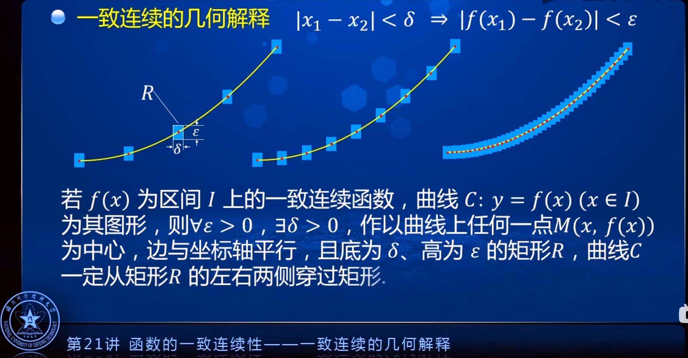

- [第一章 函数与极限](#第一章-函数与极限)
  - [1.10 闭区间上连续函数的性质](#110-闭区间上连续函数的性质)
    - [一、有界性与最大值最小值定理](#一有界性与最大值最小值定理)
      - [定理1 有界性与最大值最小值定理](#定理1-有界性与最大值最小值定理)
    - [二、零点定理与介值定理](#二零点定理与介值定理)
      - [定理2 零点定理](#定理2-零点定理)
      - [定理3 介值定理](#定理3-介值定理)
        - [推论](#推论)
    - [三、一致连续性](#三一致连续性)
      - [定义](#定义)
        - [例](#例)
      - [一致连续与连续的关系](#一致连续与连续的关系)
      - [不一致连续](#不一致连续)
      - [一直连续性的几何解释](#一直连续性的几何解释)
      - [定理4 一致连续性定理 （康托尔定理）](#定理4-一致连续性定理-康托尔定理)
  - [习题1-10](#习题1-10)

# 第一章 函数与极限

## 1.10 闭区间上连续函数的性质

### 一、有界性与最大值最小值定理

#### 定理1 有界性与最大值最小值定理

**在闭区间上连续的函数在该区间上有界且一定能取得它的最大值和最小值.**

### 二、零点定理与介值定理

#### 定理2 零点定理

**设函数 $f(x)$ 在闭区间 $[a,b]$上连续，且 $f(a)$ 与 $f(b)$ 异号(即 $f(a) \cdot f(b) \lt 0$)，则在开区间 $(a,b)$内至少有一点 $\xi$，使 $f(\xi) = 0$.**

$\xi$ 称为函数 $f(x)$ 的零点.

#### 定理3 介值定理

设函数 $f(x)$ 在闭区间 $[a,b]$上连续，且在这区间的端点取不同的函数值 $f(a) = A$ 及 $f(b) = B$，则对于 $A$ 与 $B$ 之间的任意一个数 $C$，在开区间 $(a,b)$内至少有一点 $\xi$，使得 $f(\xi) = C \kern1em (a\lt \xi \lt b)$.

##### 推论

在闭区间 $[a,b]$上连续的函数 $f(x)$ 的值域为闭区间 $[m, M]$，其中 $m$ 与 $M$ 依次为 $f(x)$ 在 $[a,b]$ 上的最小值与最大值.

### 三、一致连续性

#### 定义

设函数 $f(x)$ 在区间 $I$上有定义. 如果对于任意给定的正数 $\varepsilon$，总存在正数 $\delta$，使得对于区间 $I$上的任意两点 $x_1, x_2$，当 $|x_1 - x_2| \lt \delta$时，有 $|f(x_1) - f(x_2)| \lt \varepsilon$，那么称函数 $f(x)$ 在区间 $I$上一致连续.

$\forall \varepsilon \gt 0, \exists \delta \gt 0$，当 $x_1, x_2 \in I$ 且 $|x_1-x_2| \lt \delta$时，有 $|f(x_1) - f(x_2)| \lt \varepsilon$.

##### 例

证明函数 $f(x) = \sqrt x$ 在区间 $[1, +\infty)$上一致连续.

**证** $\forall \varepsilon \gt 0$，要使 $x_1, x_2 \in [1, +\infty)$ 有

$$
\begin{align}
|f(x_1) - f(x_2)| & = |\sqrt{x_1} - \sqrt{x_2}| \\
& = \frac{|x_1 - x_2|}{\sqrt{x_1} + \sqrt{x_2}} \\
& \leqslant \frac 1 2 |x_1 - x_2| \\
& \lt \varepsilon
\end{align}
$$

只要 $|x_1 - x_2| \lt 2\varepsilon$. 取 $\delta = 2\varepsilon$，即有 $|f(x_1) - f(x_2)| \leqslant \frac 1 2|x_1 - x_2| =\frac 1 2 \delta = \varepsilon$，即 $f(x)$ 在区间 $[1, +\infty)$上一致连续.

#### 一致连续与连续的关系

若函数 $f(x)$ 在区间 $(a,b)$内一致连续，则 $f(x)$ 在 $(a,b)$内连续.

**证** 由于函数 $f(x)$ 在区间 $(a,b)$内一致连续，则 $\forall \varepsilon \gt 0, \exists \delta \gt 0$，当 $x_1, x_2 \in (a,b)$ 且 $|x_1 - x_2| \lt \delta$时， $|f(x_1) - f(x_2)| \lt \varepsilon$。

$\forall x_0 \in (a,b)$，取 $x_1 = x_0$, 当 $x_2 = x$，只要 $|x-x_0| = |x_2 - x_1| \lt \delta$, 有 $|f(x_1) - f(x_2)| \lt \varepsilon$. 即 $f(x)$ 在 $x_0$处连续. 

#### 不一致连续

函数 $f(x)$ 在区间 $(a,b)$内不一致连续 $\iff$
$\exists \varepsilon \gt 0, \forall \delta \gt 0, \exists x_1, x_2 \in (a, b)$, 有 $|x_1-x_2| \lt \delta$ 且 $|f(x_1) - f(x_2)|\geqslant \varepsilon$.

#### 一直连续性的几何解释

#### 定理4 一致连续性定理 （康托尔定理）

如何函数 $f(x)$ 在闭区间 $[a,b]$上连续，则 $f(x)$ 在 $[a,b]$上一致连续.

## 习题1-10

1. 假设函数 $f(x)$ 在闭区间 $[0,1]$ 上连续并且对 $[0,1]$ 上任意一点 $x$ 有 $0\leqslant f(x) \leqslant 1$. 试证明 $[0,1]$ 中必存在一点 $c$，使得 $f(c) = c$（ $c$ 称为函数 $f(x)$ 的不动点）.

   **证** 设 $F(x) = f(x) - x$，则 $F(0) = f(0) \geqslant 0, F(1) = f(1) - 1 \leqslant 0$

   若 $F(0)=0$ 或 $F(1)=0$，则 0 或 1 即为 $f(x)$ 的不动点；若 $F(0) \gt 0$ 且 $F(1) \lt 0$，则由零点定理，必存在 $c\in (0, 1)$，使 $F(c) = 0$，即 $f(c) = c$，这时 $c$ 为 $f(x)$ 的不动点.

2. 略
3. 证明方程 $x=a\sin x+b$，其中 $a\gt 0, b\gt 0$，至少有一个正根，并且它不超过 $a+b$.
   
   **证** 设 $f(x) = x-a\sin x - b$，则 $f(x)$ 在闭区间 $[0, a+b]$ 上连续，且 $f(0) = -b \lt 0, f(a+b) = a[1-\sin(a+b)]$. 当 $\sin(a+b) \lt 1$ 时， $f(a+b) \gt 0$，由零点定理，即知 $\exists \xi \in (0, a+b)$，使 $f(\xi) = 0$，即 $\xi$ 为原方程的根且不超过 $a+b$; 当 $\sin(a+b) = 1$时， $f(a+b)=0, a+b$就是满足条件的正根.

4. 证明任一最高次幂的指数为奇数的代数方程
   
   $$
   a_0x_{2n+1}+a_1x^{2n} + \cdots + a_{2n}x + a_{2n+1} = 0
   $$

   至少有一实根，其中 $a_0, a_1, \cdots, a_{2n+1}$ 均为常数， $n\in \N$.

   [【国防科技大学】高等数学 p119 03:10](https://www.bilibili.com/video/BV1h7411M73b?p=119)

   **证** 等 $|x|$ 充分大时， $f(x)$ 的符号取决于 $a_0$ 的符号，即当 $x$ 为正时与 $a_0$ 同号，当 $x$ 为负时与 $a_0$ 异号，而 $a_0 \ne 0$. 因 $f(x)$ 是连续函数，它在某充分大的区间的两端处异号，由零点定理可知它在区间内某一点处必定为零，故方程 $f(x)=0$ 至少有一实根.

5. 若 $f(x)$ 在 $[a,b]$ 上连续， $a\lt x_1 \lt x_2 \lt \cdots \lt x_n \lt b (n\geqslant 3)$，则在 $(x_1, x_n)$内至少有一点 $\xi$，使 $f(\xi) = \frac{f(x_1)+f(x_2)+\cdots + f(x_n)}{n}$.
   
   **证** 因为 $f(x)$ 在 $[a,b]$ 上连续，又 $[x_1, x_n] \subset [a,b]$，所以 $f(x)$ 在 $[x_1, x_n]$ 上连续. 设 

   $$
   M = \max\lbrace f(x) | x_1 \leqslant x \leqslant x_n \rbrace, m = \min \lbrace f(x) | x_1 \leqslant x \leqslant x_n \rbrace,
   $$

   则

   $$
   m \leqslant \frac{f(x_1)+f(x_2)+\cdots + f(x_n)}{n} \leqslant M.
   $$

   若上述不等式中为严格不等号，则有介值定理， $\exists \xi \in (x_1, x_2)$，使 

   $$
   f(\xi) = \frac{f(x_1)+f(x_2)+\cdots + f(x_n)}{n};
   $$

   若上述不等式中出现等号，如

   $$
   m = \frac{f(x_1)+f(x_2)+\cdots + f(x_n)}{n}
   $$

   则有 $f(x_1) = f(x_2) = \cdots = f(x_n) = m$，任取 $x_2, \cdots, x_n-1$ 中一点作为 $\xi$，即有 $\xi \in (x_1, x_n)$，使

   $$
   f(\xi) = \frac{f(x_1)+f(x_2)+\cdots + f(x_n)}{n};
   $$

   如 

   $$
   \frac{f(x_1)+f(x_2)+\cdots + f(x_n)}{n} = M
   $$

   则有 $f(x_1) = f(x_2) = \cdots = f(x_n) = M$，任取 $x_2, \cdots, x_n-1$ 中一点作为 $\xi$，即有 $\xi \in (x_1, x_n)$，使

   $$
   f(\xi) = \frac{f(x_1)+f(x_2)+\cdots + f(x_n)}{n};
   $$

6. 设函数 $f(x)$ 对于闭区间 $[a,b]$ 上的任意两点 $x,y$，恒有 $|f(x)-f(y)| \leqslant L|x-y|$，其中 $L$ 为正常数，且 $f(x) \cdot f(y) \lt 0$. 证明：至少有一点 $\xi \in (a,b)$，使得 f(\xi) = 0$.
   
   **证** 任取 $x_0 \in (a, b), \forall \varepsilon \gt 0$，取 $\delta = \min \lbrace \frac \varepsilon L, x_0-a, b-x_0 \rbrace$，则当 $|x-x_0| \lt \delta$时，由假设

   $$
   |f(x) - f(x_0)| \leqslant L|x-x_0| \lt L\delta \leqslant \varepsilon
   $$

   所以 $f(x)$ 在 $x_0$ 连续. 由 $x_0 \in (a,b)$ 的任意性， $f(x)$ 在 $(a,b)$ 内连续.

   当 $x_0=a$时，取 $\delta = \frac \varepsilon L$，

   [参考](https://www.bilibili.com/video/BV18741157Gm?p=80)

