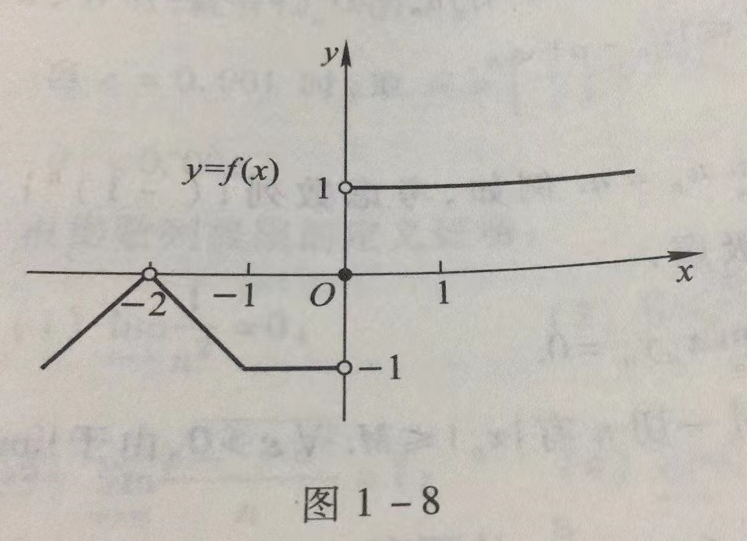
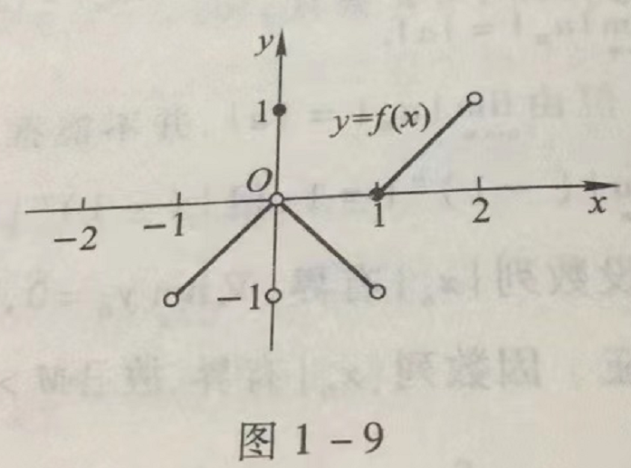
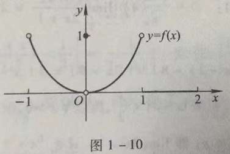

- [第一章 函数与极限](#第一章-函数与极限)
  - [一、函数极限的定义](#一函数极限的定义)
    - [1.1 自变量趋于有限值时函数的极限](#11-自变量趋于有限值时函数的极限)
    - [1.2 自变量趋于无穷大时函数的极限](#12-自变量趋于无穷大时函数的极限)
  - [二、函数极限的性质](#二函数极限的性质)
    - [定理1 函数极限的唯一性](#定理1-函数极限的唯一性)
    - [定理2 函数极限的局部有界性](#定理2-函数极限的局部有界性)
    - [定理3 函数极限的局部保号性](#定理3-函数极限的局部保号性)
    - [定理3'](#定理3)
  - [习题1-3 函数的极限](#习题1-3-函数的极限)

# 第一章 函数与极限

## 一、函数极限的定义

### 1.1 自变量趋于有限值时函数的极限

设函数 $f(x)$ 在点 $x_0$ 的某一去心邻域内有定义。如果存在常数 $A$，对于任意给定的正数 $\varepsilon$ （不论它多么小），总存在正数 $\delta$，使得当 $x$ 满足不等式 $0\lt |x-x_0| \lt \delta$ 时，对应的函数值 $f(x)$ 都满足不等式 $|f(x) - A| \lt \varepsilon$，那么常数 $A$ 就叫做函数 $f(x)$当 $x\rightarrow x_0$ 时的极限，记作

$$
\lim\limits_{x\rightarrow x_0}f(x) = A 或 f(x) \rightarrow A (当 x \rightarrow x_0)
$$

可简单表述为：

$$
\lim\limits_{x\rightarrow x_0}f(x) = A \iff \forall \varepsilon \gt 0, \exists \delta \gt 0, 当 0 \lt |x-x_0| \lt \delta 时，有 |f(x) - A| \lt \varepsilon
$$

函数 $f(x)$当 $x\rightarrow x_0$ 时极限存在的充分必要条件是左极限和右极限各自存在并且相等。

**注意**

1. 此处 $0\lt |x-x_0| \lt \delta$，说明函数有极限与否，与 $f(x)$ 在 $x_0$ 处有无定义无关
2. $\delta$ 与 $\varepsilon$ 有关

### 1.2 自变量趋于无穷大时函数的极限

设函数 $f(x)$ 当 $|x|$ 大于某一正数时有定义。如果存在常数 $A$，对于任意给定的正数 $\varepsilon$（不论它多么小），总存在正数 $X$，使得当 $x$ 满足不等式 $|x| \gt X$ 时，对应的函数值 $f(x)$ 都满足不等式 $|f(x) - A| \lt \varepsilon$，那么常数 $A$ 就叫做函数 $f(x)$当 $x\rightarrow \infty$ 时的极限，记作

$$
\lim\limits_{x\rightarrow \infty}f(x) = A 或 f(x) \rightarrow A (当 x \rightarrow \infty)
$$

可简单表述为：

$$
\lim\limits_{x\rightarrow \infty}f(x) = A \iff \forall \varepsilon \gt 0, \exists X \gt 0, 当 |x| \gt X 时，有 |f(x) - A| \lt \varepsilon
$$

**注意**

1. $\lim\limits_{x\rightarrow \infty}f(x) = A \iff \lim\limits_{x\rightarrow +\infty}f(x) = A$ 且 $\lim\limits_{x\rightarrow -\infty}f(x) = A$

2. 若 $\lim\limits_{x\rightarrow \infty}f(x) = C$, 称 $y=C$ 为函数 $f(x)$ 的水平渐近线

3. 若 $\lim\limits_{x\rightarrow +\infty}f(x) = A$, $\lim\limits_{x\rightarrow -\infty}f(x) = B$, 但是 $A\ne B$，则 $\lim\limits_{x\rightarrow \infty}f(x)$ 不存在，但有两条水平渐近线 $y=A$ 和 $y=B$

## 二、函数极限的性质

函数极限的定义按自变量的变化过程不同有各种形式：

| $x\rightarrow$ | 存在 | 当 |
|----------------|------|---|
| $+\infty$ | $\exists X \gt 0$ | $x \gt X$ |
| $-\infty$ | $\exists X \gt 0$ | $x \lt -X$ |
| $\infty$ | $\exists X \gt 0$ | $\vert x \vert \gt X$ |
| $x_0^+$ | $\exists \delta \gt 0$ | $x_0 \lt x \lt x_0 + \delta$ |
| $x_0^-$ | $\exists \delta \gt 0$ | $x_0-\delta \lt x \lt x_0$ |
| $x_0$ | $\exists \delta \gt 0$ | $0 \lt \|x - x_0\| \lt \delta$ |

### 定理1 函数极限的唯一性

如果 $\lim\limits_{x\rightarrow x_0}f(x)$ 存在，那么这极限唯一。

1. **证明:如果 $\lim\limits_{x\rightarrow x_0}f(x)$ 存在，那么这极限唯一**

    设 $\lim\limits_{x\rightarrow x_0}f(x) = A, \lim\limits_{x\rightarrow x_0}f(x) = B$。若 $A \ne B$，假设 $A\lt B$，取 $\varepsilon = \frac{B-A}2$，当 $x\rightarrow x_0$ 时，有 

    $$
    \begin{align}
    |f(x) - A| \lt \varepsilon & \implies A-\varepsilon \lt f(x) \lt A+\varepsilon \implies f(x) \lt \frac{A+B}2 \\
    |f(x) - B| \lt \varepsilon & \implies B-\varepsilon \lt f(x) \lt B + \varepsilon \implies \frac{A+B}2 \lt f(x) \\
    & \therefore \frac{A+B}2 \lt f(x) \lt \frac{A+B}2
    \end{align}
    $$

    这是不可能的。当假设 $A\gt B$ 时同理。因此 $A=B$，即若极限存在必定唯一。

2. **证明:如果 $\lim\limits_{x\rightarrow x_0^+}f(x)$ 存在，那么这极限唯一**

    设 $\lim\limits_{x\rightarrow x_0^+}f(x) = A, \lim\limits_{x\rightarrow x_0^+}f(x) = B$。若 $A \ne B$，假设 $A\lt B$，取 $\varepsilon = \frac{B-A}2$，当 $x\rightarrow x_0^+$ 时，有 

    $$
    \begin{align}
    |f(x) - A| \lt \varepsilon & \implies A-\varepsilon \lt f(x) \lt A+\varepsilon \implies f(x) \lt \frac{A+B}2 \\
    |f(x) - B| \lt \varepsilon & \implies B-\varepsilon \lt f(x) \lt B + \varepsilon \implies \frac{A+B}2 \lt f(x) \\
    & \therefore \frac{A+B}2 \lt f(x) \lt \frac{A+B}2
    \end{align}
    $$

    这是不可能的。当假设 $A\gt B$ 时同理。因此 $A=B$，即若极限存在必定唯一。

**注意**

极限存在必唯一可以用在求极限时的验证，若计算出了两个不同的极限，说明要么函数极限不存在，要么*你算错了*。。。

### 定理2 函数极限的局部有界性

如果 $\lim\limits_{x\rightarrow x_0}f(x) = A$，那么存在常数 $M\gt 0$ 和 $\delta \gt 0$，使得当 $0 \lt |x-x_0| \lt \delta$时，有 $|f(x)| \leqslant M$

**证明**

因为 $\lim\limits_{x\rightarrow x_0}f(x) = A$，所以取 $\varepsilon=1$，则 $\exists \delta \gt 0$，当 $0\lt |x-x_0| \lt \varepsilon$ 时，有 

$$
f(x) - A \lt 1 \implies |f(x)| = |f(x)+A-A| \leqslant |f(x)-A| + |A| \lt 1+|A|
$$

记 $M = |A|+1$，即得证。

### 定理3 函数极限的局部保号性

如果 $\lim\limits_{x\rightarrow x_0}f(x) = A$，且 $A\gt 0$ （或 $A\lt 0$），那么存在常数 $\delta \gt 0$，使得当 $0\lt |x-x_0| \lt \delta$ 时，有 $f(x) \gt 0$ (或 $f(x) \lt 0$)

### 定理3'

如果 $\lim\limits_{x\rightarrow x_0}f(x)=A(A\ne 0)$，那么就存在着 $x_0$ 的某一去心邻域 $\mathring{U}(x_0)$，当 $x\in \mathring{U} (x_0)$时，就有 $|f(x)| \gt \frac{|A|}2$

## 习题1-3 函数的极限

1. 对图1-8所示的函数 $f(x)$，求下列极限，如极限不存在，说明理由。

    

    (1) $\lim\limits_{x\rightarrow -2}f(x)$;

    (2) $\lim\limits_{x\rightarrow -1}f(x)$;

    (3) $\lim\limits_{x\rightarrow 0}f(x)$;

    **解**

    (1) $\lim\limits_{x\rightarrow -2}f(x)=0$;

    (2) $\lim\limits_{x\rightarrow -1}f(x) = -1$;

    (3) $\lim\limits_{x\rightarrow 0}f(x)$ 不存在，因为 $f(0^+)\ne f(0^-)$;

2. 对图1-9所示的函数 $f(x)$，下列陈述中哪些是对的，哪些是错的？

    

    (1) $\lim\limits_{x\rightarrow 0}f(x)$ 不存在；

    (2) $\lim\limits_{x\rightarrow 0}f(x) = 0$;

    (3) $\lim\limits_{x\rightarrow 0}f(x) = 1$;

    (4) $\lim\limits_{x\rightarrow 1}f(x) = 0$;

    (5) $\lim\limits_{x\rightarrow 1}f(x)$ 不存在;

    (6) 对每个 $x_0 \in (-1,1), \lim\limits_{x\rightarrow x_0}f(x)$ 存在.

    **解**

    (1) 错， $\lim\limits_{x\rightarrow 0}f(x)$ 存在与否，与 $f(0)$的值无关。事实上， $\lim\limits_{x\rightarrow 0}f(x)=0$;

    (2) 对。因为 $f(0^+)=f(0^-)$;

    (3) 错， $\lim\limits_{x\rightarrow 0}f(x)$ 的值与 $f(0)$的值无关;

    (4) 错， $f(1^+)=0$, 但 $f(1^-)=-1$，故 $\lim\limits_{x\rightarrow 1}f(x)$ 不存在;

    (5) 对，因为 $f(1^+)\ne f(1^-)$;

    (6) 对。

3. 对图1-10所示的函数，下列陈述中哪些是对的，哪些是错的？

    

    (1) $\lim\limits_{x\rightarrow -1^+}f(x) = 1$;

    (2) $\lim\limits_{x\rightarrow -1^-}f(x)$ 不存在;

    (3) $\lim\limits_{x\rightarrow 0}f(x) = 0$;

    (4) $\lim\limits_{x\rightarrow 0}f(x) = 1$;

    (5) $\lim\limits_{x\rightarrow 1^-}f(x) = 1$;

    (6) $\lim\limits_{x\rightarrow 1^+}f(x) = 0$;

    (7) $\lim\limits_{x\rightarrow 2^-}f(x) = 0$;

    (8) $\lim\limits_{x\rightarrow 2}f(x) = 0$;

    **解**

    (1) 对;

    (2) 对，因为当 $x\lt -1$时， $f(x)$ 无定义;

    (3) 对;

    (4) 错， $\lim\limits_{x\rightarrow 0}f(x)$的值与 $f(0)$的值无关;

    (5) 对;

    (6) 对;

    (7) 对;

    (8) 错，因为当 $x\gt 2$ 时， $f(x)$ 无定义， $f(2^+)$ 不存在.

4. 求 $f(x)=\frac x x, \varphi(x)=\frac {|x|} x 当 x\rightarrow 0$ 时的左、右极限，并说明它们在 $x\rightarrow 0$ 时的极限是否存在.

    **解**

    $$
    \lim\limits_{x\rightarrow 0^+}f(x) = \lim\limits_{x\rightarrow 0^+}\frac x x = \lim\limits_{x\rightarrow 0^+}1 = 1, \lim\limits_{x\rightarrow 0^-}f(x) = \lim\limits_{x\rightarrow 0^-}\frac x x = \lim\limits_{x\rightarrow 0^-}1 = 1.
    $$

    因为 $\lim\limits_{x\rightarrow 0^+}f(x) = \lim\limits_{x\rightarrow 0^-}f(x) = 1$，所以 $\lim\limits_{x\rightarrow 0}f(x)=1$.

    $$
    \lim\limits_{x\rightarrow 0^+}\varphi(x) = \lim\limits_{x\rightarrow 0^+}\frac {|x|} x = \lim\limits_{x\rightarrow 0^+}\frac x x = \lim\limits_{x\rightarrow 0^+}1 = 1, \lim\limits_{x\rightarrow 0^-}\varphi(x) = \lim\limits_{x\rightarrow 0^-}\frac {|x|} x = \lim\limits_{x\rightarrow 0^-}\frac {-x} x = \lim\limits_{x\rightarrow 0^-}-1 = -1.
    $$

    因为 $\lim\limits_{x\rightarrow 0^+}\varphi(x) \ne \lim\limits_{x\rightarrow 0^-}\varphi(x)$，所以 $\lim\limits_{x\rightarrow 0}\varphi(x)$ 不存在.

5. 根据函数极限定义证明：

    (1) $\lim\limits_{x\rightarrow 3}(3x-1)=8$;

    (2) $\lim\limits_{x\rightarrow 2}(5x+2)=12$;

    (3) $\lim\limits_{x\rightarrow -2}\frac{x^2-4}{x+2}=-4$;

    (4) $\lim\limits_{x\rightarrow -\frac 1 2}\frac{1-4x^2}{2x+1}=2$.

    **解**

    (1) 因为

    $$
    |(3x-1)-8|=|3x-9|=3|x-3|.
    $$

    要使 $|(3x-1)-8|\lt \varepsilon$，只要 $|x-3|\lt \frac \varepsilon 3$，所以 $\forall \varepsilon \gt 0$，取 $\delta=\frac \varepsilon 3$，当 $0\lt |x-3| \lt \delta$ 时，就有 $|(3x-1)-8| \lt \varepsilon$，即 $\lim\limits_{x\rightarrow 3}(3x-1)=8$;

    (2) 因为

    $$
    |(5x+2)-12|=|5x-10|=5|x-2|.
    $$

    要使 $|(5x+2)-12|\lt \varepsilon$，只要 $|x-2|\lt \frac \varepsilon 5$，所以 $\forall \varepsilon \gt 0$，取 $\delta = \frac \varepsilon 5$，当 $0\lt|x-2|\lt \delta$时，就有 $|(5x+2)-12|\lt \varepsilon$，即 $\lim\limits_{x\rightarrow 2}(5x+2)=12$;

    (3) 因为 $x\rightarrow -2, x\ne -2$.

    $$
    |\frac{x^2-4}{x+2}-(-4)|=|x-2-(-4)|=|x-(-2)|
    $$

    要使 

    $$
    |\frac{x^2-4}{x+2}-(-4)|\lt \varepsilon
    $$

    只要 $|x-(-2)| \lt \varepsilon$. 所以 $\forall \varepsilon \gt 0$, 取 $\delta=\varepsilon$，则当 $0\lt |x-(-2)|\lt \delta$ 时，就有 

    $$
    |\frac{x^2-4}{x+2}-(-4)|\lt \varepsilon
    $$

    即 $\lim\limits_{x\rightarrow -2}\frac{x^2-4}{x+2}=-4$.

    (4) 因为 $x\rightarrow -\frac 1 2, x\ne -\frac 1 2$.

    $$
    |\frac{1-4x^2}{2x+1}-2|=|1-2x-2|=2|x-(-\frac 1 2)|
    $$

    要使 

    $$
    |\frac{1-4x^2}{2x+1}-2|\lt \varepsilon
    $$

    只要 $|x-(-\frac 1 2)|\lt \frac \varepsilon 2$。所以 $\forall \varepsilon \gt 0$，取 $\delta=\frac \varepsilon 2$，则当 $0\lt |x-(-\frac 1 2)|\lt \delta$时，就有 

    $$
    |\frac{1-4x^2}{2x+1}-2|\lt \varepsilon
    $$

    即 $\lim\limits_{x\rightarrow -\frac 1 2}\frac{1-4x^2}{2x+1}=2$.

6. 根据函数极限的定义证明：

    (1) $\lim\limits_{x\rightarrow \infty}\frac{1+x^3}{2x^3}=\frac 1 2$;

    (2) $\lim\limits_{x\rightarrow +\infty}\frac{\sin x}{\sqrt x}=0$;

    **证**

    (1) 因为 $|\frac{1+x^3}{2x^3}-\frac 1 2|=\frac 1 {2|x|^3}$，要使 $|\frac{1+x^3}{2x^3}-\frac 1 2|\lt \varepsilon$，只要 $\frac 1 {2|x|^3}\lt \varepsilon$，即 $|x|\gt \frac 1 {\sqrt[3]{2\varepsilon}}$。所以 $\forall \varepsilon \gt 0$，取 $X=\frac 1 {\sqrt[3]{2\varepsilon}}$，则当 $x\gt X$ 时，就有 $|\frac{1+x^3}{2x^3}-\frac 1 2|\lt \varepsilon$，即 $\lim\limits_{x\rightarrow \infty}\frac{1+x^3}{2x^3}=\frac 1 2$;

    (2) 因为 $|\frac{\sin x}{\sqrt x}-0|\leqslant \frac 1{\sqrt x}$，要使 $|\frac{\sin x}{\sqrt x}-0|\lt \varepsilon$，只要 $\frac 1{\sqrt x} \lt \varepsilon$，即 $x\gt \frac 1 {\varepsilon^2}$，所以 $\forall \varepsilon \gt 0$，取 $X=\frac 1 {\varepsilon^2}$，则当 $x\gt X$ 时，就有 $|\frac{\sin x}{\sqrt x}-0|\lt \varepsilon$，即 $\lim\limits_{x\rightarrow +\infty}\frac{\sin x}{\sqrt x}=0$.

7. 当 $x\rightarrow 2$时， $y=x^2\rightarrow 4$。问 $\delta$ 等于多少，使当 $|x-2|\lt \delta$ 时， $|y-4|\lt 0.001$?

    **解**

    由于 $x\rightarrow 2,|x-2|\rightarrow 0$，不妨设 $|x-2|\lt 1$，即 $1\lt x \lt 3$.

    要使 $|y-4|=|x^2-4|=|x+2||x-2|\lt 5|x-2|\lt 0.001$, 只要

    $$
    |x-2|\lt \frac {0.001} 5 = 0.0002,
    $$

    取 $\delta=0.0002$，则当 $0\lt |x-2| \lt \delta$ 时，就有 $|x^2-4|\lt 0.001$.

    **注** 本题证明中，先限定 $|x-2|\lt 1$，其目的是在 $|x^2-4|=|x+2||x-2|$ 中，将 $|x+2|$ 放大为 5，从而去掉因子 $|x+2|$，再令 $5|x-2|\lt \varepsilon$，由此可以求出 $|x-2|\lt \frac \varepsilon 5$，从而找到 $\delta$。这在按定义证明极限时，也是经常采用的一种方法。

8. 当 $x\rightarrow \infty$ 时， $y=\frac{x^2-1}{x^2+3}\rightarrow 1$. 问 $X$ 等于多少，使当 $|x|\gt X$ 时， $|y-1|\lt 0.01$?

    **解**

    因为 $|\frac{x^2-1}{x^2+3}-1|=\frac 4{x^2+3}\lt \frac 4 {x^2}$，要使 $|\frac{x^2-1}{x^2+3}-1|\lt 0.01$，只要 $\frac 4{x^2}\lt 0.01$，即 $|x|\gt 20$，取 $X=20$，则当 $|x|\gt X$ 时，就有 $|y-1|\lt 0.01$.

9. 证明函数 $f(x)=|x|$ 当 $x\rightarrow 0$ 时极限为0.

    **证** 因为 $||x|-0|=|x|=|x-0|$，所以 $\forall \varepsilon \gt 0$，取 $\delta=\varepsilon$，则当 $0\lt |x-0| \lt \delta$ 时，就有 $||x|-0|\lt \varepsilon$，即 $\lim\limits_{x\rightarrow 0}|x|=0$.

10. 证明：若 $x\rightarrow +\infty$ 及 $x\rightarrow -\infty$时，函数 $f(x)$ 的极限都存在且都等于 $A$，则 $\lim\limits_{x\rightarrow \infty}f(x)=A$.

    **证** 因为 $\lim\limits_{x\rightarrow +\infty}f(x)=A$，所以 $\forall \varepsilon \gt 0$， $\exists X_1 \gt 0$，当 $x\gt X_1$ 时，就有 $|f(x)-A|\lt \varepsilon$.

    又因为 $\lim\limits_{x\rightarrow -\infty}f(x)=A$，所以对上面的 $\varepsilon \gt 0$， $\exists X_2 \gt 0$，当 $x\lt -X_2$时，就有 $|f(x)-A|\lt \varepsilon$.

    取 $X=\max \lbrace X_1, X_2 \rbrace$，则当 $|x| \gt X$，即 $x\gt X$ 或 $x\lt -X$时，就有 $|f(x)-A|\lt \varepsilon$，即 $\lim\limits_{x\rightarrow \infty}f(x)=A$.

11. 根据极限的定义证明：函数 $f(x)$ 当 $x\rightarrow x_0$时极限存在的充分必要条件是左极限、右极限各自存在并且相等。

    **证** 必要性 若 $\lim\limits_{x\rightarrow x_0}f(x)=A$，则 $\forall \varepsilon \gt 0$， $\exists \delta \gt 0$，当 $0\lt |x-x_0|\lt \delta$时，就有 $|f(x)-A|\lt \varepsilon$.

    特别，当 $0\lt x-x_0\lt \delta$时，有 $|f(x)-A|\lt \varepsilon$，即 $\lim\limits_{x\rightarrow x_0^+}f(x)=A$；当 $0\lt x_0-x \lt \delta$ 时，有 $|f(x)-A|\lt \varepsilon$，即 $\lim\limits_{x\rightarrow x_0^-}f(x)=A$.

    充分性 若 $\lim\limits_{x\rightarrow x_0^+}f(x)=A$，则 $forall \varepsilon \gt 0$， $\exists \delta_1 \gt 0$，当 $0\lt x-x_0\lt \delta_1$时，就有 $|f(x)-A|\lt \varepsilon$；又 $\exists \delta_2 \gt 0$，当 $0\lt x_0-x\lt \delta_2$时，就有 $|f(x)-A|\lt \varepsilon$. 取 $\delta=\max \lbrace \delta_1, \delta_2 \rbrace$，在当 $0\lt |x-x_0|\lt \delta$ 时，就有 $|f(x)-A|\lt \varepsilon$，即 $\lim\limits_{x\rightarrow x_0}f(x)=A$.

12. 试给出 $x\rightarrow \infty$ 时函数极限的局部有界性的定理，并加以证明。

    **解** 局部有界性定理 如果 $\lim\limits_{x\rightarrow \infty}f(x)=A$，那么存在常数 $M\gt 0$ 和 $X\gt 0$，使得当 $|x|\gt X$时，有 $|f(x)|\leqslant M$.

    证明如下：因为 $\lim\limits_{x\rightarrow \infty}f(x)=A$，所以对 $\varepsilon=1\gt 0$， $\exists X \gt 0$，当 $|x|\gt X$时，就有 $|f(x)-A|\lt 1$，从而 

    $$
    |f(x)|\leqslant |f(x)-A|+|A| \lt 1 + |A|,
    $$

    取 $M=|A|+1$,即有当 $|x|\gt X$时， $|f(x)\leqslant M$.