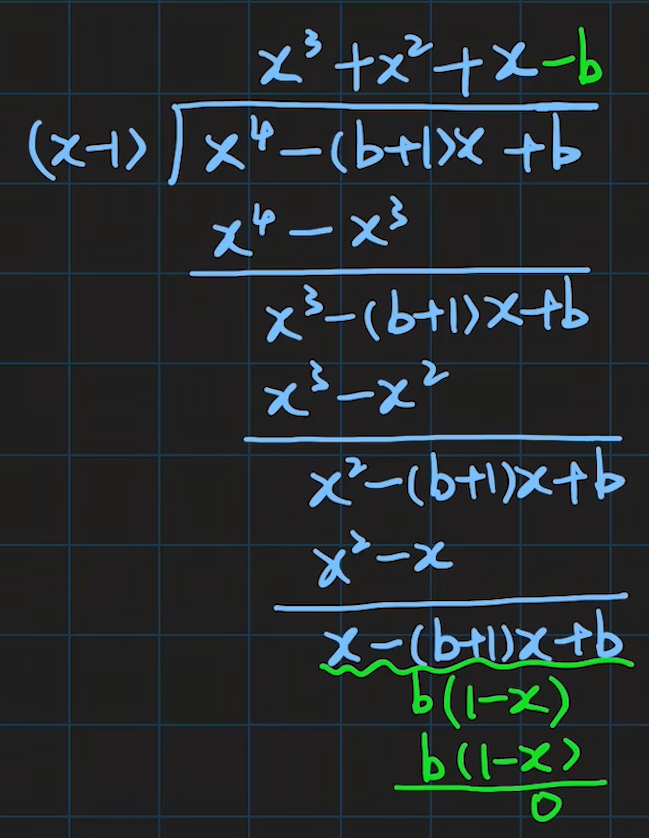

- [第一章 函数与极限](#第一章-函数与极限)
  - [1.8 函数的连续性与间断点](#18-函数的连续性与间断点)
    - [一、函数的连续性](#一函数的连续性)
      - [1.1 定义](#11-定义)
      - [1.2 定义的另一种形式](#12-定义的另一种形式)
      - [1.3 定义的 $\varepsilon-\delta$ 语言表述](#13-定义的-varepsilon-delta-语言表述)
      - [1.4 单侧连续](#14-单侧连续)
      - [1.5 区间连续](#15-区间连续)
      - [1.6 闭区间连续](#16-闭区间连续)
      - [1.7 例1](#17-例1)
      - [1.8 例2](#18-例2)
      - [1.9 例3](#19-例3)
    - [二、函数的间断点](#二函数的间断点)
      - [2.1 第一类间断点](#21-第一类间断点)
      - [2.2 第二类间断点](#22-第二类间断点)
  - [习题1.8](#习题18)

# 第一章 函数与极限

## 1.8 函数的连续性与间断点

### 一、函数的连续性

#### 1.1 定义

设函数 $f(x)$ 在点 $x_0$ 的某一去心邻域内有定义，如果

$$
\lim\limits_{\Delta x \rightarrow 0} \Delta y = \lim\limits_{\Delta x \rightarrow 0}[f(x_0 + \Delta x) - f(x_0)] = 0.
$$

那么就称函数 $f(x)$ 在点 $x_0$ 连续.

#### 1.2 定义的另一种形式

设函数 $y=f(x)$ 在点 $x_0$ 的某一邻域内有定义，如果

$$
\lim\limits_{x\rightarrow x_0}f(x) = f(x_0)
$$

那么就称函数 $f(x)$ 在点 $x_0$ 连续.

#### 1.3 定义的 $\varepsilon-\delta$ 语言表述

$f(x)$ 在点 $x_0$ 连续 $\iff$ $\forall \varepsilon \gt 0, \exists \delta \gt 0$，当 $|x-x_0|\lt \delta$ 时，有 $|f(x) - f(x_0)| \lt \varepsilon$

**注意 

1. 三种定义形式本质一致，都含有三个要素**

   1. $f(x)$ 在 $U_\delta(x_0)$ 有定义
      
      仅在 $x_0$ 点有定义不成立

   2. $\lim\limits_{x\rightarrow x_0}f(x)$ 存在

   3. $\lim\limits_{x\rightarrow x_0}f(x) = x_0$

2. 连续性是描述 $f(x)$ 在 $x_0$ 邻域的性态，即在孤立点处无连续性可言
3. [定义二](#12-定义的另一种形式) 提供了一种求极限的方法

#### 1.4 单侧连续

左连续： $\lim\limits_{x\rightarrow x_0^-}f(x) = f(x_0) \iff \forall \varepsilon \gt 0, \exists \delta \gt 0$，当 $-\delta \lt x-x_0 \lt 0$ 时，有 $|f(x) - f(x_0)| \lt \varepsilon$.

右连续： $\lim\limits_{x\rightarrow x_0^+}f(x) = f(x_0) \iff \forall \varepsilon \gt 0, \exists \delta \gt 0$，当 $0\lt x-x_0 \lt \delta$时，有 $|f(x)-f(x_0)|\lt \varepsilon$.

$f(x)$ 在 $x_0$ 连续 $\iff$ $f(x)$ 在 $x_0$ 既左连续又右连续.

$$
\lim\limits_{x\rightarrow x_0} = f(x_0) \iff \lim\limits_{x\rightarrow x_0^-}f(x) = \lim\limits_{x\rightarrow x_0^+}f(x) = f(x_0)
$$

#### 1.5 区间连续

在区间上的每一点都连续的函数，叫做在该区间上的连续函数，或者说函数在该区间上连续.如果区间包括端点，那么函数在右端点连续是指左连续，在左端点连续是指右连续.

#### 1.6 闭区间连续

$f(x)$ 在 $[a,b]$连续 $\implies f(x) \in C[a,b]$, `C is short for Continuous`

$$
\begin{cases}
f(x) 在 a 右连续 \\
f(x) 在 (a,b) 处处连续， f(x) \in C(a, b) \\
f(x) 在 b 左连续
\end{cases}
$$

#### 1.7 例1

证明函数 $y=x^2$ 在 $(-\infty, +\infty)$内是连续的.

**证** $\forall x \in (-\infty,+\infty)$，当 $x$ 有增量 $\Delta x$ 时，对应的函数的增量为

$$
\Delta y = f(x+\Delta x) - f(x) = (x+\Delta x)^2 - x^2 = \Delta x^2 + 2x \cdot \Delta x
$$

$$
\begin{align}
\lim\limits_{\Delta x \rightarrow 0}\Delta y & = \lim\limits_{\Delta x \rightarrow 0}(\Delta x^2 + 2x \cdot \Delta x) \\
& = 0
\end{align}
$$

这就证明了 $y=x^2$ 对于任一 $x\in(-\infty,+\infty)$ 是连续的.

#### 1.8 例2 

证明函数 $y=\sin x$ 在区间 $(-\infty, +\infty)$ 内是连续的.

**证** 设 $x$ 是区间 $(-\infty, +\infty)$ 内任意取定的一点，当 $x$ 有增量 $\Delta x$ 时，对应的函数的增量为

$$
\Delta y=\sin(x+\Delta x) - \sin x,
$$

由三角函数和差化积公式

$$
\sin a - \sin b = 2\cos{\frac{a+b}{2}} \sin{\frac{a-b}{2}}
$$

有

$$
\begin{align}
\lim\limits_{\Delta x \rightarrow 0} \Delta y &= \lim\limits_{\Delta x \rightarrow 0} (\sin(x+\Delta x) - \sin x) \\
& = \lim\limits_{\Delta x \rightarrow 0}2\sin{\frac {\Delta x} 2}\cos(x+\frac {\Delta x }2) \\
& = \lim\limits_{\Delta x \rightarrow 0}2\frac{\sin\frac{\Delta x}2}{\frac{\Delta x} 2} \Delta x \cos(x+\frac{\Delta x}2) \\
& = \lim\limits_{\Delta x \rightarrow 0} 0 \cos(x+\frac{\Delta x}2) \\
由于 |\cos(x+\frac{\Delta x}2)| & \leqslant 1，是有界的，\\
\therefore \lim\limits_{\Delta x \rightarrow 0} \Delta y &= 0
\end{align}
$$

因此，当 $\Delta x \rightarrow 0$ 时， $\Delta y \rightarrow 0$，这就证明了 $y=\sin x$ 对于任一 $x\in (-\infty, +\infty)$ 是连续的.

#### 1.9 例3

设函数

$$
f(x) = 
\begin{cases}
\frac{x^4+ax+b}{(x-1)(x+2)} &, x\ne 1, x\ne -2, \\ 
2 & , x=1
\end{cases}
$$ 

在 $x=1$处连续，求 $a, b$ 的值.[^1]

**解** 因为 $f(x)$ 在 $x=1$ 处连续，则

$$
\lim\limits_{x\rightarrow 1}f(x) = \lim\limits_{x\rightarrow 1}\frac{x^4+ax+b}{(x-1)(x+2)} = 2
$$

可知分母存在 0 因子 $(x-1)$，要使极限存在且为 2，分子的极限必须为0，即

$$
\lim\limits_{x\rightarrow 1}(x^4+ax+b) = 0 \implies 1+a+b =0 \implies a=-(b+1)
$$

分子还需存在 0 因子 $(x-1)$ 可以消去，对分子进行多项式除法，有

则

$$
\begin{align}
\lim\limits_{x\rightarrow 1}\frac{x^4+ax+b}{(x-1)(x+2)} & = \lim\limits_{x\rightarrow 1}\frac{(x-1)(x^3+x^2+x-b)}{(x-1)(x+2)} \\
& = \lim\limits_{x\rightarrow 1}\frac{x^3+x^2+x-b}{x+2} \\
& = \frac{3-b}{3} = 2 \\
\therefore b & = -3, a=2
\end{align}
$$

### 二、函数的间断点

设函数 $f(x)$ 在点 $x_0$ 的某去心邻域内有定义.在此前提下，如果函数 $f(x)$ 有下列三种情形之一：

(1) 在 $x=x_0$ 处没有定义；

(2) 虽在 $x=x_0$ 有定义，但 $\lim\limits_{x\rightarrow x_0}f(x)$ 不存在；

(3) 虽在 $x=x_0$ 有定义，且 $\lim\limits_{x\rightarrow x_0}f(x)$ 存在，但 $\lim\limits_{x\rightarrow x_0}f(x) \ne f(x_0)$

那么函数 $f(x)$ 在点 $x_0$ 为不连续，而点 $x_0$ 称为函数 $f(x)$的不连续点或间断点.

#### 2.1 第一类间断点

左右极限都存在.

左右极限相等：可去间断点；不相等：跳跃间断点.

#### 2.2 第二类间断点

左右极限至少有一个不存在.包括震荡间断点，无穷间断点.

**注意**

1. 狄利克雷函数在 $\R$ 内任意一点震荡间断
2. 函数的间断点可能有无穷多个

## 习题1.8 

1. 略
2. 略
3. 略
4. 略
5. 下列陈述中，哪些是对的，哪些是错的？如果是对的，说明理由；如果是错的，试给出一个反例.
   （1） 如果函数 $f(x)$ 在 $a$ 连续，那么 $|f(x)|$ 也在 $a$ 连续
   （2） 如果函数 $|f(x)|$ 在 $a$ 连续，那么 $f(x)$ 也在 $a$ 连续

   **解** （1）对.因为 

   $$
   ||f(x)|-|f(a)|| \leqslant |f(x)-f(a)| \rightarrow 0(x\rightarrow a)
   $$

   所以 $|f(x)|$ 也在 $a$ 连续
   （2）错.例如 

   $$
   f(x) = 
   \begin{cases}
   1 & , x\geqslant 0 \\
   -1 & , x \lt 0
   \end{cases}
   $$

   $f(x)$ 在 $x=0$ 处连续，而 $f(x)$ 在 $x=0$ 处不连续.

6. 证明：若函数 $f(x)$ 在点 $x_0$ 连续且 $f(x)\ne 0$，则存在 $x_0$ 的某一邻域 $U(x_0)$，当 $x\in U(x_0)$ 时， $f(x) \ne 0$
   
   **证** 若 $f(x) \gt 0$，因为 $f(x)$ 在 $x_0$连续，所以取 $\varepsilon = \frac 1 2 f(x_0) \gt 0, \exists \delta \gt 0$，当 $x\in U(x_0, \delta)$时，有 $|f(x) - f(x_0)| \lt \frac 1 2 f(x_0)$，即

   $$
   0 \lt \frac 1 2 f(x_0) \lt f(x) \lt \frac 3 2 f(x_0)
   $$

   若 $f(x) \lt 0$，因为 $f(x)$ 在 $x_0$连续，所以取 $\varepsilon = -\frac 1 2 f(x_0) \gt 0, \exists \delta \gt 0$，当 $x\in U(x_0, \delta)$时，有 $|f(x) - f(x_0)| \lt -\frac 1 2 f(x_0)$，即

   $$
   \frac 3 2 f(x_0) \lt f(x) \lt \frac 1 2 f(x_0) \lt 0
   $$

   因此，不论 $f(x_0)\gt 0$ 或 $f(x_0) \lt 0$，总存在 $x_0$ 的某一邻域 $U(x_0)$，当 $x\in U(x_0, \delta)$时，有 $f(x)\ne 0$

7. 设
   
   $$
   f(x) = 
   \begin{cases}
   x & , x\in \Q, \\
   0 & , x\in \R\backslash\Q 
   \end{cases}
   $$

   证明：（1） $f(x)$ 在 $x=0$ 连续

   （2） $f(x)$ 在非 0 的 $x$ 处都不连续

   **证** （1） $\forall \varepsilon \gt 0$，取 $\delta = \varepsilon$，则当 $|x-0| = |x| \lt \delta$ 时，

   $$
   |f(x) - f(0)| = |f(x)| \leqslant |x| \lt \varepsilon
   $$

   故 $\lim\limits_{x\rightarrow 0}f(x) = f(0)$，即 $f(x)$ 在 $x=0$ 连续

   （2）我们证明： $\forall x_0 \ne 0, f(x)$ 在 $x_0$ 不连续.

   若 $x_0 = r\ne 0, r\in \Q$，则 $f(x_0) = f(r) = r$

   分别取一有理数列 $\lbrace r_n \rbrace : r_n \rightarrow r(n\rightarrow \infty), r_n\ne r$; 取一无理数列 $\lbrace s_n \rbrace : s_n \rightarrow r(n\rightarrow \infty)$，则

   $$
   \lim\limits_{n\rightarrow \infty}f(r_n) = \lim\limits_{n\rightarrow \infty}r_n = r, \\
   \lim\limits_{n\rightarrow \infty}f(s_n) = \lim\limits_{n\rightarrow \infty}0 = 0
   $$

   而 $r\ne 0$ ,由函数极限与数列极限的关系知 $\lim\limits_{x\rightarrow r}f(x)$ 不存在，故 $f(x)$ 在 $r$ 处不连续.

   若 $x_0 = s, s\in \R\backslash\Q$，同理可证： $f(x_0) = f(s) = 0$，但 $\lim\limits_{x\rightarrow s}f(x)$ 不存在，故 $f(x)$ 在 $s$ 处不连续.

[^1]: [【梨米特】同济七版《高等数学》全程教学视频p9 21:00](https://www.bilibili.com/video/BV1864y1T7Ks?p=9)