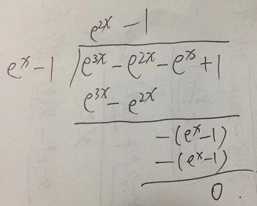

- [第一章 函数与极限](#第一章-函数与极限)
  - [1.9 连续函数的运算与初等函数的连续性](#19-连续函数的运算与初等函数的连续性)
    - [一、连续函数的和、差、积、商的连续性](#一连续函数的和差积商的连续性)
      - [定理1](#定理1)
    - [二、反函数与复合函数的连续性](#二反函数与复合函数的连续性)
      - [定理2](#定理2)
      - [定理3](#定理3)
      - [定理4](#定理4)
    - [三、初等函数的连续性](#三初等函数的连续性)
  - [习题1-9](#习题1-9)

# 第一章 函数与极限

## 1.9 连续函数的运算与初等函数的连续性

### 一、连续函数的和、差、积、商的连续性

#### 定理1 

设函数 $f(x)$ 和 $g(x)$ 在点 $x_0$ 连续，则它们的和（差） $f+g$、积 $f\cdot g$ 及商 $\frac f g$ （当 $g(x_0)\ne 0$ 时）都在点 $x_0$连续.

### 二、反函数与复合函数的连续性

#### 定理2

如果函数 $y=f(x)$ 在区间 $I_x$ 上单调增加（或单调减少）且连续，那么它的反函数 $x=f^{-1}(y)$ 也在对应的区间 $I_y = \lbrace y|y=f(x), x \in I_x \rbrace$ 上单调增加（或单调减少）且连续.

#### 定理3

设函数 $y=f[g(x)]$由函数 $u=g(x)$与函数 $y=f(u)$复合而成， $\mathring{U} (x_0) \subset D_{f\circ g}$. 若 $\lim\limits_{x\rightarrow x_0}g(x) = u_0$，而函数 $y=f(u)$ 在 $u=u_0$处连续，则

$$
\lim\limits_{x\rightarrow x_0}f[g(x)] = \lim\limits_{u\rightarrow u_0}f(u) = f(u_0)
$$

大白话就是内函数连续，外函数也连续，则复合函数也连续.

#### 定理4

设函数 $y=f[g(x)]$ 是由函数 $u=g(x)$ 和函数 $y=f(u)$ 复合而成， $U(x_0) \in D_{f\circ g}$. 若函数 $u=g(x)$ 在 $x=x_0$ 连续，且 $g(x_0) = u_0$ ，而函数 $y=f(u)$ 在 $u=u_0$ 处连续，则复合函数 $y=f[g(x)]$ 在 $x=x_0$ 也连续.

1. 大白话就是即使内函数不连续，只要极限存在，且外函数连续，则复合函数也连续.

2. $x_0$ 替换为 $\infty$，结论也成立.

**例** 求 $\lim\limits_{x\rightarrow 0}\arctan{\frac{\sin x} x}$

**解** 函数 $y=\arctan{\frac{\sin x} x}$ 可以看成 $y=\arctan u$ 和 $u=\frac {\sin x} x$ 复合而成，而 $y=\arctan u$ 在 $(-\infty, +\infty)$ 连续， 且$\lim\limits_{x\rightarrow 0}u(x)$ 存在，则

$$
\begin{align}
\lim\limits_{x\rightarrow 0} \arctan{\frac{\sin x} x} & = \arctan{\lim\limits_{x\rightarrow 0}\frac{\sin x} x} \\
& = \arctan 1 \\
& = \frac \pi 4
\end{align}
$$

### 三、初等函数的连续性

1. 基本初等函数在它们的定义域内都是连续的
2. 初等函数在其定义区间内都是连续的
3. 幂指函数
   $y=u(x)^{v(x)} = e^{v(x)\ln{u(x)}}$ 是连续的，若 $\lim u(x) = a, \lim v(x) = b$，则 $\lim y = a^b$

   **注意** $a^b$ 必须是有意义的，不能出现不定型如 $1^{\infty}, 0^0$ 等

   **例** 求 $\lim\limits_{x\rightarrow 0}(1+2x)^{\frac 3 {\sin x}}$

   **解** 

   $$
   \begin{align}
   \lim\limits_{x\rightarrow 0}(1+2x)^{\frac 3 {\sin x}} & = \lim\limits_{x\rightarrow 0} e^{\frac 3 {\sin x} \ln(1+2x)} \\
   & = e^{\lim\limits_{x\rightarrow 0}\frac{3}{\sin x} \ln(1+2x)} \\
   & = e^{\lim\limits_{x\rightarrow 0} \frac 3 x \cdot 2x} \\
   & = e^{\lim\limits_{x\rightarrow 0} 6} \\
   & = e^6
   \end{align}
   $$

   **例** 求 $\lim\limits_{x\rightarrow 0}\frac{e^{\tan x} - e^x}{\tan x - x}$

   **解**

   $$
   \begin{align}
   \lim\limits_{x\rightarrow 0}\frac{e^{\tan x} - e^x}{\tan x - x} & = \lim\limits_{x\rightarrow 0} e^x \cdot \frac{e^{\tan x - x} - 1}{\tan x - x} \\
   & = \lim\limits_{x\rightarrow 0}e^x \cdot \frac{\tan x - x}{\tan x - x} \\
   & = 1
   \end{align}
   $$

## 习题1-9

1. 略
2. 设函数 $f(x)$ 与 $g(x)$ 在点 $x_0$ 连续，证明函数
   $$
   \varphi (x) = \max \{f(x), g(x)\}, \psi (x) = \min \{f(x), g(x) \}
   $$
   在点 $x_0$ 连续

   **证**

   $$
   \begin{align}
   \varphi(x) & = \max\{f(x) + g(x)\} = \frac 1 2 [f(x) + g(x) + |f(x) - g(x)|], \\
   \psi(x) & = \min \{f(x), g(x) \} = \frac 1 2 [f(x) + g(x) - |f(x) - g(x)|]
   \end{align}
   $$

   又，若 $f(x)$ 在点 $x_0$ 连续，则 $|f(x)|$ 在点 $x_0$ 也连续；由连续函数的和、差仍连续，故 $\varphi(x), \psi(x)$ 在点 $x_0$ 也连续.

3. 求极限
   
   (3) $\lim\limits_{x\rightarrow \frac \pi 6}\ln(2\cos{2x})$

   **解** 

   $$
   \begin{align}
   \lim\limits_{x\rightarrow \frac \pi 6}\ln(2\cos{2x}) & = \ln(2\cos {\frac \pi 3}) \\
   & = \ln 1 \\
   & = 0
   \end{align}
   $$

   (7) $\lim\limits_{x\rightarrow \infty}(\sqrt{x^2+x} - \sqrt{x^2-x})$

   **解**

   $$
   \begin{align}
   \lim\limits_{x\rightarrow \infty}(\sqrt{x^2+x} - \sqrt{x^2-x}) & = \lim\limits_{x\rightarrow \infty}(\frac{2x}{\sqrt{x^2+x} + \sqrt{x^2 - x}}) \\
   & = \lim\limits_{x\rightarrow \infty}\frac{2}{(\sqrt{1+\frac 1 x} + \sqrt{1- \frac 1 x})} \\
   & = 1
   \end{align}
   $$

   (8) $\lim\limits_{x\rightarrow 0}\frac{(1-\frac 1 2x^2)^\frac 2 3 - 1}{x \ln(1+x)}$

   **解**

   $$
   \begin{align}
   \lim\limits_{x\rightarrow 0}\frac{(1-\frac 1 2x^2)^\frac 2 3 - 1}{x \ln(1+x)} & = \lim\limits_{x\rightarrow 0}\frac{\frac 2 3 \cdot (-\frac 1 2 x^2)}{x \cdot x} \\
   & = -\frac 1 3
   \end{align}
   $$

4. 求极限

   (6) $\lim\limits_{x\rightarrow 0}\frac{\sqrt{1+\tan x} - \sqrt{1+\sin x}}{x\sqrt{1+\sin^2 x}-x}$

   **解**

   $$
   \begin{align}
   \lim\limits_{x\rightarrow 0}\frac{\sqrt{1+\tan x} - \sqrt{1+\sin x}}{x\sqrt{1+\sin^2 x}-x} & = \lim\limits_{x\rightarrow 0}\frac{\tan x - \sin x}{x(\sqrt{1+\sin^2 x} - 1)(\sqrt{1+\tan x} + \sqrt{1+\sin x})} \\
   & = \lim\limits_{x\rightarrow 0}\frac{\sin x(\sec x - 1)}{x\cdot \frac 1 2\sin^2 x\cdot (\sqrt{1+\tan x} + \sqrt{1+\sin x})} \\
   & = \lim\limits_{x\rightarrow 0}\frac{x \cdot \frac 1 2 x^2}{x\cdot \frac 1 2 x^2 \cdot (\sqrt{1+\tan x} + \sqrt{1+\sin x})} \\
   & = \lim\limits_{x\rightarrow 0}\frac 1 {\sqrt{1+\tan x} + \sqrt{1+\sin x}} \\
   & = \frac 1 2
   \end{align}
   $$

   (7) $\lim\limits_{x\rightarrow e}\frac{\ln x - 1}{x-e}$

   **解** 令 $t=x-e$, 则 $x = t+e$, 当 $x\rightarrow e$ 时， $t\rightarrow 0$

   $$
   \begin{align}
   \lim\limits_{x\rightarrow 0}\frac{\ln x - 1}{x-e} & = \lim\limits_{t\rightarrow 0}\frac{\ln(t+e) - \ln e}{t} \\
   & = \lim\limits_{t\rightarrow 0}\frac{\ln(1+\frac t e)}{t} \\
   & = \lim\limits_{t\rightarrow 0}\frac{\frac t e}{t} \\
   & = \frac 1 e
   \end{align}
   $$

   (8) $\lim\limits_{x\rightarrow 0}\frac{e^{3x} - e^{2x} - e^x + 1}{\sqrt[3]{(1-x)(1+x)} - 1}$
   
   **解** 已知 当 $x\rightarrow 0$ 时， $e^x - 1 \sim x$，利用多项式除法构造因子 $e^x - 1$:

   

   $$
   \begin{align}
   \lim\limits_{x\rightarrow 0}\frac{e^{3x} - e^{2x} - e^x + 1}{\sqrt[3]{(1-x)(1+x)} - 1} & = \frac{(e^x - 1)(e^{2x} - 1)}{(1-x^2)^{\frac 1 3} - 1} \\
   & = \lim\limits_{x\rightarrow 0}\frac{x \cdot 2x}{-\frac 1 3 x^2} \\
   & = -6
   \end{align}
   $$

5. 设 $f(x)$ 在 $\R$ 上连续，且 $f(x)\ne 0 \varphi(x)$ 在 $\R$ 上有定义，且有间断点，则下列陈述中，哪些是对的，哪些是错的？如果是对的，试说明理由；如果是错的，试给出一个反例.
   
   **(1) $\varphi[f(x)]$ 必有间断点**

   错，例如 $\varphi(x) = sgn(x), f(x) = e^x, \varphi(f(x)) \equiv 1$ 在 $\R$ 上处处连续

   (2) $[\varphi(x)]^2$ 必有间断点

   错，例如 
   
   $$
   \varphi(x) = 
   \begin{cases}
   1 & , x\in \Q \\
   -1 & , x \in \R \backslash \Q
   \end{cases}
   $$ 

   $[\varphi(x)]^2 \equiv 1$ 在 $\R$ 上处处连续

   (3) $f[\varphi(x)]$ 未必有间断点

   对，例如 $\varphi(x)$ 同 (2)， $f(x) = |x|+1, f[\varphi(x)] \equiv 2$ 在 $\R$ 上处处连续

   (4) $\frac{\varphi(x)}{f(x)}$ 必有间断点

   对，因为若 $F(x) = \frac{\varphi(x)}{f(x)}$ 在 $\R$ 上处处连续，则 $\varphi(x) = F(x) \cdot f(x)$ 也在 $\R$ 上处处连续，这与已知条件矛盾

6. 设函数 
   
   $$
   f(x) = 
   \begin{cases}
   e^x & , x \lt 0 \\
   a + x & , x \geqslant 0
   \end{cases}
   $$

   应当怎样选择数 $a$，才能使得 $f(x)$ 成为在 $(-\infty, +\infty)$ 内的连续函数.

   **解** 由初等函数的连续性， $f(x)$ 在 $(-\infty, 0) \cup (0, +\infty)$ 内连续，所以要使 $f(x)$ 在 $(-\infty, +\infty)$ 内连续，只要选择数 $a$ , 使 $f(x)$ 在 $x=0$ 处连续即可.

   在 $x=0$ 处， $\lim\limits_{x\rightarrow 0^-}f(x) = \lim\limits_{x\rightarrow 0^-}e^x = 1, \lim\limits_{x\rightarrow 0^+}f(x) = \lim\limits_{x\rightarrow 0^+}(a+x) = a, f(0) = a$，取 $a=1$，即有

   $$
   \lim\limits_{x\rightarrow 0^-}f(x) = \lim\limits_{x\rightarrow 0^+}f(x) = f(0)
   $$

   即 $f(x)$ 在 $x=0$ 处连续. 于是，选择 $a=1, f(x)$ 就成为在 $(-\infty, +\infty)$ 内的连续函数.

