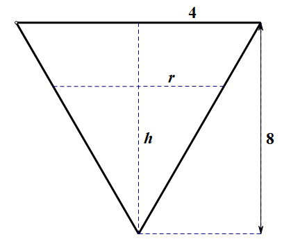
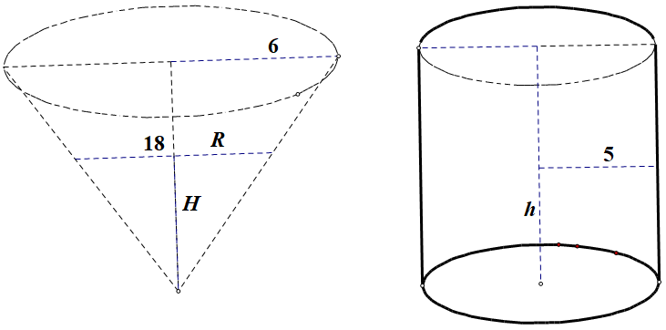

# 第四节 隐函数及由参数方程所确定的函数的导数 相关变化率

## 一、隐函数的导数

## 二、由参数方程所确定的函数的导数

## 三、相关变化率

## 习题

### 8 求参数方程所确定的函数的二阶导数 $\frac{d^2y}{dx^2}$

#### (1) 

$$
\begin{cases}
x &=\frac{t^2}2, \\
y&=1-t; 
\end{cases}
$$

**解**

$$
\begin{align}
\frac{dy}{dx} & = \frac{dy/dt}{dx/dt} = \frac{-1}{t} \\
\frac{d^2y}{dx^2} & = \frac{d(dx/dy)}{dx} \\
&= \frac{\frac{d(dx/dy)}{dt}}{\frac{dx}{dt}} \\
& = \frac{(\frac {-1}{t})'}{(\frac {t^2}2)'} \\
& = \frac{\frac 1 {t^2}} t \\
& = \frac 1 {t^3}
\end{align}
$$

### 10. 落在平静水面上的石头，产生同心波纹. 若最外一圈波半径的增大速率总是 $6 m/s$，问在 $2s$ 末水面面积增大的速率为多少?

**解**

半径 $r=6t$，面积 $s=\pi r^2$，所求为 $\frac{ds}{dt}|_{t=2}$

面积函数两边同时对 $t$ 求导

$\frac{ds}{dt} = 2\pi r \cdot \frac{dr}{dt}$

由已知 $\frac{dr}{dt}|_{t=2}=6, r|_{t=2}=6t=12$

$\frac{ds}{dt}|_{t=2}  = 2\pi \cdot 12 \cdot 6=144\pi$ $(m^2/s)$

### 11. 注水入深 $8m$ 上顶直径 $8m$ 的正圆锥形容器中，其速率为 $4m^3/min$. 当水深为 $5m$ 时，其表面上升的速率为多少?

**解**

水深 $h=h(t)$

水体积 $V=\frac 1 3\pi r^2 h$, 又 $\frac r 4 = \frac h 8 \implies r=\frac 1 2 h$，

$V=\frac 1 {12} \pi h^3$

两边同时对 $t$ 求导

$V' = \frac 1 4 \pi h^2 \cdot \frac {dh}{dt}$

$\implies \frac {dh}{dt} = \frac{4V'}{\pi h^2}$

由已知当 $t=t_0$ 时 $V'|_{t=t_0}=4, h=5$

$$
\frac{dh}{dt}|_{t=t_0}=\frac{4V'|_{t=t_0}}{\pi h^2} =\frac{4\times 4}{25\pi}=\frac{16}{25\pi}\approx 0.204(m/min)
$$

### 12. 溶液自深 $18cm$ 顶直径 $12cm$ 的正圆锥形漏斗中漏入一直径为 $10cm$ 的圆柱形筒中，开始时漏斗中盛满了溶液. 已知当溶液在漏斗中深为 $12cm$ 时，其表面下降的速率为 $1cm/min$. 问此时圆柱形筒中溶液表面上升的速率为多少?

**解**

由已知

$$
\frac R 6 = \frac H {18} \implies R=\frac 1 3 H
$$

溶液总体积

$$
V=\frac 1 3 \pi 6^2 \cdot 18=216\pi(cm^3)
$$

$t=t_0$ 时， $H=12cm$

漏斗中剩余溶液体积为

$$
V_1=\frac 1 3\pi R^2H=\frac 1 {27}\pi H^3
$$

圆柱形筒中溶液体积为 

$$
V_2=\pi 5^2 h=25\pi h
$$

易知 $V-V1=V2$，即

$$
216\pi - \frac 1 {27} \pi H^3 = 25\pi h
$$

等式两边对 $t$ 求导

$$
-\frac 1{9}\pi H^2 \frac{dH}{dt} = 25\pi \frac{dh}{dt} \implies \frac {dh}{dt} = -\frac 1 {25\pi}(\frac 1 9\pi H^2 \frac{dH}{dt})
$$

又由已知 $t=t_0$ 时 $H=12, \frac{dH}{dt}|_{t=t_0}=-1$，代入上式得

$$
\frac{dh}{dt}|_{t=t_0}=-\frac 1 {25\pi}(\frac 1 9 \pi \cdot 144 \cdot -1) = \frac{16}{25} \approx 0.64(cm/min).
$$

