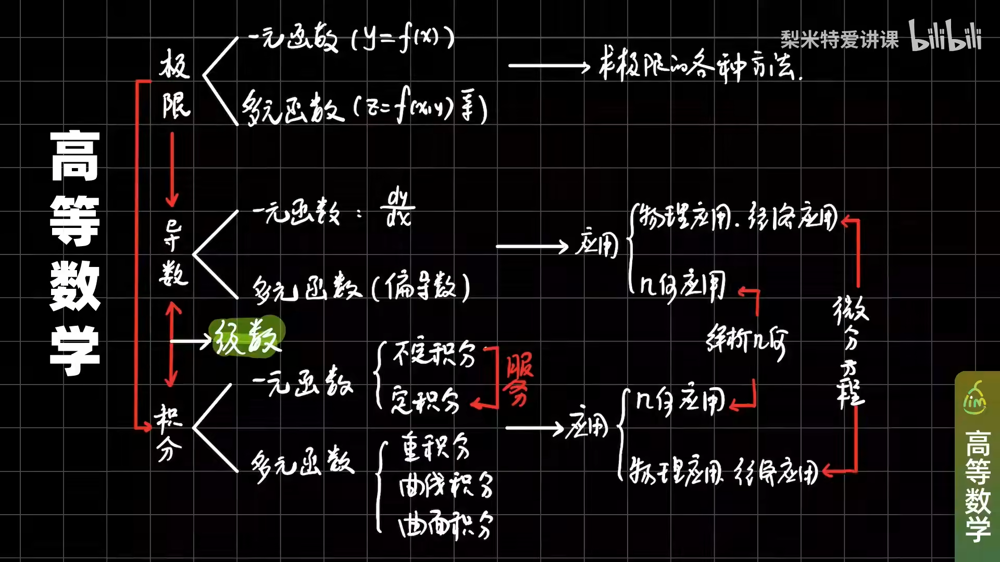

# 高等数学

- 《高等数学》第七版 高等教育出版社 同济大学数学系编
- 《高等数学习题全解指南》 第七版 高等教育出版社 同济大学数学系编

**课程**

- [【樊顺厚】《高等数学》全集](https://www.bilibili.com/video/BV1FU4y1p7f3)
- [【梨米特】同济七版《高等数学》全程教学视频](https://www.bilibili.com/video/BV1864y1T7Ks)
- [【国防科技大学】高等数学（全·配字幕）-朱建民](https://www.bilibili.com/video/BV1h7411M73b)
- [《高等数学》同济版 全程教学视频（宋浩老师）](https://www.bilibili.com/video/BV1Eb411u7Fw)
- [【高等数学】上海交通大学-乐经良](https://www.bilibili.com/video/BV1EW411H7Vj)
- [《高等数学》同济7版全程超精讲-孔祥仁](https://www.bilibili.com/video/BV1a14y187qn)
- [北大 | 高等数学1-100讲（共109讲 彭立忠教授）](https://www.bilibili.com/video/BV1Nb411j7Y2)

**习题解析**

- [【课后习题】同济高等数学（第7版）课后难题解析-世纪高教在线考研](https://www.bilibili.com/video/BV14t411M7aR)
- [同济大学第七版课后习题-研研研必胜](https://www.bilibili.com/video/BV1EB4y1u7Zh)
- [同济大学第七版高等数学课后习题讲解-慧升考研APP](https://www.bilibili.com/video/BV18741157Gm)
- [同济七版高数上册课后难题解析视频大合集-心一学长](https://www.bilibili.com/video/BV197411L77D)

**知识框架**

